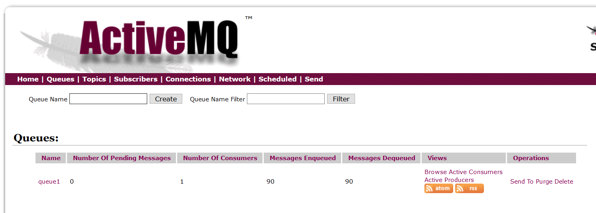

# JMS之收发消息

JMS中，两个最重要的概念就是消息的`生产者Producer`和`消费者Consumer`，一个负责发出消息，一个负责接收消息。Producer发出消息后，消息暂时存储在`消息队列`中，Consumer从队列中接收。如果有多个Consumer，他们不会收到同样的消息。

下面例子代码使用JMS和ActiveMQ，编写了一对Producer和Consumer。

## Producer

Producer.java
```java
package com.ciyaz.example;

import org.apache.activemq.ActiveMQConnection;
import org.apache.activemq.ActiveMQConnectionFactory;

import javax.jms.*;

public class Producer
{
	public static void main(String[] args)
	{
		//连接工厂
		ConnectionFactory connectionFactory;
		//连接对象
		Connection connection = null;
		//会话，代表一个生成消息的线程
		Session session;
		//消息目的地
		Destination destination;
		//消息生产者
		MessageProducer messageProducer;

		connectionFactory = new ActiveMQConnectionFactory("admin", "admin", ActiveMQConnection.DEFAULT_BROKER_URL);
		try
		{
			//创建连接，创建Session，获取消息生产者对象
			connection = connectionFactory.createConnection();
			connection.start();
			session = connection.createSession(true, Session.AUTO_ACKNOWLEDGE);
			destination = session.createQueue("queue1");
			messageProducer = session.createProducer(destination);

			//发送十条消息
			for(int i = 0; i < 10; i++)
			{
				TextMessage textMessage = session.createTextMessage("msg" + i);
				messageProducer.send(textMessage);
			}
			//提交事务
			session.commit();

		}
		catch (JMSException e)
		{
			e.printStackTrace();
		}
		finally
		{
			if(connection != null)
			{
				try
				{
					connection.close();
				}
				catch (JMSException e)
				{
					e.printStackTrace();
				}
			}
		}
	}
}
```

JMS的API还是设计的比较复杂的，下面对一些关键的对象进行解释：

* ConnectionFactory：生成连接对象的工厂，初始化时需要用户名、密码、消息中间件的URL（默认`ActiveMQConnection.DEFAULT_BROKER_URL`值为`tcp://localhost:61616`）
* Connection：连接对象
* Session：会话，代表一个生成消息的线程
* Destination：消息目的地，我们创建了一个叫做`queue1`的消息队列
* MessageProducer：消息生产者操作对象，这里我们发送的是一个`TextMessage`

注：实际上也可以创建一个`ObjectMessage`将一个Java对象存入消息队列，只要我们传输的对象能够正确的序列化，但是ActiveMQ不推荐使用该方法，因为这可能产生安全问题，Consumer必须将被序列化的实体类所在包配置为`trust`可信任的。

比如，下面代码将所有的包都配置为了可信任的：

```java
activeMQConnectionFactory.setTrustAllPackages(true);
```

## Consumer

Consumer.java
```java
package com.ciyaz.example;

import org.apache.activemq.ActiveMQConnection;
import org.apache.activemq.ActiveMQConnectionFactory;

import javax.jms.*;

public class Consumer
{
	public static void main(String[] args)
	{
		ConnectionFactory connectionFactory;
		Connection connection = null;
		Session session;
		Destination destination;
		MessageConsumer messageConsumer;
		connectionFactory = new ActiveMQConnectionFactory("admin", "admin", ActiveMQConnection.DEFAULT_BROKER_URL);
		try
		{
			connection = connectionFactory.createConnection();
			connection.start();
			session = connection.createSession(false, Session.AUTO_ACKNOWLEDGE);
			destination = session.createQueue("queue1");
			messageConsumer = session.createConsumer(destination);
			//收到消息的回调函数
			messageConsumer.setMessageListener(message -> {
				try
				{
					TextMessage textMessage = (TextMessage) message;
					System.out.println("收到消息：" + textMessage.getText());
				}
				catch (JMSException e)
				{
					e.printStackTrace();
				}
			});
		}
		catch (JMSException e)
		{
			e.printStackTrace();
		}
	}
}
```

这里注意接收消息的写法，我们为messageConsumer注册了一个监听器，当有消息来到时，监听器中的代码就会回调。

上面代码运行后，会启动新的线程监听消息的到来，因此程序不会自动退出，不用担心这个异步操作还没收到消息程序就结束了，如果我们想结束监听，那么将Connection关闭，监听线程也就关闭了，程序就退出了。

在ActiveMQ的web控制台中，我们能看到我们注册的`queue1`相关的信息。



## Queue模式的用法

通常情况下，我们有一个模块作为Consumer处理消息队列中的消息，除此之外有一个或多个Producer生成消息，将消息写入消息队列，以此解决流量峰值等各种问题。
