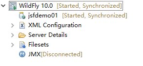
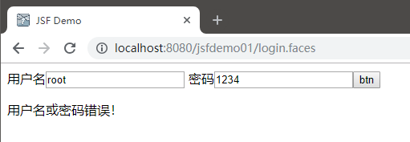

# JSF简介和环境搭建

## JSF简介

JSF（Java Server Faces）是一个以组件为中心的服务器端用户界面构建框架，和现在比较流行的Struts2、SpringMVC不同，JSF的优点是基于事件驱动的编程模型，这和Swing比较相似，因此JSF使用起来比较像编写桌面端程序，而不是基于HTTP协议的Web程序，当然，这个优点也同样是缺点，这种开发方式生成的前端代码不可控，不利于前后端分离，随着HTML5的流行和发展，许多交互逻辑其实交给前端是比较适合的，JSF这种开发模式已经比较落后了。

注意：由于JSF是个比较古老的技术，而现在已经并不流行，因此许多书的JSF版本还是JSF1.x，这和我们使用的JSF2.x区别很大，看到还在使用JavaEE5的书基本就可以略过了。

## 使用Wildfly10.0搭建JSF开发环境

这里我们使用JDK8和支持JavaEE7的应用服务器Wildfly10.0搭建JSF开发环境，JavaEE7对应最新版的JSF2.2（目前用的还比较多的JavaEE6对应JSF2.1）。

这里我们在Eclipse中创建一个Maven工程，并在`pom.xml`中配置编译环境为JDK8：
```xml
<properties>
  <maven.compiler.target>1.8</maven.compiler.target>
  <maven.compiler.source>1.8</maven.compiler.source>
</properties>
```

我们需要把Wildfly的运行时环境加入项目的BuildPath，或者在Maven中引入`jsf-api`、`cdi-api`，注意作用域标注为`provided`，这里我们遵循Maven的设计思想，采用第二种方式。

```xml
<dependency>
  <groupId>com.sun.faces</groupId>
  <artifactId>jsf-api</artifactId>
  <version>2.2.18</version>
  <scope>provided</scope>
</dependency>
<dependency>
  <groupId>javax.enterprise</groupId>
  <artifactId>cdi-api</artifactId>
  <version>1.2</version>
  <scope>provided</scope>
</dependency>
```

要想使用JSF，需要在`web.xml`中配置一个FacesServlet：
```xml
<!DOCTYPE web-app PUBLIC
 "-//Sun Microsystems, Inc.//DTD Web Application 2.3//EN"
 "http://java.sun.com/dtd/web-app_2_3.dtd" >

<web-app>
	<display-name>Archetype Created Web Application</display-name>

	<servlet>
		<servlet-name>faces</servlet-name>
		<servlet-class>javax.faces.webapp.FacesServlet</servlet-class>
		<load-on-startup>1</load-on-startup>
	</servlet>
	<servlet-mapping>
		<servlet-name>faces</servlet-name>
		<url-pattern>*.faces</url-pattern>
	</servlet-mapping>
</web-app>
```

至此，我们就已经搭建好JSF的开发环境了，新版本的JSF并没有什么复杂的配置文件，使用起来也是非常的简单。

## hello world

这里我们使用JSF，编写一个最简单的登录程序。用户输入用户名和密码并进行校验，校验成功跳转到成功页面，校验失败依然将登录页面返回给用户，并显示错误信息。

User.java
```java
package com.ciyaz.demo.jsfdemo01;

import java.io.Serializable;

import javax.enterprise.context.RequestScoped;
import javax.inject.Named;

@Named("user")
@RequestScoped
public class User implements Serializable
{
	private static final long serialVersionUID = 1L;

	private String username = "";
	private String password = "";
	private String errMessage = "";

	public String getUsername()
	{
		return username;
	}

	public void setUsername(String username)
	{
		this.username = username;
	}

	public String getPassword()
	{
		return password;
	}

	public void setPassword(String password)
	{
		this.password = password;
	}

	public String getErrMessage()
	{
		return errMessage;
	}

	public void setErrMessage(String errMessage)
	{
		this.errMessage = errMessage;
	}

	public String login()
	{
		if(username.equals("root") && password.equals("123456"))
		{
			return "success";
		}
		else
		{
			errMessage = "用户名或密码错误！";
			return "login";
		}
	}
}
```

这里的User类，其实既是一个控制器类，也是一个实体类。其中`login()`函数就是登录的处理逻辑。注意类上标注的两个注解，使用`@Named`标注，CDI就能将这个类的对象注入JSF框架，`@RequestScoped`则表示这个对象的作用域。

注意：JSF也有一套自己的注解，需要引入JSF相关的包，并且不再依赖`cdi-api`了，适用于单独使用JSF的情况，然而JSF一般都是结合EJB一起使用的，这里就不多做介绍了。

login.xhtml
```html
<?xml version="1.0" encoding="UTF-8"?>
<!DOCTYPE html PUBLIC "-//W3C//DTD XHTML 1.0 Transitional//EN" "
http://www.w3.org/TR/xhtml1/DTD/xhtml1-transitional.dtd">
<html xmlns="http://www.w3.org/1999/xhtml"
	xmlns:h="http://java.sun.com/jsf/html"
	xmlns:f="http://java.sun.com/jsf/core">
<h:head>
	<title>JSF Demo</title>
</h:head>
<h:body>
	<h:form>
		<label for="username">用户名</label>
		<h:inputText id="username" value="#{user.username}"></h:inputText>
		<label for="password">密码</label>
		<h:inputText id="password" value="#{user.password}"></h:inputText>
		<h:commandButton value="btn" action="#{user.login()}"></h:commandButton>
	</h:form>
	<p>
		<h:outputText value="#{user.errMessage}"></h:outputText>
	</p>
</h:body>
</html>
```

上面页面代码中，我们引入了一些`xmlns`命名空间，引入它们后，我们才能在JSF中使用相关的标签。上面页面中，主要使用了`h:inputText`和`h:commandButton`这两个控件，分别是文本输入框和表单提交按钮。注意两个控件上的`value`和`action`，它们将控件和实体类进行了数据绑定，其中`#{}`是EL表达式，和JSP的`${}`差不多，在JSP相关内容中我们已经学习过了。

success.xhtml
```html
<?xml version="1.0" encoding="UTF-8"?>
<!DOCTYPE html PUBLIC "-//W3C//DTD XHTML 1.0 Transitional//EN" "
http://www.w3.org/TR/xhtml1/DTD/xhtml1-transitional.dtd">
<html xmlns="http://www.w3.org/1999/xhtml"
	xmlns:h="http://java.sun.com/jsf/html"
	xmlns:f="http://java.sun.com/jsf/core">
<h:head>
	<title>JSF Demo</title>
</h:head>
<h:body>
	<p>
		Login Success!
	</p>
</h:body>
</html>
```

这个页面没什么特别的，就是显示一个成功信息。

将项目部署到wildfly中，启动wildfly，就可以看到我们的程序正常运行了。



这里我们输个错误密码试验一下：


