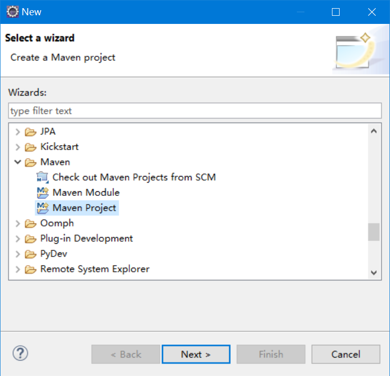
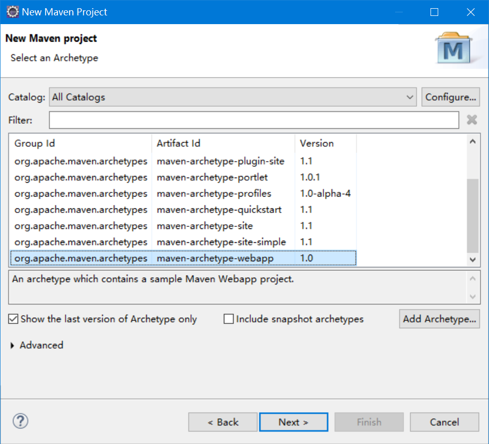
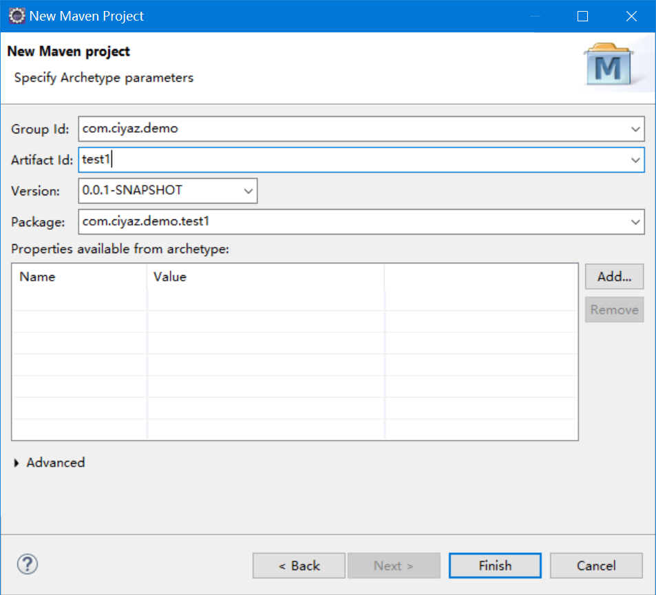
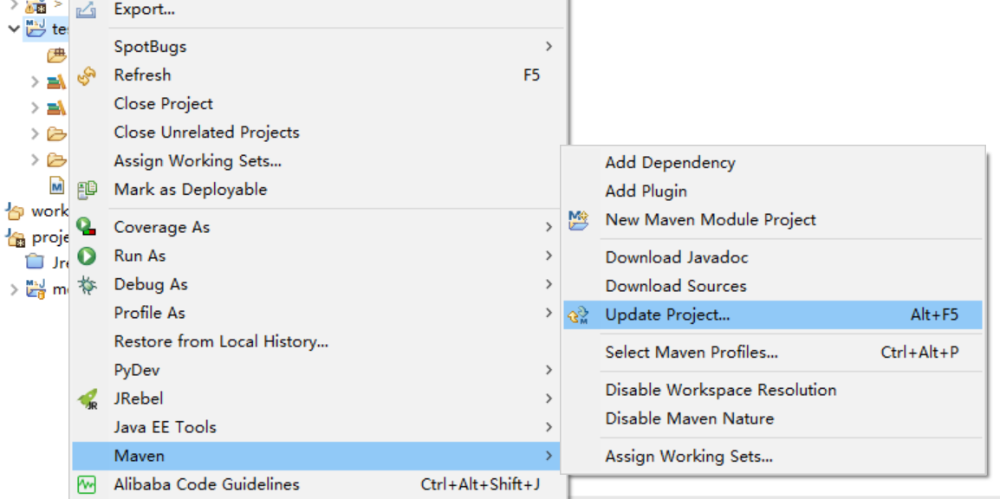
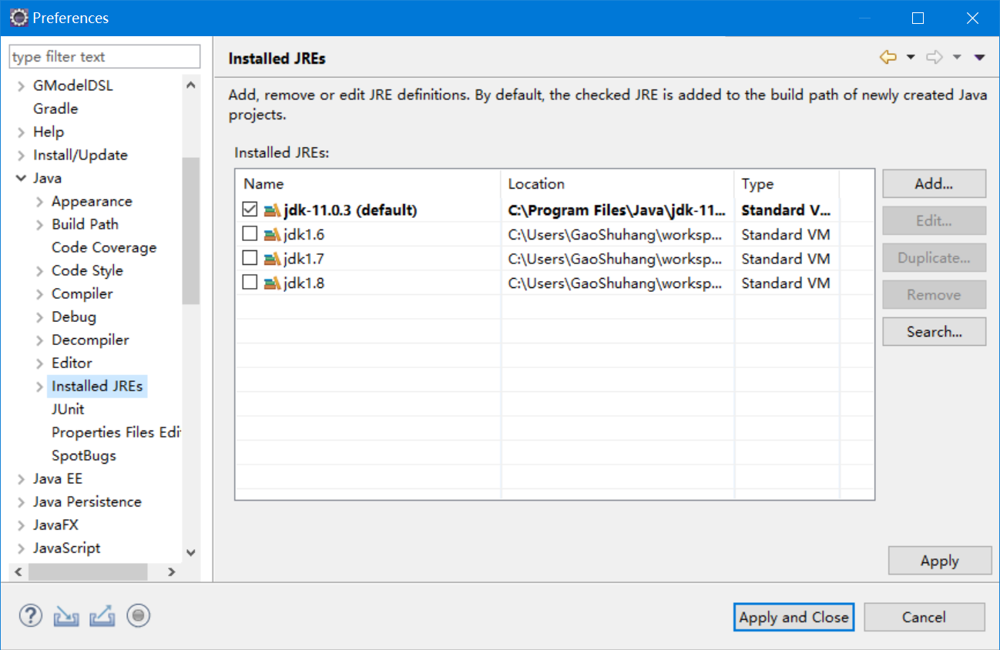
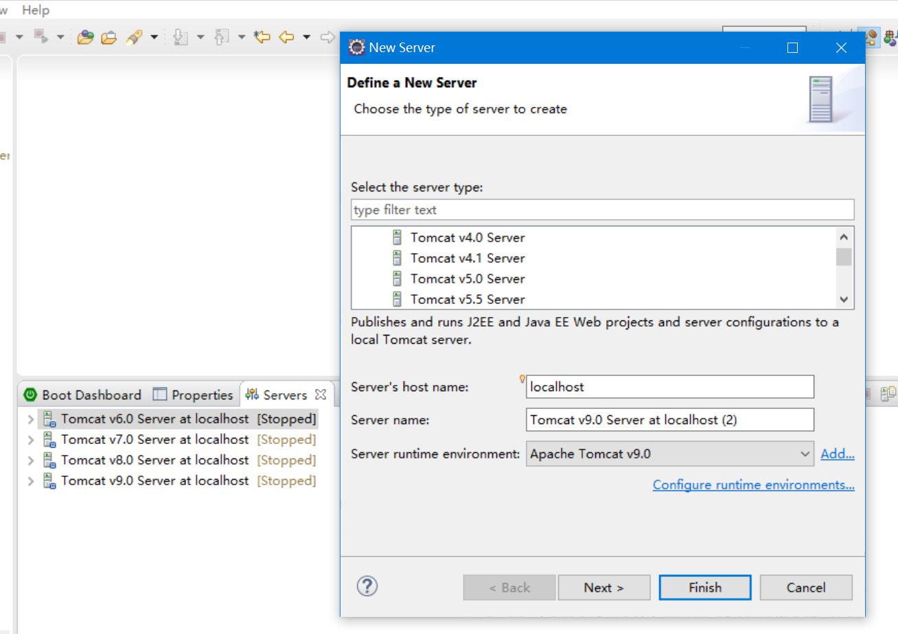
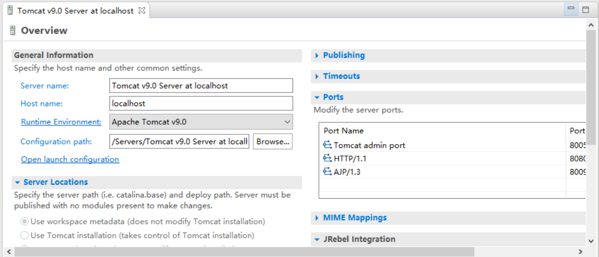
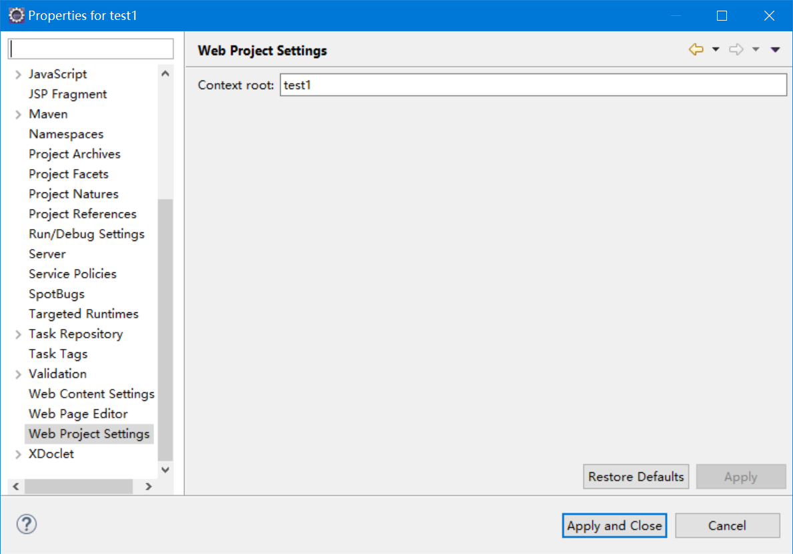
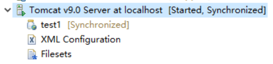
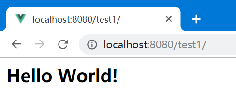

# 使用Eclipse创建项目

Eclispe是当下最流行的开源Java集成开发环境之一，而我们的项目一般使用Maven进行依赖管理和构建。我们这里以Eclipse为例，介绍如何创建基于Maven的JavaWeb项目。

## 创建项目结构

在新建项目中，选择Maven项目。



模板选择`maven-archetype-webapp`。



输入`Group Id`和`Artifact Id`，创建项目。



## 调整Maven配置

默认创建的项目中，一些配置信息版本都比较老旧了。我们这里将JDK版本修改为JDK8，并加入一些相关的依赖。

pom.xml
```xml
<project xmlns="http://maven.apache.org/POM/4.0.0"
	xmlns:xsi="http://www.w3.org/2001/XMLSchema-instance"
	xsi:schemaLocation="http://maven.apache.org/POM/4.0.0 http://maven.apache.org/maven-v4_0_0.xsd">
	<modelVersion>4.0.0</modelVersion>
	<groupId>com.ciyaz.demo</groupId>
	<artifactId>test1</artifactId>
	<packaging>war</packaging>
	<version>0.0.1-SNAPSHOT</version>
	<name>test1 Maven Webapp</name>
	<url>http://maven.apache.org</url>

	<properties>
		<project.build.sourceEncoding>UTF-8</project.build.sourceEncoding>
		<maven.compiler.source>1.8</maven.compiler.source>
		<maven.compiler.target>1.8</maven.compiler.target>
	</properties>

	<dependencies>
		<dependency>
			<groupId>junit</groupId>
			<artifactId>junit</artifactId>
			<version>4.12</version>
			<scope>test</scope>
		</dependency>
		<dependency>
			<groupId>javax.servlet</groupId>
			<artifactId>javax.servlet-api</artifactId>
			<version>4.0.1</version>
			<scope>provided</scope>
		</dependency>
	</dependencies>
	
	<build>
		<finalName>test1</finalName>
	</build>
</project>
```

修改Maven配置后，在项目上选择`右键 -> Maven -> Update Project...`，刷新Maven依赖关系。



其中，`junit`是单元测试的库，我们一般都会用到，这个库不需要打包到最终生成的`war`文件中，因此将其作用域设置为`test`。

`javax.servlet-api`是Tomcat的运行时接口包，虽然Tomcat本身带有这个库，但是使用Maven时配置本地路径是不合适的，这里最佳实践是添加一个`provided`依赖。这里`4.x`版本对应Tomcat9。

## 调整web.xml

默认的`web.xml`使用的版本是Servlet2.3，已经非常老旧了，我们这里将其换成Servlet4.0。

```xml
<web-app xmlns="http://xmlns.jcp.org/xml/ns/javaee"
  xmlns:xsi="http://www.w3.org/2001/XMLSchema-instance"
  xsi:schemaLocation="http://xmlns.jcp.org/xml/ns/javaee
                      http://xmlns.jcp.org/xml/ns/javaee/web-app_4_0.xsd"
  version="4.0"
  metadata-complete="false">
</web-app>
```

注意：指定`metadata-complete="false"`能够开启Servlet3.0的注解功能，但会稍微增加一些启动时间，如果设置为`true`，Servlet等Web组件就只能通过`web.xml`进行配置了。

## 配置JRE

由于我们使用Maven管理项目，因此编译等级是`pom.xml`指定的，但Tomcat的运行时JRE还是要我们手动指定。在设置对话框中，找到`Java -> Installed JREs`，我们这里加入JDK8的运行时。



## 配置Tomcat

这里我们在底部Servers中添加一个Tomcat9。



添加好应用服务器后，在其上右键，点击`Add and Remove...`，可以添加和部署项目。

双击可以打开应用服务器配置，一些大项目启动很慢，启动超时设置、启动JVM参数等都可以在这里找到。



在项目上右键，选择`Properties`，可以找到一个`Web Project Settings`配置，项目的Context Path可以在这里配置。



## 编译运行和构建

在Tomcat中添加好项目后，直接在`Servers`面板启动即可。



访问`localhost:8080/<项目context path>`，可以看到项目创建时默认生成的`index.jsp`，这个文件位于`webapp`目录下。



构建war包我们直接在命令行中，执行`mvn clean package`即可。