# 创建项目

点击Create New Project，项目类型选择Maven项目，模板选择maven-archetype-webapp，填写groupId，artifactId。选择项目文件目录，创建即可。

注：

* 在Maven参数中添加archetypeCatalog=local，指定使用本地archetype-catalog.xml文件，否则因为网络原因会卡死
* 进入项目后可以点击maven的enable auto import，这样修改pom.xml，改动会立即生效


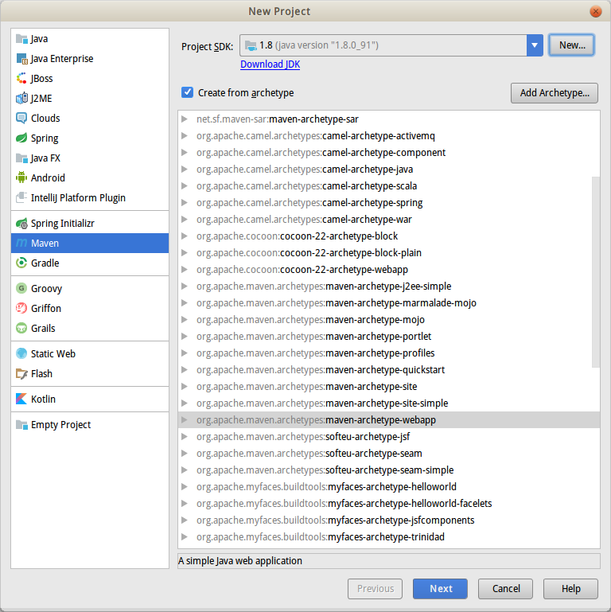

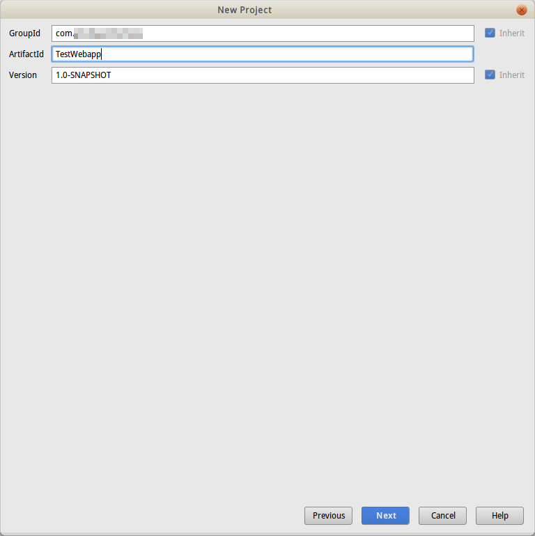

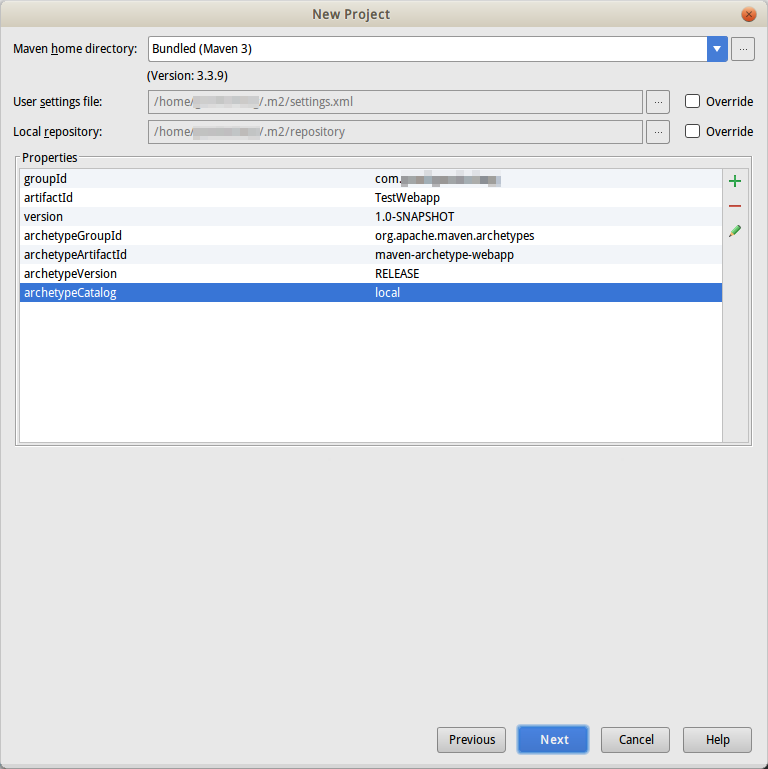

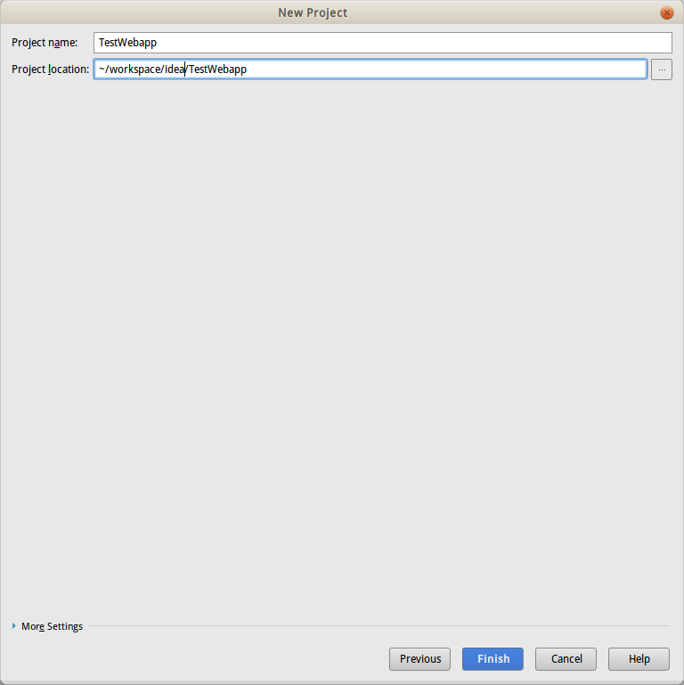

# 项目配置

点击project structure打开项目配置界面。

## JDK和编译等级

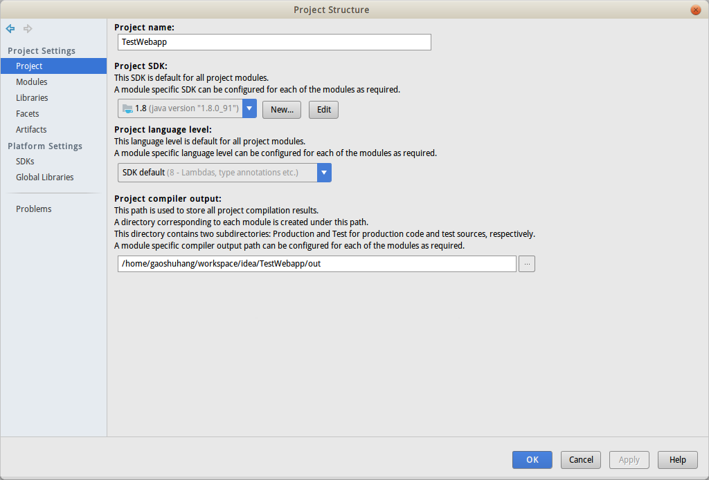

## 项目模块配置

### 模块结构

左侧是模块列表，右侧是该模块的结构目录树，由于是Maven的项目，这里在src/main/下创建一个java文件夹，并标记为source folder。

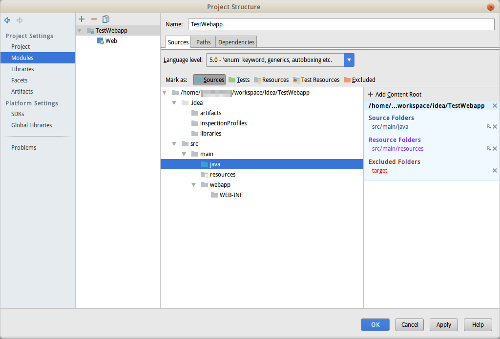

### 输出路径

一般留作默认即可。

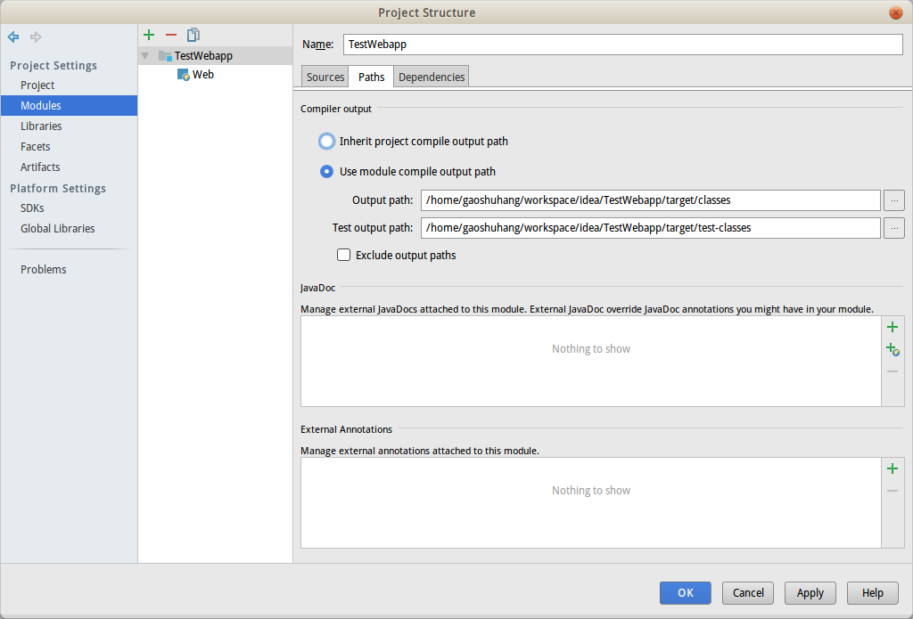

### 模块依赖

一个模块可以依赖其他模块，依赖maven管理的类库，还有jdk和tomcat的类库。默认已经设置了jdk和maven依赖，这里因为要使用tomcat的servlet api，因此需要加入tomcat依赖。点击加号，点击Library，选择tomcat的类库（此操作前需要配置tomcat运行环境）。

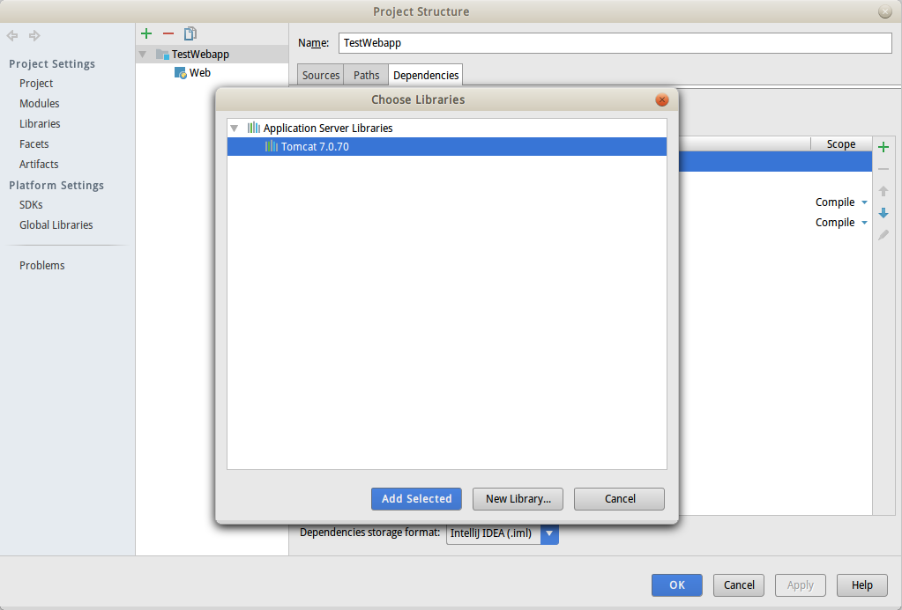

# 运行配置

解压缩tomcat的压缩包后，先给catalina.sh和shutdown.sh添加执行权限。

idea中，点击运行的下拉三角，可以打开运行需要的tomcat服务器和运行配置信息的设置面板。

## tomcat设置

左侧点击加号添加一个tomcat服务器，右侧配置名字，tomcat路径，端口等。

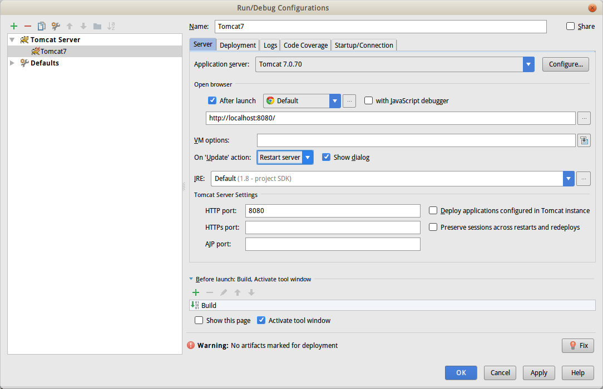

## 部署设置

部署设置可以选择war包部署或者展开部署，还可以设置application context（就是请求你的应用的基础URL）。

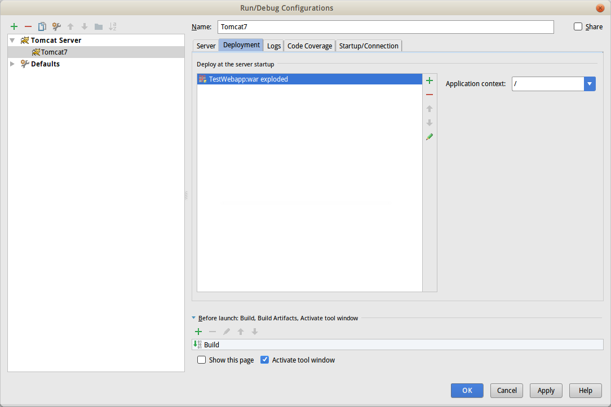

# 一些其他修改

默认创建的maven项目，jdk版本低，使用的是servlet2.3，junit3.x，这些在新项目中都应该改成新版本了。

## maven编译级别

在build中加入使用最新jdk8的编译插件。

pom.xml
```xml
<plugins>
  <!--设置编译级别和运行环境为Java8-->
  <plugin>
    <groupId>org.apache.maven.plugins</groupId>
    <artifactId>maven-compiler-plugin</artifactId>
    <configuration>
      <source>1.8</source>
      <target>1.8</target>
    </configuration>
  </plugin>
</plugins>
```

## 使用servlet3.0

web.xml
```xml
<?xml version="1.0" encoding="UTF-8"?>
<web-app xmlns:xsi="http://www.w3.org/2001/XMLSchema-instance"
         xmlns="http://java.sun.com/xml/ns/javaee"
         xsi:schemaLocation="http://java.sun.com/xml/ns/javaee http://java.sun.com/xml/ns/javaee/web-app_3_0.xsd"
         id="WebApp_ID" version="3.0">
  <display-name>TestWebapp</display-name>

</web-app>
```

# 运行应用

点击绿色三角即可。

注：

* 看到hello world！是因为项目模板默认创建了一个index.jsp

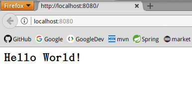
