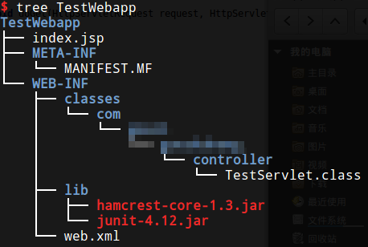

# project视图目录结构

IDE的project视图隐藏了一些不必要的文件夹，只列出和开发相关的文件夹。这里以maven项目为例。

* TestWebapp 项目模块
* .idea 项目的配置信息，不需要修改，使用git时应该加入gitignore
* src 源代码文件夹
  * main
    * java 存放.java源文件，子目录就是java包
    * resources 配置文件，编译后会直接放在工程classpath
    * webapp web相关资源文件，如jsp等
      * META-INF 存放manifest
      * WEB-INF web相关配置文件，主要是web.xml和一些框架的配置文件
  * test 测试代码文件夹
    * java resouces 等
* target 编译输出的文件夹，不应该修改，使用git时应该加入gitignore
* pom.xml maven配置文件
* TestWebapp.iml idea的相关配置文件，使用git时应该加入gitignore
* External Libraries 依赖库

# 编译生成的webapp目录结构

javaweb工程有固定的目录结构，这里是指真正放到tomcat中的目录结构。

* TestWebapp 项目根目录，可以直接存放资源文件如jsp等，也可以建多个文件夹分类存放
* META-INF 存放manifest
* WEB-INF
  * classes 存放编译后的class
  * lib 存放依赖库的jar包
  * web.xml 配置文件
