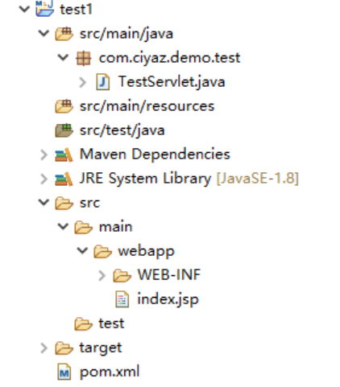
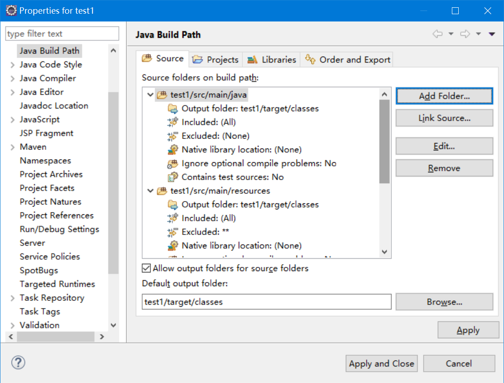

# 项目目录结构

这篇笔记我们简单介绍一下JavaWeb项目的目录结构。

## 目录结构

一个最简单的基于Maven的JavaWeb工程的目录结构大致是这样的，实际上它还是遵循Maven的目录结构。

* `pom.xml`：Maven配置文件
* `src/main/java`：源码，包括我们编写的Servlet、Filter等组件
* `src/main/resources`：配置文件
* `src/test/java`：单元测试源码，不会打包到最终构建结果中
* `src/test/resources`：单元测试使用的配置文件，不会打包到最终构建结果中
* `src/main/webapp`：和web工程相关的资源，如JSP文件等
* `src/main/webapp/WEB-INF`：包括`web.xml`等web配置文件
* `target`：编译和构建输出的目录

## 源码文件夹

实际上，默认使用`maven-archetype-webapp`模板创建的项目可能缺少一些源码文件夹，我们可以手动在Eclipse的`Build Path`中添加。

