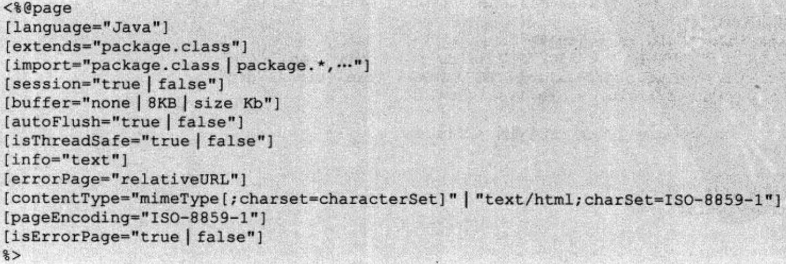

# JSP

网页内容通常是HTML排版的，JavaWeb中最基础的服务端组件是Servlet。然而，直接使用Servlet输出网页内容会给编程造成很大困难，JavaWeb工程通常在JSP中编写布局相关的内容。JSP中也可以包含Java代码，但更一般的情况是使用JSP作为模板实现MVC。

实际上，在Tomcat内部，JSP还是会编译成Servlet，因此其实还是利用Servlet输出JSP的内容。

## 后期补充

时至今日，已经十分不建议再继续学习和使用JSP了。首先，Java适用的领域是「应用软件系统」，基于B/S的软件系统和「网页开发」是两个领域，在这里前后端分离是共识，后端只需要提供Web接口供前端调用即可。即使不打算前后端分离，表现层模板也建议使用Thymeleaf，该模板在静态页面设计阶段比JSP容易调试的多，而且当下最流行的SpringBoot也不再对JSP继续支持了。

## 最简单的例子

```html
<%@ page contentType="text/html;charset=UTF-8"%>
<%--这是注释--%>
<html>
	<head>
		<title>hello</title>
	</head>
	<body>
		<h2>Hello World!</h2>
	</body>
</html>
```

* 第1行是page编译指令，说明这个文件是JSP，语言支持是java
* 第2行是JSP注释
* 接下来就是html的内容，这些内容会输出到浏览器中进行渲染

注：

* JSP注释和HTML注释区别：JSP注释不会从服务器输出，HTML注释输出到浏览器，只是浏览器不渲染HTML注释而已
* JSP里可以写java代码，但现在较少这样做，我们一般遵守MVC分层的结构

## 编译指令

### page



page指令指定了一些jsp的属性，实际上很多属性mvc中通常是由控制器（如servlet）进行处理，因此并不常用。

* language 使用语言，一般无需设置此项
* extends jsp编译得到的class的父类或接口，mvc中jsp不允许写java代码，一般无需设置此项
* import 导入的包，mvc中jsp不允许写java代码，一般无需设置此项
* session 这个jsp是否使用session，mvc中session通常由控制器决定，一般无需设置此项
* buffer 输出缓冲区大小
* autoFlush buffer满后自动刷新输出
* 该jsp信息，可以由getServletInfo()得到
* errorPage jsp出错处理页
* contentType http头信息中的值，文件类型和字符集
* pageEncoding 生成网页的编码字符集
* isErrorPage 该jsp是否是出错处理页

### include

include指令可以将外部文件嵌入当前jsp中。

`<%@include file="xxx"%>`：编译后另一个jsp的内容完全融入当前jsp生成的servlet中，是同一个servlet，而不是请求了两次的html页面嵌入，会导入目标的编译指令。

例子
```html
<%@ page contentType="text/html;charset=UTF-8" language="java" %>
<html>
	<head>
		<title>hello</title>
	</head>
	<body>
		<%@include file="test.jsp"%>
		<h2>Hello World!</h2>
	</body>
</html>
```

在实际开发中，我们经常会把顶部Nav导航条，底部栏等封装到单独的JSP文件，在各处引用。

### taglib

声明使用jsp标签库，我们经常能用到的标签库包括JSP核心标签库（JSTL），Struts2标签库等。其中核心标签库是最常用的，一些页面上的渲染逻辑，如`if`，`foreach`等都需要核心标签库实现。

引入核心标签库：`<%@ taglib prefix="c" uri="http://java.sun.com/jsp/jstl/core" %>`

注意：引入核心标签库需要额外的Maven依赖：

```xml
<dependency>
    <groupId>javax.servlet.jsp.jstl</groupId>
    <artifactId>jstl</artifactId>
    <version>1.2</version>
</dependency>
```

有关标签库的具体使用，在后续章节介绍。

## 动作指令

* jsp:forward 请求转发
* jsp:param 用于传递参数，转发时添加的参数可以被接收
* jsp:include 动态引入，效果同静态引入
* jsp:plugin 下载JavaBean或applet到客户端
* jsp:useBean 创建JavaBean
* jsp:setProperty 设置JavaBean属性
* jsp:getProperty 得到JavaBean属性

注：mvc开发模式下，上面大部分动作指令都没什么用，仅作了解

### jsp:include

动态include，只导入页面的内容，不会导入编译指令，实际上编译后是两个Servlet（内部互相调用），但是输出时是一个页面。

## 9个内置对象

jsp内置对象对应servlet api接口，但是jsp对其进行了默认初始化

* application javax.servlet.ServletContext的实例，该实例代表web应用本身
* config javax.servlet.ServletConfig的实例，代表该jsp的配置信息
* exception java.lang.Throwable的实例，该页面是错误处理页面时才有用，代表其他页面的错误信息
* out javax.servlet.jsp.JspWriter的实例，用于控制jsp的输出流
* page 对应servlet的this，该jsp本身
* pageContext javax.servlet.jsp.PageContext 代表jsp页面上下文，可以访问页面中的共享数据，常用方法有getServletContext()
* request javax.servlet.http.HttpServletRequest 请求对象，封装了很多请求信息
* response javax.servlet.http.HttpServletResponse 封装了响应信息，jsp中很少使用
* session javax.servlet.http.HttpSession 封装session信息

注：application作用域是整个应用，session是一次会话，request是一次请求，page是一个servlet或jsp，这四个对象经常用于存取参数。
