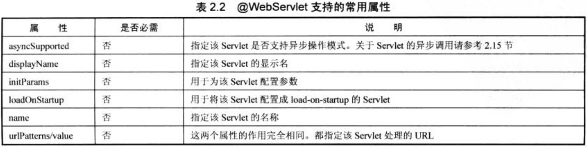

# Servlet

Servlet是JavaEE规范中提供网络服务的最基础的组件。用户浏览器发起的HTTP请求，会交给Servlet进行处理，完成后再把对应的页面或是错误消息返回给用户浏览器。Java应用服务器已经替我们把业务不相关的部分封装好了，我们只要在Servlet中，针对GET，POST等请求编写相应函数内容即可。

除此之外，我们还要知道，JSP经过编译就会生成Servlet。JSP虽然可以可以单独使用，但是通常MVC结构的JavaWeb应用中，使用JSP作为视图，Servlet作为控制器，两者一起结合使用。Servlet处理好请求后，生成页面不方便，因为那样需要把HTML编码到一个字符串变量里，由输出流写出。而JSP如果Java代码和HTML代码混杂，可读性很差，因此通常的做法就是Servlet携带数据把请求转发给JSP处理，JSP负责生成返回给用户的页面。

## Servlet例子

下面代码是一个最简单的Servlet例子，其功能是输出一个信息到HTTP响应体。

```java
package com.ciyaz.demo.test;

import java.io.IOException;
import javax.servlet.ServletException;
import javax.servlet.annotation.WebServlet;
import javax.servlet.http.HttpServlet;
import javax.servlet.http.HttpServletRequest;
import javax.servlet.http.HttpServletResponse;

/**
 * 测试Servlet
 * 
 * @author CiyaZ
 */
@WebServlet(name = "TestServlet", urlPatterns = "/test")
public class TestServlet extends HttpServlet {
	private static final long serialVersionUID = 1L;

	public TestServlet() {
		super();
	}

	@Override
	protected void doGet(HttpServletRequest request, HttpServletResponse response)
			throws ServletException, IOException {
		String msg = "Served at: " + request.getContextPath();
		response.getWriter().append(msg);
	}

	@Override
	protected void doPost(HttpServletRequest request, HttpServletResponse response)
			throws ServletException, IOException {
		doGet(request, response);
	}

}
```

* Servlet的init()和destroy()方法：通常不用管这两个方法，servlet初始化和销毁时这两个方法会被回调
* @WebServlet：是servlet3.0中的新功能注解配置，和在xml中配置等价

## 注解配置

注解配置比较简单易用，通常应该首先考虑。注解的可配置属性如下：



注意：需要在web.xml中指定``metadata-complete="false"``，`@WebServlet`注解才会生效。

## XML配置

尽管注解配置Servlet十分方便，但缺点是配置分散不好管理，实际上XML配置也会经常用到。像SpringMVC，我们没法修改其核心Servlet的代码，因此只能通过XML进行配置。下面是通过XML配置Servlet的例子：

```xml
<servlet>
  <servlet-name>TestServlet</servlet-name>
  <servlet-class>com.ciyaz.controller.TestServlet</servlet-class>
</servlet>
<servlet-mapping>
	<servlet-name>TestServlet</servlet-name>
	<url-pattern>/test</url-pattern>
</servlet-mapping>
```

## servlet生命周期

客户端第一次请求一个Servlet时，该Servlet初始化。如果配置了load-on-startup，则在应用启动时初始化。默认情况下，Servlet是单例的。

1. web服务器实例化servlet
2. 调用servlet的init()初始化servlet
3. servlet处理网络请求
4. 应用关闭时，servlet销毁

## 重要对象

下面介绍一下Servlet相关编程中，常用到的几个对象。

### javax.servlet.http.HttpServletRequest

* Cookie[] getCookies() 获得cookie数组，没有cookie返回null
* String getParameter(String parameterName) 获得请求参数信息
* Map getParameterMap() 获得请求参数信息Map
* String getHeader(String name) 获得请求头信息
* void setCharacterEncoding(String charset) 设置解析请求参数的编码字符集
* void setAttribute(String name, Object o) 设置属性，用于转发到jsp显示
* Object getAttribute(String name) 获得属性，jsp中直接使用EL表达式即可
* HttpSession getSession() 获得session对象

### javax.servlet.http.HttpServletResponse

* void addCookie(Cookie cookie) 添加cookie
* void addHeader(String name, String value) 添加响应头信息
* void sendRedirect(String location) 重定向
* PrintWriter getWriter() 获得输出流

### 其他重要对象

* javax.servlet.http.HttpSession Session对象，用于在一次回话中保存数据
* javax.servlet.http.cookie Cookie对象

## MVC架构介绍

M：模型，指Javabean

V：视图，指jsp

C：控制器，指servlet

在简单的JavaWeb工程中，我们通常使用Servlet作为控制器，使用JSP作为模板。

### MVC实例

user.java
```java
public class User
{
	private String username;
	private int age;

	public String getUsername()
	{
		return username;
	}

	public void setUsername(String username)
	{
		this.username = username;
	}

	public int getAge()
	{
		return age;
	}

	public void setAge(int age)
	{
		this.age = age;
	}
}
```

TestServlet.java
```java
@WebServlet(name = "TestServlet", urlPatterns = "/Test")
public class TestServlet extends HttpServlet
{
	protected void doPost(HttpServletRequest request, HttpServletResponse response) throws ServletException, IOException
	{
		doGet(request, response);
	}

	protected void doGet(HttpServletRequest request, HttpServletResponse response) throws ServletException, IOException
	{
		User user = new User();
		user.setUsername("admin");
		user.setAge(10);

		request.setAttribute("user", user);
		request.getRequestDispatcher("/show.jsp").forward(request, response);
	}
}
```

show.jsp
```html
<%@ page contentType="text/html;charset=UTF-8" language="java" %>
<%@taglib prefix="c" uri="http://java.sun.com/jsp/jstl/core" %>
<html>
<head>
	<title>show domain</title>
</head>
<body>
<p>${user.username}</p>
<p>${user.age}</p>
</body>
</html>
```
