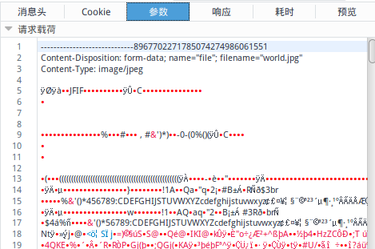

# 文件上传

servlet3.0提供了方便的文件上传处理API。在3.0之前，我们通常使用`commons-fileupload`，处理文件上传。Servlet规范发展到3.0后，参考这个类库制定了文件上传API，Tomcat本身就使用`commons-fileupload`作为其实现。所以我们使用的其实还是同一个东西，只不过不需要再次引入这个依赖库，直接内置了，比较方便。

## Servlet中处理文件上传

例子

index.jsp
```html
<%@ page contentType="text/html;charset=UTF-8" language="java" %>
<%@taglib prefix="c" uri="http://java.sun.com/jsp/jstl/core" %>
<html>
<head>
	<title>file upload demo</title>
</head>
<body>
	<form enctype="multipart/form-data" method="post" action="UploadServlet">
		<input type="file" name="file">
		<input type="submit" value="提交">
	</form>
</body>
</html>
```

注意表单的`enctype`，这个参数是必须的，我们直到`form`的默认`enctype`是`application/x-www-form-urlencoded`，HTTP请求体会组织为类似`key1=value1&key2=value2...`的形式，而`multipart/form-data`则是专门用于使用HTTP传输二进制文件，其格式如下：



我们手动解析这个格式还是比较复杂的，这也是`commons-fileupload`出现的原因。

UploadServlet.java
```java
@MultipartConfig
@WebServlet(name = "UploadServlet", urlPatterns = "/UploadServlet")
public class UploadServlet extends HttpServlet
{
	protected void doPost(HttpServletRequest request, HttpServletResponse response) throws ServletException, IOException
	{
		Part part = request.getPart("file");
		part.write(getServletContext().getRealPath("/uploadfile"));
	}
}
```

注： @MultipartConfig是必须的，没有这个注解就会造成第7行空指针报错。

我们获得的Part对象，就是用户上传的文件。第8行，我们把文件的数据写入了另一个文件。

## 文件上传的最佳实践

首先我们要考虑清楚，我们的用户会上传哪些类型的文件。是头像这种小图片，还是视频这种超大文件。无论何种情况，将二进制文件保存在MySQL中都是极其糟糕的做法，这会严重影响数据库性能。将文件写入服务器文件系统，是解决方案之一。但是分散在文件系统上的文件难以管理，一个文件夹内文件过多，也会影响服务器磁盘的读取性能，因此我们应该精心设计好文件的存储方式，比如按日期建立文件夹存储，文件名为GUID（而且不要忘了GUID分配时的线程安全问题），甚至还要设计专门的缓存。

实际上最简单的解决方案是使用云存储服务器，很多云服务商提供这种存储解决方案，它具有管理方便，性能高度可配置的优势。如果云服务满足不了我们的需求，我们就得自己动手开发专门的存储服务器了，这种情况一般出现在业务规模庞大的大型应用中，以至于存储服务器只是顺便开发的。

## 有关文件的MIME检测

如果允许用户上传任意类型的文件到服务器上是十分危险的，我们需要检测文件的类型，比如只允许用户上传图片，或是只允许用户上传zip格式的压缩包。

通过文件扩展名判断文件类型是绝对不行的，我们应该判断上传文件的二进制格式，通过其特征判断该文件属于哪一类型，这里建议使用Apache Tika，它是一个文件检测和分析工具，支持超过一千种的文件类型（如ppt，xls，pdf等），Tika是Apache Lucene的子项目。

官方网站：[http://tika.apache.org/](http://tika.apache.org/)

例子代码：
```java
public static void main(String[] args) throws Exception {
		File file = new File("E:\\workspace\\temp\\7f2ba118c0929b17399526db728e8223\\90794e3b050f815354e3e29e977a88ab\\e7e9366b4da1c62c0306d15e120f01ad");
		Tika tika = new Tika();
		String e = tika.detect(file);
		System.out.println(e);
}
```

输出：
```
image/png
```

注：那个很长的文件路径是一个图片服务器的工作目录，存储的内容仅以hash命名，而没有文件后缀。
