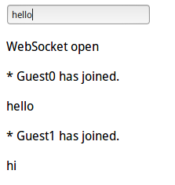

# WebSocket

传统的HTTP协议只能以请求、响应的方式进行浏览器和服务器的通信。WebSocket是html5规范定义的新功能，它能实现浏览器和服务器之间的TCP全双工通信。这种通信方式非常适合聊天室，游戏等即时应用。

JavaEE7规范提供了WebSocketAPI，在Tomcat下使用十分简单，这组API在`javax.websocket.*`下。

## 使用WebSocket

### Maven依赖

首先要添加`websocket`的Maven依赖：

```xml
<dependency>
  <groupId>javax.websocket</groupId>
  <artifactId>javax.websocket-api</artifactId>
  <version>1.0</version>
  <scope>provided</scope>
</dependency>
```

### WebSocket服务端

使用WebSocket，我们的程序必须运行在应用服务器中，使用`@ServerEndpoint(value = path)`注解标注的Java类，提供WebSocket服务。下面是一个聊天室例子：

```java
package com.ciyaz.controller;

import java.io.IOException;
import java.util.Set;
import java.util.concurrent.CopyOnWriteArraySet;
import java.util.concurrent.atomic.AtomicInteger;

import javax.websocket.OnClose;
import javax.websocket.OnError;
import javax.websocket.OnMessage;
import javax.websocket.OnOpen;
import javax.websocket.Session;
import javax.websocket.server.ServerEndpoint;

@ServerEndpoint(value = "/chat")
public class ChatAnnotation
{

	private static final String GUEST_PREFIX = "Guest";
	private static final AtomicInteger connectionIds = new AtomicInteger(0);
	private static final Set<ChatAnnotation> connections = new CopyOnWriteArraySet<>();

	private final String nickname;
	private Session session;

	public ChatAnnotation()
	{
		nickname = GUEST_PREFIX + connectionIds.getAndIncrement();
	}

	@OnOpen
	public void start(Session session)
	{
		this.session = session;
		connections.add(this);
		String message = String.format("* %s %s", nickname, "has joined.");
		broadcast(message);
	}

	@OnClose
	public void end()
	{
		connections.remove(this);
		String message = String.format("* %s %s", nickname, "has disconnected.");
		broadcast(message);
	}

	@OnMessage
	public void incoming(String message)
	{
		broadcast(message);
	}

	@OnError
	public void onError(Throwable t) throws Throwable
	{
		System.out.println("Chat Error: " + t.toString());
	}

	private static void broadcast(String msg)
	{
		for (ChatAnnotation client : connections)
		{
			try
			{
				synchronized (client)
				{
					client.session.getBasicRemote().sendText(msg);
				}
			}
			catch (IOException e)
			{
				System.out.println("Chat Error: Failed to send message to client");
				connections.remove(client);
				try
				{
					client.session.close();
				}
				catch (IOException e1)
				{
					// Ignore
				}
				String message = String.format("* %s %s", client.nickname, "has been disconnected.");
				broadcast(message);
			}
		}
	}
}
```

该例子修改自Tomcat自带的WebSocket例子。该例子代码在`webapps/examples`下。

其中用注解标注了四个方法，分别在用户连接WebSocket，关闭WebSocket，发消息，出错时回调。这里要注意的是，该类是多例的，也就是一个请求会创建一个实例，在新的线程中运行，所以用`static`修饰的`connections`来记录所有的连接。

### WebSocket客户端

客户端代码：

页面
```html
<%@ page contentType="text/html;charset=UTF-8" language="java" %>
<!DOCTYPE html>
<html lang="zh-cmn-Hans">
<head>
	<meta charset="UTF-8">
	<title>WebSocket Example</title>
	<script src="resources/app.js"></script>
</head>
<body>
<div>
	<input type="text" placeholder="输入聊天信息" id="chat_input"/>
	<div id="chat_box"></div>
</div>
</body>
</html>
```

app.js
```javascript
var Chat = {};

window.onload = function()
{
	Chat.socket = new WebSocket('ws://localhost:8080/chat');
	Chat.chatbox = document.getElementById('chat_box');

	Chat.showMessage = function(msg)
	{
		var p = document.createElement('p');
		p.innerText = msg;
		this.chatbox.appendChild(p);
	};

	Chat.sendMessage = function(msg)
	{
		Chat.socket.send(msg);
	};

	Chat.socket.onopen = function()
	{
		Chat.showMessage('WebSocket open');
	};

	Chat.socket.onclose = function()
	{
		Chat.showMessage('WebSocket closed');
	};

	Chat.socket.onmessage = function(sock_msg)
	{
		Chat.showMessage(sock_msg.data);
	};

	document.getElementById('chat_input').addEventListener('keyup', function(event)
	{
		if(event.keyCode === 13)
		{
			var msg = document.getElementById('chat_input').value;
			Chat.sendMessage(msg);
		}
	});
};
```

运行结果


