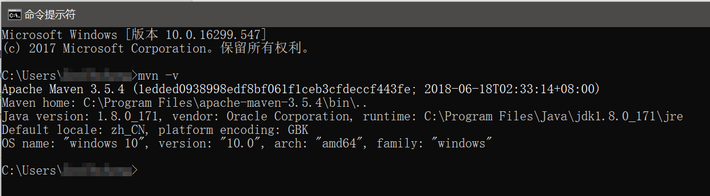

# Maven简介

Maven是一个自动化项目管理和构建工具，在Java应用程序开发中有广泛的应用。如果不使用Maven，在较大的项目开发时，我们会花费大量的时间寻找并下载项目需要的jar包，jar包的版本和兼容性更是一个难以解决的问题，除此之外，编写的项目也是高度依赖于我们所使用的IDE构建配置，这对于团队合作非常不利，Maven就是一个用来解决这些问题的工具。

Gradle是新一代的项目管理和构建工具，Gradle基于Groovy脚本语言能够实现更加灵活的构建配置，Android Studio开发时就默认使用Gradle进行构建。然而实际上，尽管使用Groovy代替XML能够让配置更加简洁和灵活，但是也同样极大的增加了Gradle的学习和使用成本，Gradle并没有取代Maven，而是成为了一个不错的可选方案。

## 安装Maven

Eclipse和Intellij IDEA都内置了Maven，但是内置的Maven不方便我们使用命令行，我们可以自己安装一个，然后在IDE中配置使用我们自己安装的Maven。

下载Maven的压缩包：[http://maven.apache.org/download.cgi](http://maven.apache.org/download.cgi)

解压后需要配置环境变量：

* `MAVEN_HOME`：指向Maven的根目录
* `Path`：指向Maven中的`bin`目录

使用命令`mvn -v`可以测试Maven是否安装成功：



## 用户目录下的.m2

Maven使用过程中，会在用户目录下创建一个`.m2`文件夹，`.m2/repository`其实就是我们的本地仓库，里面存放的就是Maven下载过的各种依赖。配置新项目时，如果我们需要的依赖在本地仓库中已经有了，Maven就不会重新从网络上下载了。

对于Maven插件也是一样的，插件位于`.m2/repository/org/apache/maven/plugins`下。

`.m2/settings.xml`是Maven的全局配置文件，比如配置中央仓库的镜像，或是配置网络代理，都可以写在这个配置文件中。如果这个文件不存在，我们可以从`MAVEN_HOME/conf/settings.xml`拷贝一个放到`.m2`下。

## 配置镜像

由于大陆的国际网络出口带宽较窄，配置一个国内的Maven镜像能够加速Maven依赖的下载。

找到settings.xml里的mirrors标签，添加如下配置。

```xml
<mirrors>
<mirror>
  <id>alimaven</id>
  <name>aliyun maven</name>
  <url>http://maven.aliyun.com/nexus/content/groups/public/</url>
  <mirrorOf>central</mirrorOf>        
</mirror>
</mirrors>
```
