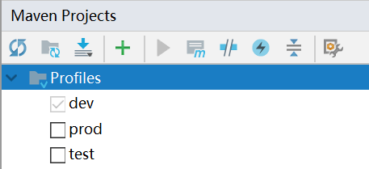

# 根据部署环境自动打包

在企业内部项目中，一般至少有开发、测试、生产三套环境，有些可能有更多。这些不同的环境需要配置不同的数据库服务器，缓存服务器，消息队列，ESB或微服务注册中心等，我们的配置一般都是写在配置文件中的，如果为每个环境打包时都手动修改一下配置文件，这个就太难搞了。即使写多份配置文件，打包时也要在各个地方调整配置文件的指向，手动完成这个工作是非常耗费精力的。

好在Maven能够帮我们实现这个需求，我们只需要指定一个`mvn`命令行参数，自动用对应环境的配置文件打包，大大减少了部署时的步骤。本篇笔记我们就了解一下如何通过`pom.xml`中配置`profile`、`filter`、`resources`实现上述功能。

注：该篇笔记的内容适用于大多数基于Maven的非SpringBoot项目，SpringBoot都继承了`spring-boot-starter-parent`模板，它再次封装了这个功能，使用起来略有不同，具体请参考SpringBoot相关章节。

## 环境准备


我们在`src/main/resources`下存放数据库配置文件，`env`下存放各个环境的配置，`jdbc.properties`将在打包时，自动替换为对应环境的配置。

env/<对应环境>.jdbc.properties
```
jdbc_url=jdbc:mysql://localhost:3306/testdb
jdbc_user=root
jdbc_password=root
```

jdbc.properties
```
jdbc_url=${jdbc_url}
jdbc_user=${jdbc_user}
jdbc_password=${jdbc_password}
```

## 配置profile

Maven中通过profile功能指定不同的部署环境，这里我们定义三个环境和对应的名字：

* 开发环境 `dev`
* 测试环境 `test`
* 生产环境 `prod`

在`pom.xml`中添加配置：

```xml
<profiles>
  <!--开发环境-->
  <profile>
    <id>dev</id>
    <properties>
      <deploy.env>dev</deploy.env>
    </properties>
    <!--指定此环境配置为默认-->
    <activation>
      <activeByDefault>true</activeByDefault>
    </activation>
  </profile>
  <!--测试环境-->
  <profile>
    <id>test</id>
    <properties>
      <deploy.env>test</deploy.env>
    </properties>
  </profile>
  <!--生产环境-->
  <profile>
    <id>prod</id>
    <properties>
      <deploy.env>prod</deploy.env>
    </properties>
  </profile>
</profiles>
```

* `id`：环境的标识，在命令行中指定该参数，会找到对应的配置
* `properties`：该标签中指定在`pom.xml`的其他位置，如何引用环境参数
  * `deploy.env`：定义引用的键
  * `prod`等：定义引用的值，如上定义，`${deploy.env}`所在位置字符串就会被替换为`prod`、`test`等字符串

通过上述指定，我们使用类似`mvn clean package`命令打包时，就可以通过`-P`命令指定一个环境参数，例如：
```
mvn clean package -Pprod
```

指定命令行环境参数后，在Maven配置文件的其他地方，我们就可以用`${deploy.env}`引用该参数了。

## 配置filter和resources

只配置profile是不够的，我们还没有指定`env`中的配置到`jdbc.properties`的替换规则，这需要通过filter指定。

在`pom.xml`中添加配置：

```xml
<filters>
  <filter>src/main/resources/env/${deploy.env}.jdbc.properties</filter>
</filters>
```

我们还需要对一个目录指定开启filter，其配置才会生效。

在`pom.xml`中添加配置：

```xml
<resources>
  <resource>
    <directory>src/main/resources</directory>
    <filtering>true</filtering>
    <!--不需要将env下配置文件打入jar包 -->
    <excludes>
      <exclude>env/</exclude>
    </excludes>
  </resource>
</resources>
```

这个配置理解起来比较难，这里说明一下：

`${deploy.env}`会在打包时被替换为对应环境的参数，例如我们指定`-Pprod`，Maven会通过`profile`配置得知`prod`环境需要将`${deploy.env}`替换为`<deploy.env>`定义的`prod`。

然后，filter配置就会执行，根据`resources`中定义的目录`src/main/resources`，检查该目录下配置文件中，是否有使用`${}`定义的替换配置。`jdbc.properties`中有这样的配置，比如`${jdbc_url}`，那么就用`filter`中指定的`src/main/resources/env/prod.jdbc.properties`中，键为`jdbc_url`的配置对应值进行替换。

我们在`resources`中排除了`env`文件夹中的内容，因为其中的配置只在打包时会用到，运行时是不需要的。如果不做排除是不合理的，那样可能造成管理测试环境的运维人员能够得知生产环境数据库的密码。

## 执行打包命令

在命令行中，我们可以通过`-P`参数指定`profile`中定义的环境`id`。除此之外，在`Intellij IDEA`或`Eclipse`中也可以直接选择一个环境，点击打包按钮时会自动使用对应的环境参数，比较方便。




