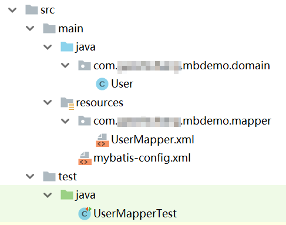

# MyBatis简介

MyBatis是一个持久层ORM框架，它的主要功能是根据参数组装SQL语句，以及将SQL执行的结果映射到Java对象。这和Hibernate不同，Hibernate映射的是Java对象和数据库表，SQL语句则是全自动生成的，因此MyBatis能够使开发人员更灵活的使用SQL，更多的利用数据库的功能，如各种数据库的专有特性等，而又不至于陷入直接使用JDBC的繁琐代码中。

## MyBatis简单使用

下面例子中，我们在一个普通的Maven项目里使用MyBatis框架，并实现一个查询功能，以此了解MyBatis的使用方法。



* User.java
* UserMapper.xml
* mybatis-config.xml
* UserMapperTest.java

首先在Maven的pom.xml中编写配置信息，引入我们需要的依赖，这里我使用的是MySQL数据库，因此引入了`mysql-connector-java`这个包。

```xml
<?xml version="1.0" encoding="UTF-8"?>
<project xmlns="http://maven.apache.org/POM/4.0.0"
         xmlns:xsi="http://www.w3.org/2001/XMLSchema-instance"
         xsi:schemaLocation="http://maven.apache.org/POM/4.0.0 http://maven.apache.org/xsd/maven-4.0.0.xsd">
	<modelVersion>4.0.0</modelVersion>

	<groupId>com.ciyaz.mybatis</groupId>
	<artifactId>mbdemo1</artifactId>
	<version>1.0-SNAPSHOT</version>

	<properties>
		<project.build.sourceEncoding>UTF-8</project.build.sourceEncoding>
		<maven.compiler.source>1.8</maven.compiler.source>
		<maven.compiler.target>1.8</maven.compiler.target>
	</properties>

	<dependencies>
		<dependency>
			<groupId>junit</groupId>
			<artifactId>junit</artifactId>
			<version>4.12</version>
			<scope>test</scope>
		</dependency>
		<dependency>
			<groupId>org.mybatis</groupId>
			<artifactId>mybatis</artifactId>
			<version>3.4.6</version>
		</dependency>
		<dependency>
			<groupId>mysql</groupId>
			<artifactId>mysql-connector-java</artifactId>
			<version>5.1.38</version>
		</dependency>
	</dependencies>

</project>
```

`mybatis-config.xml`是MyBatis的配置文件，具体内容见注释。

```xml
<?xml version="1.0" encoding="utf-8"?>
<!DOCTYPE configuration PUBLIC "-//mybatis.org//DTD Config 3.0//EN"
		"http://mybatis.org/dtd/mybatis-3-config.dtd">
<configuration>

	<!--为类全名定义一个别名方便在Mapper文件中使用-->
	<typeAliases>
		<typeAlias alias="User" type="com.ciyaz.mbdemo.domain.User"/>
	</typeAliases>

	<environments default="development">
		<environment id="development">
			<transactionManager type="JDBC"/>
			<!--使用MyBatis自带的连接池-->
			<dataSource type="POOLED">
				<property name="driver" value="com.mysql.jdbc.Driver"/>
				<property name="url" value="jdbc:mysql://localhost:3306/mbdemo"/>
				<property name="username" value="root"/>
				<property name="password" value="root"/>
			</dataSource>
		</environment>
	</environments>

	<!--映射文件位置-->
	<mappers>
		<mapper resource="com/ciyaz/mbdemo/mapper/UserMapper.xml"/>
	</mappers>

</configuration>
```

数据库对应的建表SQL语句

```sql
create table t_user(
	user_id bigint auto_increment,
	username varchar(255) not null,
	password varchar(255) not null,
	primary key(user_id)
);
```

实体类`User.java`

```java
public class User
{
	private Long id;
	private String username;
	private String password;
...省略getter/setter/toString
```

映射文件`UserMapper.xml`

```xml
<?xml version="1.0" encoding="UTF-8" ?>
<!DOCTYPE mapper
		PUBLIC "-//mybatis.org//DTD Mapper 3.0//EN"
		"http://mybatis.org/dtd/mybatis-3-mapper.dtd">
<mapper namespace="com.ciyaz.mbdemo.mapper.UserMapper">
	<select id="selectAll" resultType="User">
		select id,username,password from t_user
	</select>
</mapper>
```

注意我们这里的数据库字段名和用户实体类对应的字段名是一样的，这保证了Mapper映射文件中，能够不需要其他设置，直接将SQL返回的结果映射到Java对象上（Mapper文件中使用了`resultType`进行指定，`User`是之前配置的`com.ciyaz.mbdemo.domain.User`的别名）。

有关Mapper相关的内容将在后续章节继续详细介绍。

编写单元测试

```java
import com.ciyaz.mbdemo.domain.User;
import org.apache.ibatis.io.Resources;
import org.apache.ibatis.session.SqlSession;
import org.apache.ibatis.session.SqlSessionFactory;
import org.apache.ibatis.session.SqlSessionFactoryBuilder;
import org.junit.BeforeClass;
import org.junit.Test;

import java.io.IOException;
import java.io.Reader;
import java.util.List;

public class UserMapperTest
{
	private static SqlSessionFactory sqlSessionFactory;

	@BeforeClass
	public static void init()
	{
		try
		{
			//加载MyBatis配置文件生成SqlSessionFactory
			Reader reader = Resources.getResourceAsReader("mybatis-config.xml");
			sqlSessionFactory = new SqlSessionFactoryBuilder().build(reader);
			reader.close();
		}
		catch (IOException e)
		{
			e.printStackTrace();
		}
	}

	@Test
	public void testSelectAll()
	{
		//通过SqlSessionFactory获取SqlSession
		SqlSession sqlSession = sqlSessionFactory.openSession();
		//执行Mapper中定义的任务，selectAll是select标签的id
		List<User> userList = sqlSession.selectList("selectAll");
		for(User u : userList)
		{
			System.out.println(u);
		}
		sqlSession.close();
	}
}
```

运行输出：

```
User{id=1, username='root1', password='123456'}
User{id=2, username='root2', password='111111'}
```
