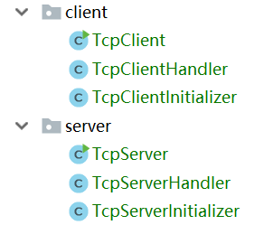
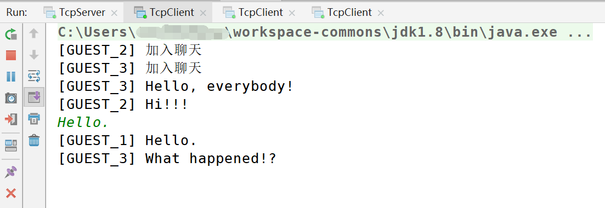

# TCP长连接服务器

本篇笔记介绍如何用Netty开发一个基于TCP的长连接服务器，同时也会涉及客户端部分。通过本文，能够让我们更深入的理解Netty各个组件的对象和线程模型。

## 功能分析

这里我们实现一个聊天室的功能，代码文件如下：



这里简单介绍下，服务端主要考虑的问题。

### 保存客户端连接的集合

聊天室功能肯定需要支持多个用户的，多个客户端连接到服务器上，我们需要一个集合来存储所有的连接对象。JDK提供的并发包中，具有如线程安全集合`CopyOnWriteArraySet`等，适合解决这个问题。

实际上，Netty提供了`ChannelGroup`来专门解决这个问题，这在后文代码中将涉及到。

### 广播消息

一个用户在聊天室中发送了一条消息，其它所有用户都会接收到这条消息，就像“广播”一样。我们可以遍历存储`Channel`的集合来实现。实际上，Netty对此也进行了封装。

### 会话数据

Web开发中一个很重要的概念是会话（Session），我们需要针对一次会话，设置一些例如用户名、权限等信息，解决办法就是给会话设置一个sessionId，然后用它关联一个键值对集合存储结构，基于TCP的长连接开发中，实际上也有类似的功能需求。

我们至少要给一个`Channel`分配一个聊天室中的用户名，好在Netty支持为`Channel`绑定数据，我们不需要手写太复杂的代码。

## 代码实现

### 服务端

TcpServer.java
```java
package com.ciyaz.demo.netty.tcp.server;

import io.netty.bootstrap.ServerBootstrap;
import io.netty.channel.EventLoopGroup;
import io.netty.channel.nio.NioEventLoopGroup;
import io.netty.channel.socket.nio.NioServerSocketChannel;

/**
 * TCP实现聊天室 服务端
 *
 * @author CiyaZ
 */
public class TcpServer {
    public static void main(String[] args) {
        EventLoopGroup parentGroup = new NioEventLoopGroup();
        EventLoopGroup childGroup = new NioEventLoopGroup();
        try {
            ServerBootstrap serverBootstrap = new ServerBootstrap();
            serverBootstrap
                    .group(parentGroup, childGroup)
                    .channel(NioServerSocketChannel.class)
                    .childHandler(new TcpServerInitializer());
            serverBootstrap
                    .bind(8080).sync()
                    .channel().closeFuture().sync();
        } catch (InterruptedException e) {
            e.printStackTrace();
        } finally {
            parentGroup.shutdownGracefully();
            childGroup.shutdownGracefully();
        }
    }
}
```

上面代码中，我们在`8080`端口启动服务器。

TcpServerInitializer.java
```java
package com.ciyaz.demo.netty.tcp.server;

import io.netty.channel.ChannelInitializer;
import io.netty.channel.ChannelPipeline;
import io.netty.channel.socket.SocketChannel;
import io.netty.handler.codec.LengthFieldBasedFrameDecoder;
import io.netty.handler.codec.LengthFieldPrepender;
import io.netty.handler.codec.string.StringDecoder;
import io.netty.handler.codec.string.StringEncoder;
import io.netty.util.CharsetUtil;

/**
 * @author CiyaZ
 */
public class TcpServerInitializer extends ChannelInitializer<SocketChannel> {

    public static final int MAX_FRAME_LENGTH = 1024;
    private TcpServerHandler tcpServerHandler = new TcpServerHandler();

    @Override
    protected void initChannel(SocketChannel ch) throws Exception {
        ChannelPipeline pipeline = ch.pipeline();
        pipeline.addLast(new LengthFieldBasedFrameDecoder(MAX_FRAME_LENGTH, 0, 4, 0, 4));
        pipeline.addLast(new LengthFieldPrepender(4));
        pipeline.addLast(new StringEncoder(CharsetUtil.UTF_8));
        pipeline.addLast(new StringDecoder(CharsetUtil.UTF_8));
        pipeline.addLast(tcpServerHandler);
    }
}
```

这里注意我们设置的处理管线中的几个处理器：

* `LengthFieldBasedFrameDecoder`是一个基于消息长度的消息分割处理器，和前一篇笔记中我们使用基于文本行的消息分割处理器作用相同，只不过基于消息长度进行分割更加通用，它不仅能用于文本消息，也能用于二进制消息，`LengthFieldPrepender`是其对应的编码器，用于为服务端返回的消息加上消息长度头信息。
* `StringEncoder`和`StringDecoder`是文本编解码器，前面已经介绍过了
* `TcpServerHandler`是我们自定义的消息处理器，这里和前一篇笔记不同，之前我们每次初始化通道处理管线时，都`new`了一个自定义的处理器，这里我们却复用了同一个对象。

TcpServerHandler.java
```java
package com.ciyaz.demo.netty.tcp.server;

import io.netty.channel.Channel;
import io.netty.channel.ChannelHandler;
import io.netty.channel.ChannelHandlerContext;
import io.netty.channel.SimpleChannelInboundHandler;
import io.netty.channel.group.ChannelGroup;
import io.netty.channel.group.DefaultChannelGroup;
import io.netty.util.AttributeKey;
import io.netty.util.concurrent.GlobalEventExecutor;

import java.util.concurrent.atomic.AtomicInteger;

/**
 * @author CiyaZ
 */
@ChannelHandler.Sharable
public class TcpServerHandler extends SimpleChannelInboundHandler<String> {

    /**
     * 该属性键用于为Channel绑定一个用户名，作用相当于Web开发中的session
     */
    private AttributeKey<String> attributeKey = AttributeKey.valueOf("username");
    /**
     * 用来给连接命名的原子变量
     */
    private AtomicInteger ids = new AtomicInteger(1);
    /**
     * ChannelGroup其实可以看成包含很多Channel的线程安全Set
     */
    private ChannelGroup channels = new DefaultChannelGroup(GlobalEventExecutor.INSTANCE);

    @Override
    public void channelRegistered(ChannelHandlerContext ctx) throws Exception {
        // 新注册的channel按顺序给它起名为GUEST_1、GUEST_2等
        Channel channel = ctx.channel();
        String username = "GUEST_" + ids.getAndIncrement();
        channel.attr(attributeKey).set(username);
        broadcast("[" + username + "]" + " " + "加入聊天");
        channels.add(channel);
    }

    @Override
    public void channelUnregistered(ChannelHandlerContext ctx) throws Exception {
        // ChannelGroup会自动移除关闭的通道，因此不需要显示调用remove()方法
        Channel channel = ctx.channel();
        String username = channel.attr(attributeKey).get();
        broadcast("[" + username + "]" + " " + "离开了聊天");
    }

    @Override
    protected void channelRead0(ChannelHandlerContext ctx, String msg) throws Exception {
        Channel channel = ctx.channel();
        String username = channel.attr(attributeKey).get();
        broadcast("[" + username + "]" + " " + msg);
    }

    @Override
    public void exceptionCaught(ChannelHandlerContext ctx, Throwable cause) throws Exception {
        cause.printStackTrace();
        ctx.close();
    }

    private void broadcast(String msg) {
        // ChannelGroup实现了广播功能，不需要手动遍历
        channels.writeAndFlush(msg);
    }
}
```

上面代码是我们自定义的消息处理器。

注意`@Sharable`注解，之前提到我们自定义的`Handler`是单例的，Netty中标注了`@Shareable`的`Handler`允许单例多线程调用。如果不加该注解，则不能这样做。

至于为什么我们将它设置为单例，因为我这里希望针对每个调用线程能够共享`AttributeKey`、`AtomicInteger`和`ChannelGroup`。当然，将它们设为`static`，让`Handler`多例，也是完全可以的。这里只是为了演示不同的写法，实际开发中根据具体需求，怎么方便怎么来就可以了。

`AttributeKey`是Netty中，用于和Channel绑定的键值对的键，我们可以在`Channel`上获取该键对应的值，并通过`get()`和`set()`方法进行修改，例如：

```java
channel.attr(attributeKey).set(username);
```

这里，我们将自动生成的一个用户名和Channel关联了起来。

注意`ChannelGroup`这个类，实际上我们完全可以用JDK并发包的集合类，实现`Channel`的全局存储，但Netty已经帮我们实现好了，`ChannelGroup`有这么几个优点：

* 使用执行器，这里我们使用的就是`GlobalEventExecutor`，一个具备任务队列的单线程执行器
* 对广播进行了封装，对关闭的Channel自动移除进行了封装
* 继承`Set`接口，具备Set集合的所有功能（取值、遍历、删除等）

### 客户端

客户端只需要和服务端维持一个`Channel`，因此逻辑比较简单。

TcpClient.java
```java
package com.ciyaz.demo.netty.tcp.client;

import io.netty.bootstrap.Bootstrap;
import io.netty.channel.ChannelFuture;
import io.netty.channel.EventLoopGroup;
import io.netty.channel.nio.NioEventLoopGroup;
import io.netty.channel.socket.nio.NioSocketChannel;

/**
 * TCP实现聊天室 客户端
 *
 * @author CiyaZ
 */
public class TcpClient {
    public static void main(String[] args) {
        EventLoopGroup group = new NioEventLoopGroup();
        try {
            Bootstrap bootstrap = new Bootstrap();
            bootstrap.group(group)
                    .channel(NioSocketChannel.class)
                    .handler(new TcpClientInitializer());
            ChannelFuture future = bootstrap.connect("localhost", 8080).sync();
            future.channel().closeFuture().sync();
        } catch (InterruptedException e) {
            e.printStackTrace();
        } finally {
            group.shutdownGracefully();
        }
    }
}
```

上面代码初始化了一个TCP客户端，并连接位于`8080`端口的服务器。

TcpClientInitializer.java
```java
package com.ciyaz.demo.netty.tcp.client;

import io.netty.channel.ChannelInitializer;
import io.netty.channel.ChannelPipeline;
import io.netty.channel.socket.SocketChannel;
import io.netty.handler.codec.LengthFieldBasedFrameDecoder;
import io.netty.handler.codec.LengthFieldPrepender;
import io.netty.handler.codec.string.StringDecoder;
import io.netty.handler.codec.string.StringEncoder;
import io.netty.util.CharsetUtil;

/**
 * @author CiyaZ
 */
public class TcpClientInitializer extends ChannelInitializer<SocketChannel> {

    public static final int MAX_FRAME_LENGTH = 1024;

    @Override
    protected void initChannel(SocketChannel ch) throws Exception {
        ChannelPipeline pipeline = ch.pipeline();
        pipeline.addLast(new LengthFieldBasedFrameDecoder(MAX_FRAME_LENGTH, 0, 4, 0, 4));
        pipeline.addLast(new LengthFieldPrepender(4));
        pipeline.addLast(new StringEncoder(CharsetUtil.UTF_8));
        pipeline.addLast(new StringDecoder(CharsetUtil.UTF_8));
        pipeline.addLast(new TcpClientHandler());
    }
}
```

上面代码中，处理管线内我们注册了基于长度的消息分割器，以及对应的编码器，此外还有文本编解码器。`TcpClientHandler`是我们自定义的处理器。

TcpClientHandler.java
```java
package com.ciyaz.demo.netty.tcp.client;

import io.netty.channel.Channel;
import io.netty.channel.ChannelHandlerContext;
import io.netty.channel.SimpleChannelInboundHandler;

import java.util.Scanner;

/**
 * 客户端Handler
 * 这里客户端部分实际上只有一个Channel，
 * 对应TcpClientHandler也只有一个
 *
 * @author CiyaZ
 */
public class TcpClientHandler extends SimpleChannelInboundHandler<String> {

    private Channel channel = null;

    protected TcpClientHandler() {
        super();
        // 这里起一个新线程用于接收控制台输入
        // 当输入quit时，关闭channel并退出控制台接收循环
        new Thread(() -> {
            Scanner scanner = new Scanner(System.in);
            while (true) {
                String input = scanner.nextLine();
                if ("quit".equals(input)) {
                    channel.close();
                    break;
                } else {
                    if (channel != null) {
                        channel.writeAndFlush(input);
                    }
                }
            }
        }).start();
    }

    @Override
    public void channelRegistered(ChannelHandlerContext ctx) throws Exception {
        super.channelRegistered(ctx);
        // channel注册上时设置到对象成员变量，供输入接收线程使用
        channel = ctx.channel();
    }

    @Override
    protected void channelRead0(ChannelHandlerContext ctx, String msg) throws Exception {
        // 收到消息打印到控制台上
        System.out.println(msg);
    }

    @Override
    public void exceptionCaught(ChannelHandlerContext ctx, Throwable cause) throws Exception {
        cause.printStackTrace();
        ctx.close();
    }
}
```

上面代码中，不太优雅的地方就是我们又起了一个线程，来循环接收控制台输入，实际开发中很少能遇到这样的需求。但实际上逻辑也很简单，接收到输入，调用`channel.writeAndFlush()`把消息发出去就行了。如果输入的字符串是`quit`，就停止接收循环，关闭`Channel`。这样整个程序就会退出。

## 运行

我们可以启动一个服务端和多个客户端，观察运行效果。


