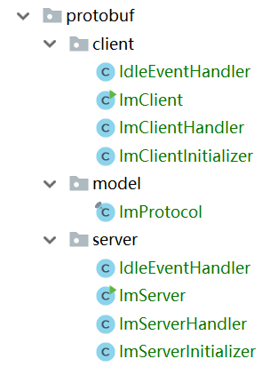

# 基于protobuf设计消息报文

前面代码中基于TCP的服务器，其实我们并没有定义什么协议报文，我们只是单纯的发送接收一些UTF8编码的文本，在实际开发中肯定是不可以这样做的。还是以前面实现IM功能的代码来说，至少我们要定义一种报文格式，把传输客户端消息的包、控制类的包（如心跳包）分开。

当然，我们可以自定义一个报文格式，比如文本第一行代表报文类型，第二行代表实际的消息，行与行之间用`\n\r`分隔，然后编写对应的编解码器，这样就实现了类似HTTP的一种文本协议。但更简单的做法是使用封装好的序列化/反序列化机制来做这件事，Google的Protocol Buffers就是这样的库。

有关Protocol Buffers单独的内容，可以参考`计算机网络原理和协议/开发库/protoBuf`。

## 功能分析

代码结构如下：



这个例子我们编写和之前`TCP长连接服务器`一样的功能，但是基于`protobuf`对自定义的协议报文进行了封装。报文分为两种：

* `TYPE_HEART_BEAT`：心跳包，客户端发送心跳包，服务端回复心跳包
* `TYPE_SMS`：业务逻辑所需的消息包，只有消息包的内容客户端会打印出来

这里我们设计消息格式如下：

im_protocol.proto
```
syntax = "proto3";

message Sms {
    int64 id = 1;
	string content = 2;
    enum SmsType {
        TYPE_HEART_BEAT = 0;
        TYPE_SMS = 1;
    }
    SmsType smsType = 3;
}
```

## protobuf的编解码器

在Netty中使用`protobuf`其实很简单，Netty都帮我们把编解码器、处理粘包的分割器都封装好了，我们直接在客户端和服务端的处理管线中设置即可。

```java
// 基于长度的消息分割
pipeline.addLast(new ProtobufVarint32FrameDecoder());
pipeline.addLast(new ProtobufVarint32LengthFieldPrepender());
// protobuf编解码器
pipeline.addLast(new ProtobufDecoder(ImProtocol.Sms.getDefaultInstance()));
pipeline.addLast(new ProtobufEncoder());
```

注意：之前我们使用过`LengthFieldBasedFrameDecoder`，用来根据消息报文长度进行消息分割。但如果使用`protobuf`，则需要使用`ProtobufVarint32FrameDecoder`。

有了消息编解码器，我们直接读写protobuf的`Message`对象就可以了，非常简单。

## 例子代码

### 服务端代码

ImServer.java
```java
package com.ciyaz.demo.netty.protobuf.server;

import io.netty.bootstrap.ServerBootstrap;
import io.netty.channel.EventLoopGroup;
import io.netty.channel.nio.NioEventLoopGroup;
import io.netty.channel.socket.nio.NioServerSocketChannel;
import org.slf4j.Logger;
import org.slf4j.LoggerFactory;

/**
 * @author CiyaZ
 */
public class ImServer {

    private static Logger logger = LoggerFactory.getLogger(ImServer.class);

    public static void main(String[] args) {
        EventLoopGroup parentGroup = new NioEventLoopGroup();
        EventLoopGroup childGroup = new NioEventLoopGroup();
        try {
            ServerBootstrap serverBootstrap = new ServerBootstrap();
            serverBootstrap
                    .group(parentGroup, childGroup)
                    .channel(NioServerSocketChannel.class)
                    .childHandler(new ImServerInitializer());
            serverBootstrap
                    .bind(8080).sync()
                    .channel().closeFuture().sync();

        } catch (InterruptedException e) {
            e.printStackTrace();
        } finally {
            parentGroup.shutdownGracefully();
            childGroup.shutdownGracefully();
        }
    }
}
```

ImServerInitializer.java
```java
package com.ciyaz.demo.netty.protobuf.server;

import com.ciyaz.demo.netty.protobuf.model.ImProtocol;
import io.netty.channel.ChannelInitializer;
import io.netty.channel.ChannelPipeline;
import io.netty.channel.socket.SocketChannel;
import io.netty.handler.codec.protobuf.ProtobufDecoder;
import io.netty.handler.codec.protobuf.ProtobufEncoder;
import io.netty.handler.codec.protobuf.ProtobufVarint32FrameDecoder;
import io.netty.handler.codec.protobuf.ProtobufVarint32LengthFieldPrepender;
import io.netty.handler.timeout.IdleStateHandler;

import java.util.concurrent.TimeUnit;

/**
 * @author CiyaZ
 */
public class ImServerInitializer extends ChannelInitializer<SocketChannel> {

    private ImServerHandler imServerHandler = new ImServerHandler();

    @Override
    protected void initChannel(SocketChannel ch) throws Exception {
        ChannelPipeline pipeline = ch.pipeline();
        // 基于长度的消息分割
        pipeline.addLast(new ProtobufVarint32FrameDecoder());
        pipeline.addLast(new ProtobufVarint32LengthFieldPrepender());
        // protobuf编解码器
        pipeline.addLast(new ProtobufDecoder(ImProtocol.Sms.getDefaultInstance()));
        pipeline.addLast(new ProtobufEncoder());
        // 心跳超时处理器
        pipeline.addLast(new IdleStateHandler(5, 7, 10, TimeUnit.SECONDS));
        pipeline.addLast(new IdleEventHandler());
        // 业务逻辑处理器
        pipeline.addLast(imServerHandler);
    }
}
```

IdleEventHandler.java
```java
package com.ciyaz.demo.netty.protobuf.server;

import io.netty.channel.ChannelHandlerContext;
import io.netty.channel.ChannelInboundHandlerAdapter;
import io.netty.handler.timeout.IdleStateEvent;
import org.slf4j.Logger;
import org.slf4j.LoggerFactory;

/**
 * @author CiyaZ
 */
public class IdleEventHandler extends ChannelInboundHandlerAdapter {
    private Logger logger = LoggerFactory.getLogger(this.getClass());

    @Override
    public void userEventTriggered(ChannelHandlerContext ctx, Object evt) throws Exception {
        if (evt instanceof IdleStateEvent) {
            IdleStateEvent idleStateEvent = (IdleStateEvent) evt;
            String evtType;
            switch (idleStateEvent.state()) {
                case READER_IDLE:
                    evtType = "读超时";
                    break;
                case WRITER_IDLE:
                    evtType = "写超时";
                    break;
                case ALL_IDLE:
                    evtType = "读写超时";
                    break;
                default:
                    evtType = "未知原因";
                    break;
            }
            logger.info(ctx.channel().remoteAddress() + " " + evtType);
            ctx.channel().close();
        }
    }
}
```

ImServerHandler.java
```java
package com.ciyaz.demo.netty.protobuf.server;

import com.ciyaz.demo.netty.protobuf.model.ImProtocol;
import com.google.protobuf.Message;
import io.netty.channel.Channel;
import io.netty.channel.ChannelHandler;
import io.netty.channel.ChannelHandlerContext;
import io.netty.channel.SimpleChannelInboundHandler;
import io.netty.channel.group.ChannelGroup;
import io.netty.channel.group.DefaultChannelGroup;
import io.netty.util.concurrent.GlobalEventExecutor;
import org.slf4j.Logger;
import org.slf4j.LoggerFactory;

/**
 * @author CiyaZ
 */
@ChannelHandler.Sharable
public class ImServerHandler extends SimpleChannelInboundHandler<Message> {
    /**
     * ChannelGroup其实可以看成包含很多Channel的线程安全Set
     */
    private ChannelGroup channels = new DefaultChannelGroup(GlobalEventExecutor.INSTANCE);

    private Logger logger = LoggerFactory.getLogger(this.getClass());

    @Override
    public void channelRegistered(ChannelHandlerContext ctx) throws Exception {
        broadcast("[" + ctx.channel().remoteAddress() + "] " + " 加入聊天");
        logger.info(ctx.channel().remoteAddress() + " 加入聊天");
        channels.add(ctx.channel());
    }

    @Override
    public void channelUnregistered(ChannelHandlerContext ctx) throws Exception {
        broadcast("[" + ctx.channel().remoteAddress() + "] " + " 退出聊天");
        logger.info(ctx.channel().remoteAddress() + " 退出聊天");
    }

    @Override
    public void exceptionCaught(ChannelHandlerContext ctx, Throwable cause) throws Exception {
        super.exceptionCaught(ctx, cause);
    }

    @Override
    protected void channelRead0(ChannelHandlerContext ctx, Message msg) throws Exception {
        ImProtocol.Sms smsMsg = (ImProtocol.Sms) msg;
        if (smsMsg.getSmsType() == ImProtocol.Sms.SmsType.TYPE_SMS) {
            // 该报文类型是消息，广播消息
            String smsMsgStr = smsMsg.getContent();
            broadcast("[" + ctx.channel().remoteAddress() + "] " + smsMsgStr);
            logger.info(ctx.channel().remoteAddress() + " 收到消息");
        } else if (smsMsg.getSmsType() == ImProtocol.Sms.SmsType.TYPE_HEART_BEAT) {
            // 如果是心跳包，再回复一个心跳包
            echoHeartBeat(ctx.channel());
            logger.info(ctx.channel().remoteAddress() + " 收到心跳");
        }
    }

    /**
     * 向一个Channel回复一个心跳包
     *
     * @param channel 通道
     */
    private void echoHeartBeat(Channel channel) {
        ImProtocol.Sms sms = ImProtocol.Sms.newBuilder()
                .setId(1L)
                .setContent("Heart beat echo!")
                .setSmsType(ImProtocol.Sms.SmsType.TYPE_HEART_BEAT)
                .build();
        channel.writeAndFlush(sms);
    }

    /**
     * 向所有Channel广播消息
     *
     * @param message 消息字符串
     */
    private void broadcast(String message) {
        ImProtocol.Sms sms = ImProtocol.Sms.newBuilder()
                .setId(1L)
                .setContent(message)
                .setSmsType(ImProtocol.Sms.SmsType.TYPE_SMS)
                .build();
        channels.writeAndFlush(sms);
    }
}
```

### 客户端代码

ImClient.java
```java
package com.ciyaz.demo.netty.protobuf.client;

import io.netty.bootstrap.Bootstrap;
import io.netty.channel.ChannelFuture;
import io.netty.channel.EventLoopGroup;
import io.netty.channel.nio.NioEventLoopGroup;
import io.netty.channel.socket.nio.NioSocketChannel;
import io.netty.util.concurrent.DefaultEventExecutor;
import io.netty.util.concurrent.EventExecutor;
import org.slf4j.Logger;
import org.slf4j.LoggerFactory;

import java.util.Scanner;
import java.util.concurrent.ConcurrentLinkedQueue;
import java.util.concurrent.TimeUnit;
import java.util.concurrent.atomic.AtomicBoolean;
import java.util.concurrent.atomic.AtomicInteger;

/**
 * @author CiyaZ
 */
public class ImClient {

    private static Logger logger = LoggerFactory.getLogger(ImClient.class);

    public static final String HOST = "localhost";
    public static final int PORT = 8080;

    /**
     * 重试次数
     */
    public static AtomicInteger retries = new AtomicInteger(1);
    /**
     * 最大重试次数
     */
    public static final int MAX_RETRIES = 3;
    /**
     * 是否已连接
     */
    public static AtomicBoolean connected = new AtomicBoolean(false);

    /**
     * 用来接受输入，供子线程读取
     */
    public static final ConcurrentLinkedQueue<String> MSG_QUEUE = new ConcurrentLinkedQueue<>();

    public static void main(String[] args) {
        // 这里起一个新线程用于接收控制台输入
        // 当输入quit时，关闭channel并退出控制台接收循环
        // 和之前不同，这里创建线程的方式改为Executor，而不是手动new
        EventExecutor scannerTask = new DefaultEventExecutor();
        scannerTask.schedule(() -> {
            Scanner scanner = new Scanner(System.in);
            logger.info("Scanner线程已初始化");
            while (true) {
                String input = scanner.nextLine();
                ImClient.MSG_QUEUE.add(input);
            }
        }, 0, TimeUnit.SECONDS);
        connect();
    }

    public static void connect() {
        EventLoopGroup group = new NioEventLoopGroup();
        try {
            Bootstrap bootstrap = new Bootstrap();
            bootstrap.group(group)
                    .channel(NioSocketChannel.class)
                    .handler(new ImClientInitializer());
            ChannelFuture future = bootstrap.connect(HOST, PORT);
            future.addListener(future1 -> {
                if (future.isSuccess()) {
                    connected.set(true);
                    retries.set(1);
                    logger.info("重连成功！");
                } else {
                    connected.set(false);
                    logger.info("重连出错：" + future1.cause().getMessage());
                }
            });
            future.channel().closeFuture().sync();

        } catch (InterruptedException e) {
            e.printStackTrace();
        } finally {
            group.shutdownGracefully();
        }

        // 进入断线监控循环
        while (true) {
            try {
                Thread.sleep(5000);
            } catch (InterruptedException e) {
                e.printStackTrace();
            }
            if (!connected.get() && retries.getAndIncrement() <= MAX_RETRIES) {
                // 断线，停止监控循环，重新connect次
                logger.info("第" + (retries.get() - 1) + "次重试...");
                connect();
                break;
            } else if(retries.get() > MAX_RETRIES) {
                logger.info("不行了。。。");
                System.exit(-1);
            }
        }
    }
}
```

ImClientInitializer.java
```java
package com.ciyaz.demo.netty.protobuf.client;

import com.ciyaz.demo.netty.protobuf.model.ImProtocol;
import io.netty.channel.ChannelInitializer;
import io.netty.channel.ChannelPipeline;
import io.netty.channel.socket.SocketChannel;
import io.netty.handler.codec.protobuf.ProtobufDecoder;
import io.netty.handler.codec.protobuf.ProtobufEncoder;
import io.netty.handler.codec.protobuf.ProtobufVarint32FrameDecoder;
import io.netty.handler.codec.protobuf.ProtobufVarint32LengthFieldPrepender;
import io.netty.handler.timeout.IdleStateHandler;

import java.util.concurrent.TimeUnit;

/**
 * @author CiyaZ
 */
public class ImClientInitializer extends ChannelInitializer<SocketChannel> {

    @Override
    protected void initChannel(SocketChannel ch) throws Exception {
        ChannelPipeline pipeline = ch.pipeline();
        // 基于长度的消息分割
        pipeline.addLast(new ProtobufVarint32FrameDecoder());
        pipeline.addLast(new ProtobufVarint32LengthFieldPrepender());
        // protobuf编解码器
        pipeline.addLast(new ProtobufDecoder(ImProtocol.Sms.getDefaultInstance()));
        pipeline.addLast(new ProtobufEncoder());
        // 心跳超时处理器
        pipeline.addLast(new IdleStateHandler(5, 7, 10, TimeUnit.SECONDS));
        pipeline.addLast(new IdleEventHandler());
        // 业务逻辑处理器
        pipeline.addLast(new ImClientHandler());
    }
}
```

IdleEventHandler.java
```java
package com.ciyaz.demo.netty.protobuf.client;

import io.netty.channel.ChannelHandlerContext;
import io.netty.channel.ChannelInboundHandlerAdapter;
import io.netty.handler.timeout.IdleStateEvent;
import org.slf4j.Logger;
import org.slf4j.LoggerFactory;

/**
 * @author CiyaZ
 */
public class IdleEventHandler extends ChannelInboundHandlerAdapter {
    private Logger logger = LoggerFactory.getLogger(this.getClass());

    @Override
    public void userEventTriggered(ChannelHandlerContext ctx, Object evt) throws Exception {
        if (evt instanceof IdleStateEvent) {
            IdleStateEvent idleStateEvent = (IdleStateEvent) evt;
            String evtType;
            switch (idleStateEvent.state()) {
                case READER_IDLE:
                    evtType = "读超时";
                    break;
                case WRITER_IDLE:
                    evtType = "写超时";
                    break;
                case ALL_IDLE:
                    evtType = "读写超时";
                    break;
                default:
                    evtType = "未知原因";
                    break;
            }
            logger.info("客户端心跳超时 " + evtType);
            ctx.channel().close();
        }
    }
}
```

ImClientHandler.java
```java
package com.ciyaz.demo.netty.protobuf.client;

import com.ciyaz.demo.netty.protobuf.model.ImProtocol;
import com.google.protobuf.Message;
import io.netty.channel.Channel;
import io.netty.channel.ChannelHandlerContext;
import io.netty.channel.SimpleChannelInboundHandler;
import io.netty.util.concurrent.DefaultEventExecutor;
import io.netty.util.concurrent.EventExecutor;
import org.slf4j.Logger;
import org.slf4j.LoggerFactory;

import java.util.concurrent.TimeUnit;

/**
 * @author CiyaZ
 */
public class ImClientHandler extends SimpleChannelInboundHandler<Message> {

    private Logger logger = LoggerFactory.getLogger(this.getClass());

    @Override
    public void channelRegistered(ChannelHandlerContext ctx) throws Exception {
        Channel channel = ctx.channel();
        logger.info("通道已注册");

        // 发送心跳
        channel.eventLoop().scheduleAtFixedRate(() -> {
            if (channel.isActive()) {
                // 通道仍连通，发送心跳
                ImProtocol.Sms sms = ImProtocol.Sms.newBuilder()
                        .setId(1L)
                        .setContent("Heart beat!")
                        .setSmsType(ImProtocol.Sms.SmsType.TYPE_HEART_BEAT)
                        .build();
                channel.writeAndFlush(sms);
            }
        }, 1, 1, TimeUnit.SECONDS);

        // 起个新线程，读取队列中待发送的消息
        EventExecutor msgReadTask = new DefaultEventExecutor();
        msgReadTask.scheduleAtFixedRate(() -> {
            String msg = ImClient.MSG_QUEUE.poll();

            if (!channel.isActive()) {
                msgReadTask.shutdownGracefully();
            }

            if ("quit".equals(msg)) {
                channel.close();
                logger.info("终止程序");
                System.exit(0);
            } else {
                if (channel.isActive() && msg != null) {
                    sendSms(channel, msg);
                }
            }
        }, 100, 100, TimeUnit.MILLISECONDS);
    }

    @Override
    public void channelUnregistered(ChannelHandlerContext ctx) throws Exception {
        logger.info("通道已注销");
        ImClient.connected.set(false);
    }

    @Override
    protected void channelRead0(ChannelHandlerContext ctx, Message msg) throws Exception {
        ImProtocol.Sms smsMsg = (ImProtocol.Sms) msg;

        if (smsMsg.getSmsType() == ImProtocol.Sms.SmsType.TYPE_SMS) {
            System.out.println(smsMsg.getContent());
        }
    }

    private void sendSms(Channel channel, String message) {
        ImProtocol.Sms sms = ImProtocol.Sms.newBuilder()
                .setId(1L)
                .setContent(message)
                .setSmsType(ImProtocol.Sms.SmsType.TYPE_SMS)
                .build();
        channel.writeAndFlush(sms);
    }
}
```
