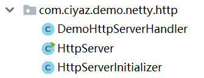
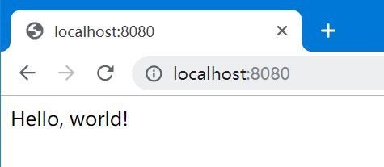

# Netty入门简介


Netty是一个基于NIO的异步事件驱动的网络编程框架，它基本对所有常见的网络协议都进行了封装，而且性能较好，我们一般基于Netty来开发TCP、UDP、HTTP、WebSocket、RTSP等协议的高性能服务端程序。

## Netty的适用场景

如果学习过Java的Socket，或Unix环境C语言的Socket网络编程，我们就会意识到，直接使用套接字接口进行服务端网络编程是比较繁琐的。例如编写一个基于TCP的服务端应用程序，我们要处理的不仅仅是从流中读数据、写数据那么简单，并发处理、线程调度、协议解析、报文编解码都要手写，即使是老手也要花不少精力去处理这些和业务逻辑不太相关的代码，而且还很容易出bug！

而Netty的意义就在于，框架对很多常用的代码逻辑进行了封装，我们按照一个“模板”把各个组件、工具类配置好，它就能良好的工作了。

Netty几乎适用于除Web外（毕竟基于Servlet的技术还是远比Netty方便的），所有和网络相关的编程工作，包括游戏服务端，流媒体服务端等等。

## 引入Netty依赖

这里我们使用Maven进行依赖和工程构建配置管理，Netty各个功能都封装了不同的包目录，我们可以直接引用一个`netty-all`依赖把所有功能引入：

```xml
<dependency>
    <groupId>io.netty</groupId>
    <artifactId>netty-all</artifactId>
    <version>4.1.38.Final</version>
</dependency>
```

注：关于Netty版本，Netty有`3`，`4`，`4.1`这三个版本分支，目前大部分都是使用的`4.1`版本，曾经出现过`Netty5`，但是该版本因为种种原因很快就被废弃了（不确定未来是否还会有Netty5、Netty6）。这些版本的API都不一样，因此网上的代码千奇百怪，确实给我们的学习增加了不小的难度。

## Hello World

这里我们使用Netty编写一个基于HTTP的服务端程序，使用浏览器访问，返回一个包含`Hello, world!`字符串的HTML。我们可以和基于Servlet的代码、基于Socket（和NIO）的代码进行对比学习。创建的3个Java文件如下：



HttpServer.java
```java
package com.ciyaz.demo.netty.http;

import io.netty.bootstrap.ServerBootstrap;
import io.netty.channel.EventLoopGroup;
import io.netty.channel.nio.NioEventLoopGroup;
import io.netty.channel.socket.nio.NioServerSocketChannel;

/**
 * 启动服务器
 *
 * @author CiyaZ
 */
public class HttpServer {
    public static void main(String[] args) {

        // 主事件循环组，负责接受请求并分派给从事件循环组
        EventLoopGroup parentGroup = new NioEventLoopGroup();
        // 从事件循环组
        EventLoopGroup childGroup = new NioEventLoopGroup();

        try {
            // 服务器启动
            ServerBootstrap serverBootstrap = new ServerBootstrap();
            serverBootstrap
                    // 配置两个事件循环组
                    .group(parentGroup, childGroup)
                    // 配置NioServerSocketChannel
                    .channel(NioServerSocketChannel.class)
                    // 注册自定义处理器
                    .childHandler(new HttpServerInitializer());
            serverBootstrap
                    // 尝试获取异步通知并阻塞等待
                    .bind(8080).sync()
                    .channel().closeFuture().sync();
        } catch (InterruptedException e) {
            e.printStackTrace();
        } finally {
            parentGroup.shutdownGracefully();
            childGroup.shutdownGracefully();
        }
    }
}
```

上面代码包含我们程序的入口函数，其功能就是初始化服务端程序，具体每一步的作用参考代码注释和API文档。虽然看似很复杂，但是基本上所有基于Netty的应用程序，其写法思路都和上面类似。

HttpServerInitializer.java
```java
package com.ciyaz.demo.netty.http;

import io.netty.channel.ChannelInitializer;
import io.netty.channel.ChannelPipeline;
import io.netty.channel.socket.SocketChannel;
import io.netty.handler.codec.http.HttpServerCodec;

/**
 * 初始化服务器
 *
 * @author CiyaZ
 */
public class HttpServerInitializer extends ChannelInitializer<SocketChannel> {
    @Override
    protected void initChannel(SocketChannel socketChannel) throws Exception {
        // 处理管道
        ChannelPipeline pipeline = socketChannel.pipeline();
        // HTTP协议请求响应的编解码处理器
        pipeline.addLast(new HttpServerCodec());
        // 自定义的处理器
        pipeline.addLast(new DemoHttpServerHandler());
    }
}
```

`ChannelInitializer`实现了`ChannelHandler`，代码中我们其实做的就是配置了一个处理管道。由于我们要编写一个基于HTTP的服务端程序，因此引入了内置的`HttpServerCodec`组件，管道末尾是我们自己的处理器组件。

DemoHttpServerHandler.java
```java
package com.ciyaz.demo.netty.http;

import io.netty.buffer.ByteBuf;
import io.netty.buffer.Unpooled;
import io.netty.channel.ChannelHandlerContext;
import io.netty.channel.SimpleChannelInboundHandler;
import io.netty.handler.codec.http.*;
import io.netty.util.CharsetUtil;

/**
 * 自定义处理器
 *
 * @author CiyaZ
 */
public class DemoHttpServerHandler extends SimpleChannelInboundHandler<HttpObject> {
    /**
     * 该方法会在收到请求时回调
     */
    @Override
    protected void channelRead0(ChannelHandlerContext channelHandlerContext, HttpObject httpObject) throws Exception {
        if (httpObject instanceof HttpRequest) {
            // 创建一个包含返回数据的ByteBuf缓冲区作为HTTP响应体
            ByteBuf content = Unpooled.copiedBuffer("<p>Hello, world!</p>", CharsetUtil.UTF_8);
            // HTTP响应对象
            FullHttpResponse response = new DefaultFullHttpResponse(HttpVersion.HTTP_1_1, HttpResponseStatus.OK, content);
            response.headers().set(HttpHeaderNames.CONTENT_TYPE, "text/html");
            response.headers().set(HttpHeaderNames.CONTENT_LENGTH, content.readableBytes());
            // 将所有响应数据写入并冲刷缓冲区
            channelHandlerContext.writeAndFlush(response);
        }
    }
}
```

上面代码就是我们真正自定义的HTTP请求处理器了，注意类继承的`SimpleChannelInboundHandler`带有一个泛型`HttpObject`，这样配置，只有HTTP相关的报文才会回调`channelRead0`。

至于`channelRead0`方法（尽管它的名字比较奇怪），我们自定义的处理逻辑很简单，无论请求是什么，都给返回一个`<p>Hello, world!</p>`，稍显复杂的就是响应的各种配置，比如响应体字符编码，响应头设置等。方法最后，我们把HTTP响应对象写入输出网络缓冲区。

我们可以用浏览器访问：



## 总结

上面例子代码其实比较复杂，但如果你曾经有闲得无聊用Java或C手写一个HTTP服务器的经历，大致就能体会到使用Netty的好处。

仅以HTTP部分为例，Netty不仅封装了从Socket读取、写入的代码，也封装了事件循环、HTTP报文解析等功能，这些功能全靠手写真的很繁琐（尤其是多线程编程难调试，且很容易出bug）。但你可能会说，用基于Servlet的技术不是简单的多吗？毕竟上面只是一个简单直观的例子，Netty真正发挥作用的，远不止HTTP协议这一小部分。
