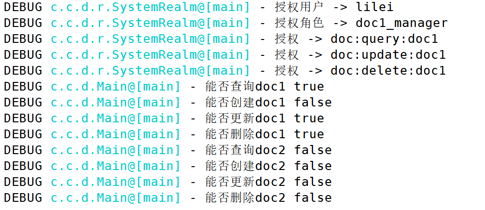

# Realm安全信息域

`Realm`这个词外行可能比较难理解，其实说白了就是一组用户和对应的授权信息，它用来访问一组特定的资源。在Shiro中，Realm组件用来给框架从数据源加载这些数据信息，我们当然也可以编写多个Realm。

## 编写Realm

这里我们编写一个最简单的认证Realm实现用户登录，入口类还是沿用前一篇笔记的`Main.java`。

SystemRealm.java
```java
package com.ciyaz.demo.realm;

import lombok.extern.slf4j.Slf4j;
import org.apache.shiro.authc.*;
import org.apache.shiro.authz.AuthorizationInfo;
import org.apache.shiro.authz.SimpleAuthorizationInfo;
import org.apache.shiro.realm.AuthorizingRealm;
import org.apache.shiro.subject.PrincipalCollection;

import java.util.HashSet;
import java.util.Set;

/**
 * @author CiyaZ
 */
@Slf4j
public class SystemRealm extends AuthorizingRealm
{

	/**
	 * 该方法用于查询用户的授权信息
	 *
	 * @param principals 用户名
	 * @return 授权信息
	 */
	@Override
	protected AuthorizationInfo doGetAuthorizationInfo(PrincipalCollection principals)
	{
		String username = (String) getAvailablePrincipal(principals);

		log.debug("授权用户 -> " + username);
		log.debug("授权角色 -> doc1_manager");
		log.debug("授权 -> doc:query:doc1");
		log.debug("授权 -> doc:update:doc1");
		log.debug("授权 -> doc:delete:doc1");

		// 假设这里查询了数据库，获得了一些权限信息
		SimpleAuthorizationInfo info = new SimpleAuthorizationInfo();
		Set<String> perms = new HashSet<>();
		perms.add("doc:query:doc1");
		perms.add("doc:update:doc1");
		perms.add("doc:delete:doc1");
		info.setStringPermissions(perms);
		Set<String> roles = new HashSet<>();
		roles.add("doc1_manager");
		info.setRoles(roles);

		return info;
	}

	/**
	 * 该方法用户身份认证，输入用户名，返回认证信息
	 *
	 * @param token 包含登录用户名和凭证
	 * @return 认证信息
	 * @throws AuthenticationException 登录出错状况
	 */
	@Override
	protected AuthenticationInfo doGetAuthenticationInfo(AuthenticationToken token) throws AuthenticationException
	{
		String username = (String) token.getPrincipal();
		String password = new String((char[]) token.getCredentials());

		log.debug("认证用户 -> " + username);
		log.debug("认证密码 -> " + password);

		// 假设这里查询了数据库，出现了可能的异常情况
//		throw new UnknownAccountException();
//		throw new IncorrectCredentialsException();

		return new SimpleAuthenticationInfo(username, password, getName());
	}
}
```

虽然代码很长，但其实非常简单，两个函数分别用于加载认证信息和授权信息，我们这里没有实际查询数据库，而是简单的用Java代码模拟了几个数据插入，作用和之前我们使用`ini`文件定义认证和授权信息差不多。

## 加载Realm

我们编写好Realm，Shiro框架还不知道如何从该Realm中读取数据，这可以在`ini`文件中配置。

shiro.ini
```ini
SystemRealm = com.ciyaz.demo.realm.SystemRealm
securityManager.realms = $SystemRealm
```

## 运行

使用前一篇笔记中提供的`main()`函数运行即可。



## 使用多个Realm

实际上，Realm是可以有多个的，比如一个用户的认证信息在`Realm1`中存在，但在`Realm2`中不存在，那么该用户能否认证成功呢？这需要根据具体业务场景决定，配置多个Realm需要用到`Authenticator`，并指定一个策略。

```ini
Realm1 = com.ciyaz.demo.realm.Realm1
Realm2 = com.ciyaz.demo.realm.Realm2
authenticator = org.apache.shiro.authc.pam.ModularRealmAuthenticator
strategy = org.apache.shiro.authc.pam.AtLeastOneSuccessfulStrategy
authenticator.authenticationStrategy = $strategy
authenticator.realms=$Realm2,$Realm1
securityManager.authenticator = $authenticator
```

上面配置比较复杂，我们指定了两个`Realm`，并将两个Realm，以及多域规则注册到`authenticator`，最后将`authenticator`指定给`securityManager`。

`ModularRealmAuthenticator`的多域认证规则有三种：

1. AtLeastOneSuccessfulStrategy：默认，至少有一个域认证成功
2. FirstSuccessfulStrategy：第一个域认证成功，后面不执行
3. AllSucessfulStrategy：全部域认证成功

## 内置Realm

之前我们继承`AuthorizingRealm`实现了一个自己的Realm，Shiro中其实有一些内置的已经实现好的Realm，其中比较常用的就是`IniRealm`和`JdbcRealm`。

例如`JdbcRealm`，我们对其定义好密码匹配规则（散列算法，盐值），查询SQL语句等参数，它就可以自动工作了，但这些内置Realm局限性很大，已经不太符合现代企业级项目的要求了，我不喜欢这种方式，这里就不多做介绍了。
