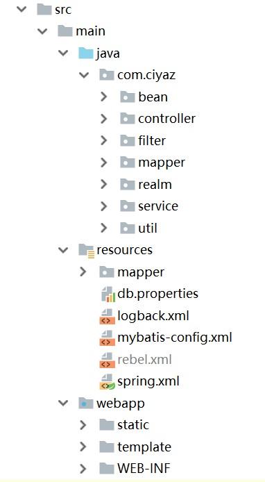

# Spring整合实例

这篇笔记介绍点实际的内容，这里我们在一个SSM工程中整合Shiro，通过查询数据库加载认证、鉴权信息，以及登出系统。使用的框架和库包括：

* JDK8/Tomcat9
* Spring5/SpringMVC
* Mybatis
* Thymeleaf
* Slf4j/Logback
* HikariCP/MySQL
* Lombok

前面说过，Shiro中有很多鸡肋功能（包括那种已经过时的开发模式），我这里只是最轻度的进行整合，尽量避免被Shiro这个框架给限制住。



由于文件、代码较多，不可能全部发上来，这里只挑重点介绍，完整例子工程放在`git@osc`上了。SSM工程我也不会从头搭建，我这里是直接使用自己抽取的Archetype创建的项目。

## 加入Maven依赖

Shiro的依赖我们除了需要`shiro-core`，还需要`shiro-web`和`shiro-spring`，其中包括Shiro的过滤器，以及和Spring整合的组件。

```xml
<dependency>
  <groupId>org.apache.shiro</groupId>
  <artifactId>shiro-core</artifactId>
  <version>${shiro.version}</version>
</dependency>
<dependency>
  <groupId>org.apache.shiro</groupId>
  <artifactId>shiro-web</artifactId>
  <version>${shiro.version}</version>
</dependency>
<dependency>
  <groupId>org.apache.shiro</groupId>
  <artifactId>shiro-spring</artifactId>
  <version>${shiro.version}</version>
</dependency>
```

## web.xml

Shiro的过滤器需要在Spring配置文件中装配，因此在`web.xml`中，使用`DelegatingFilterProxy`进行配置。

```xml
<!-- shiro filter -->
<filter>
  <filter-name>shiroFilter</filter-name>
  <filter-class>org.springframework.web.filter.DelegatingFilterProxy</filter-class>
  <init-param>
    <!-- 将生命周期交由Spring管理 -->
    <param-name>targetFilterLifecycle</param-name>
    <param-value>true</param-value>
  </init-param>
</filter>
<filter-mapping>
  <filter-name>shiroFilter</filter-name>
  <url-pattern>/*</url-pattern>
</filter-mapping>
```

注：`filter-name`要和Spring配置文件中装配的Bean对应。

## Spring配置文件

```xml
<!-- securityManager配置 -->
<bean id="securityManager" class="org.apache.shiro.web.mgt.DefaultWebSecurityManager">
  <!-- 我们自定义的Realm -->
  <property name="realm" ref="systemRealm"/>
</bean>

<!-- 自定义Realm -->
<bean id="systemRealm" class="com.ciyaz.realm.SystemRealm"/>

<!-- 自定义异常处理 -->
<bean class="com.ciyaz.realm.SystemExceptionResolver" />

<!-- Shiro过滤器配置 -->
<bean id="shiroFilter" class="org.apache.shiro.spring.web.ShiroFilterFactoryBean">
  <property name="securityManager" ref="securityManager"/>
  <!-- 登录页面地址 -->
  <property name="loginUrl" value="/auth/login"/>
  <!-- 拦截路径 -->
  <property name="filterChainDefinitions" value="/admin/**=authc"/>
</bean>

<!-- 开启Shiro注解 -->
<bean id="lifecycleBeanPostProcessor" class="org.apache.shiro.spring.LifecycleBeanPostProcessor"/>
<bean class="org.springframework.aop.framework.autoproxy.DefaultAdvisorAutoProxyCreator"
      depends-on="lifecycleBeanPostProcessor">
  <property name="proxyTargetClass" value="true"/>
</bean>
<bean class="org.apache.shiro.spring.security.interceptor.AuthorizationAttributeSourceAdvisor">
  <property name="securityManager" ref="securityManager"/>
</bean>
```

`securityManager`之前已经介绍过，它需要加载`Realm`配置来初始化，之前我们在普通Java工程是使用Shiro提供的工厂方法初始化的，这里只不过改为了使用Spring装配。

`systemRealm`使我们自定义的Realm。前面介绍过，Shiro中有一些内置的Realm，比如`JdbcRealm`，但我总觉得把它们用好的成本比自己写一个Realm还高，这里我们就使用自己的Realm。

`SystemExceptionResolver`是我们自定义的一个异常处理器，我们知道Shiro在认证和鉴权时，任何不符合条件的状况都是通过抛运行时异常来完成的，Shiro的过滤器抛出的异常需要一个组件来统一接收处理，该异常处理器主要就是用来控制Shiro过滤器抛出的未认证和未授权异常的。

Shiro过滤器也是一个Bean，其中需要指定登录地址（供未认证时跳转）以及拦截路径，`/admin/**=authc`表示`/admin/**`路径都要进行认证过滤，不符合条件的将不予显示，并跳转到登录页。

后两个Bean用来开启Shiro注解。

## Realm

```java
package com.ciyaz.realm;

import com.ciyaz.bean.Perm;
import com.ciyaz.bean.Role;
import com.ciyaz.bean.RolesAndPerms;
import com.ciyaz.bean.User;
import com.ciyaz.service.AuthService;
import lombok.extern.slf4j.Slf4j;
import org.apache.commons.codec.digest.DigestUtils;
import org.apache.shiro.authc.*;
import org.apache.shiro.authz.AuthorizationInfo;
import org.apache.shiro.authz.SimpleAuthorizationInfo;
import org.apache.shiro.realm.AuthorizingRealm;
import org.apache.shiro.subject.PrincipalCollection;
import org.springframework.beans.factory.annotation.Autowired;

/**
 * @author CiyaZ
 */
@Slf4j
public class SystemRealm extends AuthorizingRealm
{
	@Autowired
	private AuthService authService;

	private static final String SALT = "qqqwwweee";

	/**
	 * 鉴权信息查询
	 *
	 * @param principals 鉴权原则
	 * @return 鉴权信息
	 */
	@Override
	protected AuthorizationInfo doGetAuthorizationInfo(PrincipalCollection principals)
	{
		Integer userId = (Integer) getAvailablePrincipal(principals);
		log.debug("鉴权用户ID -> " + userId);
		RolesAndPerms rolesAndPerms = authService.getAuthorizationInfoByUsername(userId);
		SimpleAuthorizationInfo info = new SimpleAuthorizationInfo();
		for (Role role : rolesAndPerms.getRoleSet())
		{
			String roleName = role.getRoleName();
			log.debug("鉴权角色 -> " + roleName);
			info.addRole(roleName);
		}
		for (Perm perm : rolesAndPerms.getPermSet())
		{
			String permName = perm.getPermName();
			log.debug("鉴权权限 -> " + permName);
			info.addStringPermission(permName);
		}
		return info;
	}

	/**
	 * 认证信息查询
	 *
	 * @param token 用户名密码
	 * @return 认证信息
	 * @throws AuthenticationException 认证失败
	 */
	@Override
	protected AuthenticationInfo doGetAuthenticationInfo(AuthenticationToken token) throws AuthenticationException
	{
		String username = (String) token.getPrincipal();
		String password = new String((char[]) token.getCredentials());

		log.debug("认证用户 -> " + username);
		log.debug("认证密码 -> " + password);

		// 认证
		User realUser = authService.getUserByUsername(username);
		if (realUser == null)
		{
			throw new UnknownAccountException();
		}
		String passEnc = DigestUtils.sha256Hex(password + SALT);
		if (!passEnc.equals(realUser.getPassword()))
		{
			throw new IncorrectCredentialsException();
		}
		// 认证成功
		log.debug("认证成功");
		return new SimpleAuthenticationInfo(realUser.getUserId(), password, getName());
	}
}
```

代码虽然多，但是很容易理解，注意下`AuthService`，这个是后台的业务逻辑层接口，底层调用MyBatis实现，由于我们已经把该Realm在Spring配置文件中装配，因此这里能直接从Spring应用上下文中获取`AuthService`，这里就不多做介绍了。

## ExceptionResolver

```java
package com.ciyaz.realm;

import org.apache.shiro.authz.UnauthenticatedException;
import org.apache.shiro.authz.UnauthorizedException;
import org.springframework.web.servlet.ModelAndView;
import org.springframework.web.servlet.handler.SimpleMappingExceptionResolver;

import javax.servlet.http.HttpServletRequest;
import javax.servlet.http.HttpServletResponse;
import java.io.IOException;
import java.io.PrintWriter;

/**
 * 自定义未认证和未授权异常，未认证跳转登录页，未授权报401
 *
 * @author CiyaZ
 */
public class SystemExceptionResolver extends SimpleMappingExceptionResolver
{
	public SystemExceptionResolver() {}

	@Override
	protected ModelAndView doResolveException(HttpServletRequest request, HttpServletResponse response, Object handler, Exception ex)
	{
		try
		{
			if (ex instanceof UnauthenticatedException)
			{
				response.sendRedirect(request.getContextPath() + "/auth/login");
			}
			else if (ex instanceof UnauthorizedException)
			{
				response.setStatus(401);
				PrintWriter writer = response.getWriter();
				writer.write("Unauthorized");
				writer.flush();
			}
			else
			{
				response.setStatus(403);
				PrintWriter writer = response.getWriter();
				writer.write("Unknown Error Request Forbidden");
				writer.flush();
			}
		}
		catch (IOException e)
		{
			e.printStackTrace();
		}
		return new ModelAndView();
	}
}
```

这个异常处理类主要对未认证和未授权异常进行拦截，我们直接继承了`SimpleMappingExceptionResolver`并重写了`doResolveException`，异常类型会通过`ex`这个参数传入。我们对异常类型进行判断，然后根据判断结果进行处理即可。

## AuthController

```java
package com.ciyaz.controller;

import org.apache.shiro.SecurityUtils;
import org.apache.shiro.authc.AuthenticationException;
import org.apache.shiro.authc.IncorrectCredentialsException;
import org.apache.shiro.authc.UnknownAccountException;
import org.apache.shiro.authc.UsernamePasswordToken;
import org.apache.shiro.subject.Subject;
import org.springframework.stereotype.Controller;
import org.springframework.ui.Model;
import org.springframework.web.bind.annotation.RequestMapping;
import org.springframework.web.bind.annotation.RequestMethod;
import org.springframework.web.bind.annotation.RequestParam;

/**
 * @author CiyaZ
 */
@Controller
public class AuthController
{
	@RequestMapping(value = "/auth/login", method = RequestMethod.GET)
	public String login()
	{
		return "auth/login";
	}

	@RequestMapping(value = "/auth/doLogin", method = RequestMethod.POST)
	public String doLogin(@RequestParam String username,
	                      @RequestParam String password,
	                      Model model)
	{
		Subject subject = SecurityUtils.getSubject();
		UsernamePasswordToken token = new UsernamePasswordToken(username, password);
		token.setRememberMe(true);
		boolean ok = true;
		try
		{
			subject.login(token);
		}
		catch (UnknownAccountException e)
		{
			ok = false;
			model.addAttribute("errMsg", "未知账号");
		}
		catch (IncorrectCredentialsException e)
		{
			ok = false;
			model.addAttribute("errMsg", "密码错误");
		}
		catch (AuthenticationException e)
		{
			ok = false;
			model.addAttribute("errMsg", "未知错误");
		}


		if (ok)
		{
			return "redirect:/admin/dashboard";
		}
		else
		{
			return "auth/login";
		}
	}

	@RequestMapping(value = "/auth/doLogout", method = RequestMethod.GET)
	public String doLogout()
	{
		Subject subject = SecurityUtils.getSubject();
		subject.logout();
		return "redirect:/auth/login";
	}
}
```

该控制器实现获取登录页面，以及登录登出功能，其中我们使用的任何和授权相关的信息都是通过调用`SecurityUtils`实现的。Shiro会自动将登录状态和Session关联。

## AdminController

```java
package com.ciyaz.controller;

import lombok.extern.slf4j.Slf4j;
import org.apache.shiro.SecurityUtils;
import org.apache.shiro.authz.annotation.RequiresPermissions;
import org.apache.shiro.subject.Subject;
import org.springframework.stereotype.Controller;
import org.springframework.ui.Model;
import org.springframework.web.bind.annotation.RequestMapping;
import org.springframework.web.bind.annotation.RequestMethod;
import org.springframework.web.bind.annotation.ResponseBody;

/**
 * @author CiyaZ
 */
@Slf4j
@Controller
public class AdminController
{
	@RequestMapping(value = "/admin/dashboard", method = RequestMethod.GET)
	public String index(Model model)
	{
		Subject subject = SecurityUtils.getSubject();

		// debug
		String[] permsCheck = new String[]{
				"doc:query:doc1",
				"doc:create:doc1",
				"doc:update:doc1",
				"doc:delete:doc1",
				"doc:query:doc2",
				"doc:create:doc2",
				"doc:update:doc2",
				"doc:delete:doc2"
		};
		boolean[] permsCheckResult = subject.isPermitted(permsCheck);
		log.debug("能否查询doc1 " + permsCheckResult[0]);
		log.debug("能否创建doc1 " + permsCheckResult[1]);
		log.debug("能否更新doc1 " + permsCheckResult[2]);
		log.debug("能否删除doc1 " + permsCheckResult[3]);
		log.debug("能否查询doc2 " + permsCheckResult[4]);
		log.debug("能否创建doc2 " + permsCheckResult[5]);
		log.debug("能否更新doc2 " + permsCheckResult[6]);
		log.debug("能否删除doc2 " + permsCheckResult[7]);

		return "admin/dashboard";
	}

	@ResponseBody
	@RequiresPermissions("doc:create:doc1")
	@RequestMapping(value = "/admin/createdoc1", method = RequestMethod.GET)
	public String createDoc1()
	{
		log.debug("createDoc1被调用");
		return null;
	}
}
```

第一个函数写法其实可以用来实现「根据权限设置菜单」这种页面需求，只要我们把权限信息传入表现层Thymeleaf模板，然后在页面上写出页面展示逻辑即可。如果是前后端分离项目，我们可以把权限信息作为JSON传给前端，前端根据权限信息组织菜单组件。

第二个函数写法通常用来拦截一个请求，认证该操作是否具有相应的权限。注意`@RequiresPermissions`这个注解，它指定`/admin/createdoc1`这个HTTP请求路径的访问客体，必须有`doc:create:doc1`这个权限，如果没有该权限，Shiro的Filter就会抛出异常，我们自定义的`ExceptionResolver`会拦截该异常，并作出相应的错误处理。

上面代码只是简单的输出一个调试信息，并没有真正做太复杂的页面，但是已经足够讲清楚Shiro的使用方法了。

## 总结

其实，写了这么多Shiro相关的内容，大部分工作量都集中在前期项目配置上，在团队中由专人配好Shiro框架，普通开发人员只要标注几个注解就能方便的实现权限控制，这样就极大的提高了开发效率，而且提升了项目的健壮性、可维护性和安全性，这就是使用Shiro的好处。
