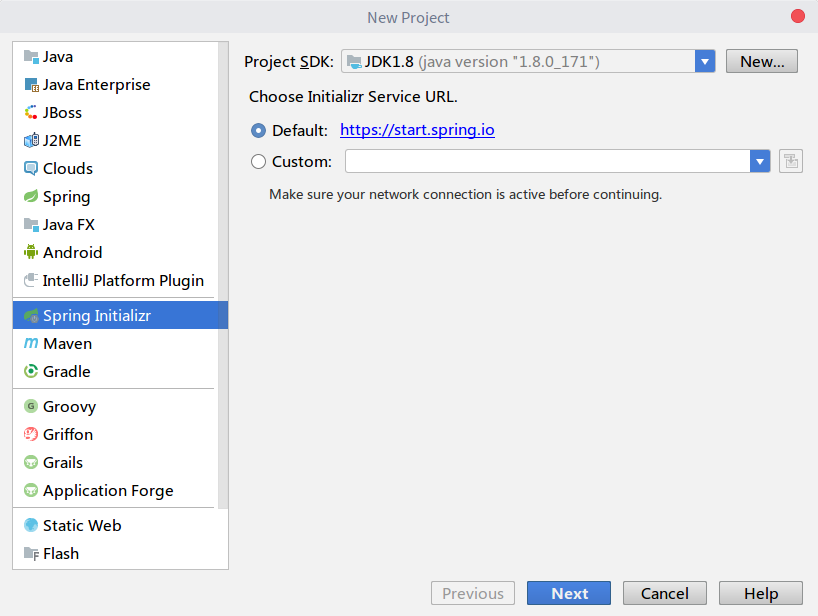
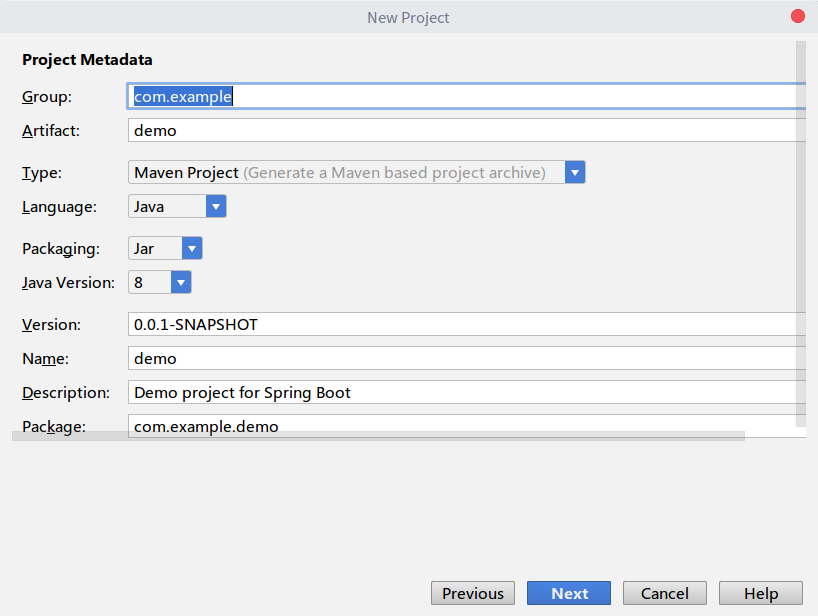
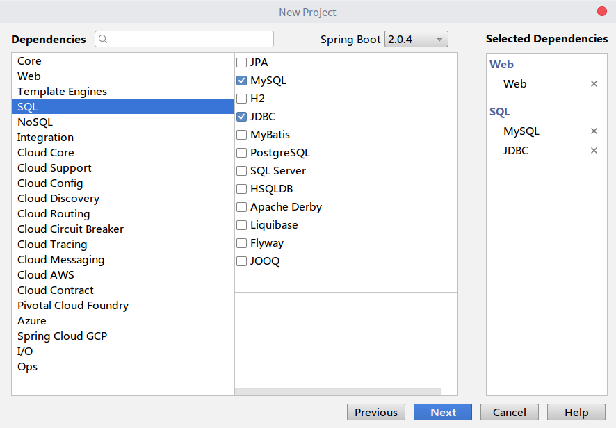
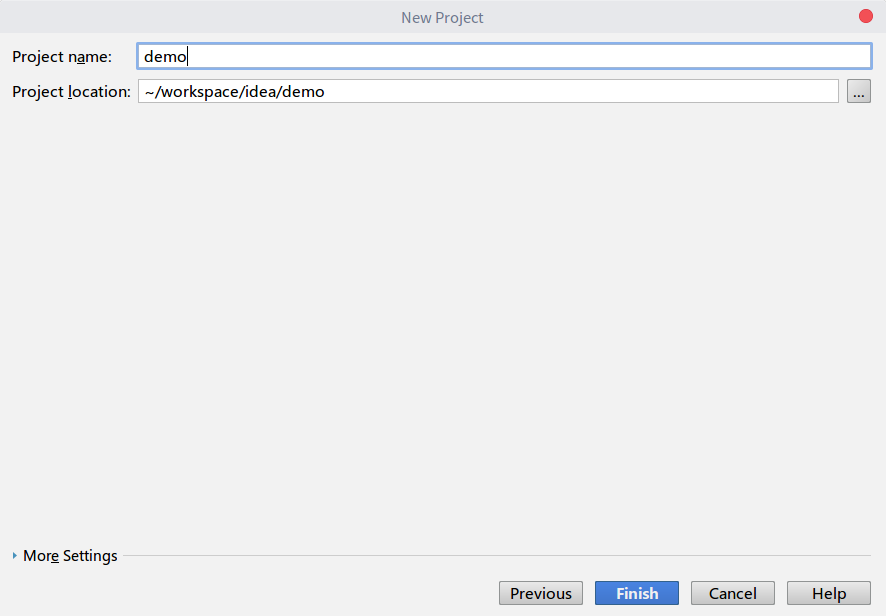
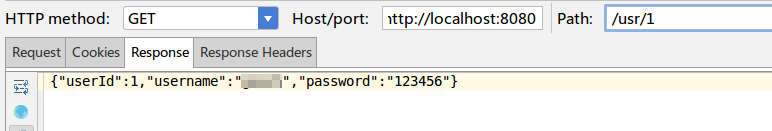

# SpringBoot 快速构建接口服务

这篇笔记中，我们使用SpringBoot快速搭建一个REST服务。

## 使用Intellij IDEA创建SpringBoot项目

`Spring Initializr`是一个Spring官方网站提供的在线工具（当然也可以搭建在本地），我们可以输入一些项目的初始配置，这个工具就能自动帮我们生成好整个项目的框架。`Intellij IDEA`整合了这个在线工具，如下图所示，我们创建SpringBoot项目时，就可以选择`Spring Initializr`。



输入项目名、Group、Artifact等信息。



输入项目的初始依赖，SpringBoot会自动帮我们加载我们可能需要的依赖包，加载的包的版本一般情况下都是良好兼容的。



最后输入项目的存储路径等信息。



项目创建好后，Intellij IDEA会使用Maven下载依赖包，毕竟不是手工一个一个配置的依赖，SpringBoot难免会把大量“可能会用到”的包加载进来，导致下载的时间稍长，不过如果配好速度快的Maven镜像，这个过程还是很快的。

## 编写一个REST服务

这里我们打算使用Spring提供的JdbcTemplate访问MySQL数据库。

项目搭建后，我们唯一需要配置的就是数据库服务器的URL、用户名和密码。

application.properties
```
spring.datasource.url=jdbc:mysql://localhost:3306/demo01
spring.datasource.username=root
spring.datasource.password=root
```

其余的代码和正常使用Spring和SpringMVC都是一样的了

MainController.java
```java
@RestController
public class MainController
{
	@Autowired
	private UserDao userDao;

	@RequestMapping(value = "/usr/{id}", method = RequestMethod.GET)
	public String doGet(@PathVariable Long id)
	{
		User user = userDao.getUserById(id);

		ObjectMapper mapper = new ObjectMapper();
		String respJson;
		try
		{
			respJson = mapper.writeValueAsString(user);
		}
		catch (JsonProcessingException e)
		{
			e.printStackTrace();
			respJson = "";
		}
		return respJson;
	}
}
```

UserDao.java
```java
@Repository
public class UserDao
{
	@Autowired
	private JdbcTemplate jdbcTemplate;

	public User getUserById(Long userId)
	{
		String sql = "select * from t_user where user_id=?";
		try
		{
			Map<String, Object> resultMap = jdbcTemplate.queryForMap(sql, userId);

			User user = new User();
			user.setUserId((Long) resultMap.get("user_id"));
			user.setUsername((String) resultMap.get("username"));
			user.setPassword((String) resultMap.get("password"));

			return user;
		}
		catch (Exception e)
		{
			e.printStackTrace();
			return null;
		}
	}
}
```

## 使用Intellij IDEA自带的工具进行测试


