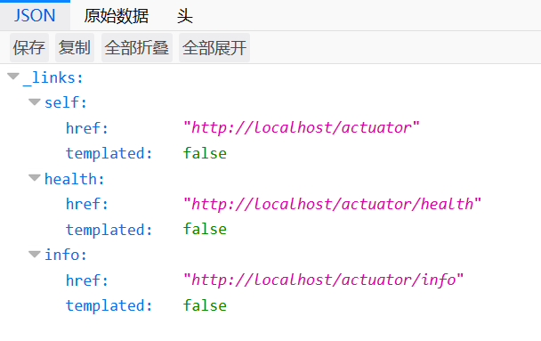

# Actuator

Actuator用于监控和度量Spring Boot应用，了解应用程序运行时的内部状况。在以前，这个功能通常是我们开发人员自行实现的，但是如果使用Spring Boot进行开发，引入Actuator的starter依赖即可，非常方便。

Actuator是一个比较新的功能，因此SpringBoot2.x和1.x的Actuator使用时区别比较大，这里以2.x为例进行讲解。

Actuator依赖：
```xml
<dependency>
  <groupId>org.springframework.boot</groupId>
  <artifactId>spring-boot-starter-actuator</artifactId>
</dependency>
```

## EndPoint 端点

Actuator提供了若干端点，供我们调用以获取我们需要的数据。默认情况下，Actuator提供了web和JMX两种方式访问这些数据，数据以JSON形式呈现。

Actuator提供的端点很多，而且随着版本更新经常变动（SpringBoot2.x和1.x的Actuator就有很多不同），这里建议使用时查询对应版本的文档：[https://docs.spring.io/spring-boot/docs/2.0.4.RELEASE/reference/htmlsingle](https://docs.spring.io/spring-boot/docs/2.0.4.RELEASE/reference/htmlsingle)

我们引入Actuator依赖后，可以使用浏览器访问`/actuator`，查看web能够访问的端点。



默认情况下，仅能通过web访问`health`和`info`两个端点。

## 启动端点

默认情况下，SpringBoot启动了除shutdown以外的所有端点。

例子：

启动shutdown端点：
```
management.endpoint.shutdown.enabled=true
```

默认禁用所有端点：
```
management.endpoints.enabled-by-default=false
```

## 暴露端点

启动端点后，我们需要把它暴露出去，才能正常访问。默认情况下，所有端点（除了不适用于JMX的）通过JMX暴露，只有`health`和`info`通过web暴露。

我们通过`include`和`exclude`控制端点是否暴露。`include`表示暴露端点，`exclude`表示不暴露端点。

例子：

通过JMX暴露`health`端点：
```
management.endpoints.jmx.exposure.include=health
```

通过web暴露除了`env`和`beans`的所有端点：
```
management.endpoints.web.exposure.include=*
management.endpoints.web.exposure.exclude=env,beans
```
