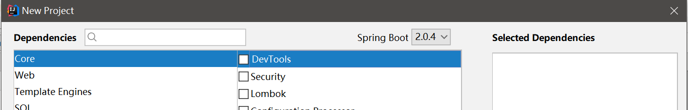
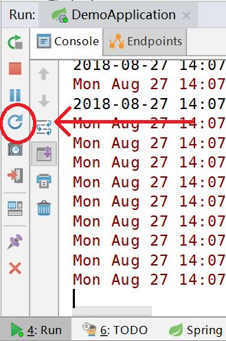
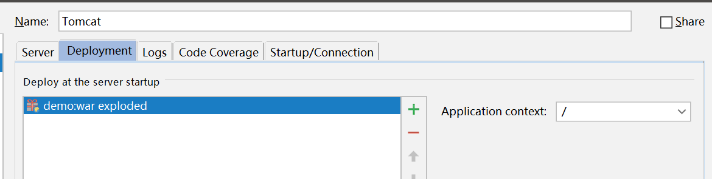

# 常见问题总结

## Intellij IDEA中实现热部署

SpringBoot提供了热部署的功能devtools，可以替代JRebel。使用devtools需要在`pom.xml`中添加依赖项：

```xml
<dependency>
  <groupId>org.springframework.boot</groupId>
  <artifactId>spring-boot-devtools</artifactId>
  <optional>true</optional>
</dependency>
```

或者使用Spring Initializr新建项目时，勾选上`devtools`：



这样Intellij IDEA中就会出现热部署按钮，点一下就可以实现热部署了（实际上不手动点也会自动刷新）：



有时候这个按钮不出现，这可能是现在版本Intellij IDEA的bug（我使用的版本是2018.1），我们可以在上面菜单中找到同样的功能：`Run->Reload Changed Classes`。

实际上，这个热部署方案还是不如JRebel好用，更改方法参数、添加新类时经常不好使，也不知道是出bug了还是不支持。

然而，我尝试在Tomcat9上以war（exploed）包形式部署SpringBoot2.x，使用JRebel Debug模式，SpringBoot却启动报错（错误信息十分奇葩，估计是bug：报错找不到Hibernate Validator依赖）。

## 无法访问静态资源

使用Spring Initializr创建的项目模板，静态资源通常放到`src/main/resources/static`中，但是直接以可执行jar运行web应用时，静态资源根本无法访问，这是因为静态资源没有打包到可执行jar中。

解决方案：实际上我们基本不会用可执行jar的方式真正部署SpringBoot工程的，我们最好把它部署到外部的Tomcat里，我们可以直接在IDE中进行执行环境配置，以war的形式部署。

首先创建ServletInitializer类：

```java
package com.ciyaz.demo;

import org.springframework.boot.builder.SpringApplicationBuilder;
import org.springframework.boot.web.servlet.support.SpringBootServletInitializer;

/**
 * @author CiyaZ
 */
public class DemoServletInitializer extends SpringBootServletInitializer
{
	@Override
	protected SpringApplicationBuilder configure(SpringApplicationBuilder builder)
	{
		return builder.sources(DemoApplication.class);
	}
}
```

然后在Maven的`pom.xml`中，将打包方式改为`war`。

```xml
<packaging>war</packaging>
```

然后配置好Tomcat：



这样我们就能正常在浏览器中访问静态资源了。这种部署方式，还可以结合jrebel实现热部署，非常好用。

## 注册Listener和Filter

SpringBoot支持Servlet3注解，直接自动注册监听器和过滤器，但是我们必须配置启用Servlet注解扫描。

在启动类上添加这个注解即可：
```
@ServletComponentScan
```

然后我们定义的Listener或Filter使用对应的注解标注即可使用了。如果使用Servlet容器部署，启动类是不起作用的，只要我们的容器支持Servlet3.0注解就行了。

## 将Servlet容器改为Undertow

SpringBoot默认使用Tomcat作为Servlet容器，Tomcat性能不错，而且功能强大，代码健壮性良好，但是Undertow源码更轻量，性能比Tomcat还要好一些。将容器改为Undertow，首先要排除Tomcat的依赖：

```xml
<dependency>
  <groupId>org.springframework.boot</groupId>
  <artifactId>spring-boot-starter-web</artifactId>
  <exclusions>
    <exclusion>
      <groupId>org.springframework.boot</groupId>
      <artifactId>spring-boot-starter-tomcat</artifactId>
    </exclusion>
  </exclusions>
</dependency>
```

然后加入Undertow的起步依赖：

```xml
<dependency>
  <groupId>org.springframework.boot</groupId>
  <artifactId>spring-boot-starter-undertow</artifactId>
</dependency>
```

其余都无需改动。
