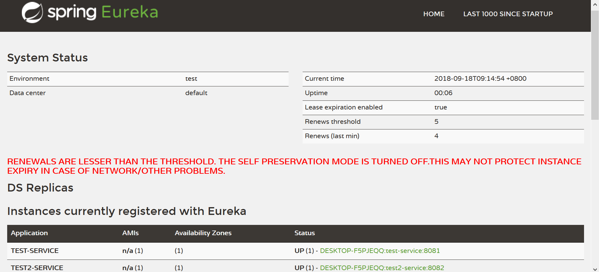

# Spring Cloud Eureka 服务治理

Spring Cloud Eureka是基于Netflix Eureka的二次封装，主要实现了针对Spring体系微服务架构的服务治理功能。我们在Spring Boot中引入相关依赖，并做一些简单的配置，就可以很容易的通过Spring Boot实现微服务架构。

## 配置启动Eureka注册中心

这里我们先演示如何启动一个单节点的Eureka注册中心。

配置Eureka注册中心非常简单，我们只需要起一个Spring Boot工程，然后引入Eureka Server的依赖：

```xml
<dependency>
    <groupId>org.springframework.cloud</groupId>
    <artifactId>spring-cloud-starter-netflix-eureka-server</artifactId>
</dependency>
```

然后在`Application`类上，使用`@EnableEurekaServer`标注。
```java
@SpringBootApplication
@EnableEurekaServer
public class DemoApplication
{

    public static void main(String[] args)
    {
        SpringApplication.run(DemoApplication.class, args);
    }
}
```

在application.properties加入一些配置：
```
# EurekaServer的域名
eureka.instance.hostname=localhost
# EurekaServer的端口号
server.port=8080
# 是否注册该应用到EurekaServer，该应用自己就是EurekaServer，所以不注册
eureka.client.register-with-eureka=false
# 是否从EurekaServer同步数据，这里搭建单节点的EurekaServer，因此不需要
eureka.client.fetch-registry=false
# 注册和查询服务的地址
eureka.client.serviceUrl.defaultZone=http://${eureka.instance.hostname}:${server.port}/eureka/
# 是否启用自我保护机制，测试环境建议关闭
eureka.server.enable-self-preservation=false
```

注：Eureka的自我保护机制：短时间内大量服务Provider下线时会触发Eureka保护机制，服务的注册信息会被保留在Eureka Server的存储中，这是为了应对短时间的网络故障而设计的，而我们开发过程中频繁启停服务，这个保护机制会影响我们的开发。

配置好后，启动Spring Boot应用，使用浏览器访问`http://localhost:8080/`，就可以看到Eureka Server的Web页面了。



## 配置服务Provider

这里我们再创建一个Spring Boot工程，作为服务提供者（Provider）。首先引入Eureka Client的依赖，以及Spring Web的依赖：

```xml
<dependency>
    <groupId>org.springframework.boot</groupId>
    <artifactId>spring-boot-starter-web</artifactId>
</dependency>
<dependency>
    <groupId>org.springframework.cloud</groupId>
    <artifactId>spring-cloud-starter-netflix-eureka-client</artifactId>
</dependency>
```

使用`@EnableEurekaClient`标注Application类，表示该应用是需要注册到Eureka Server的一个微服务。
```java
@SpringBootApplication
@EnableEurekaClient
public class DemoApplication
{

	public static void main(String[] args)
	{
		SpringApplication.run(DemoApplication.class, args);
	}
}
```

application.properties
```
# 服务名称
spring.application.name=test-service
# 服务端口号
server.port=8081
# 在注册中心中进行注册
eureka.client.serviceUrl.defaultZone=http://localhost:8080/eureka/
```

注意：这里配置的`defaultZone`需要和Eureka Server中配置的相对应，这样我们编写的微服务才能正确注册。

Controller中的服务提供方法：
```java
@RequestMapping(value = "/mytest", method = RequestMethod.GET)
public Map<String, Object> testMethod()
{
  Map<String, Object> resultMap = new HashMap<>();
  resultMap.put("key1", "val1");
  resultMap.put("key2", "val2");
  return resultMap;
}
```

这个方法并没有什么特别之处，只是在`/mytest`上提供一个JSON接口，但是通过之前Eureka Client相关的配置，这个接口就会注册到Eureka配置中心里，供其他微服务调用。

## 配置服务Consumer

服务的消费者我们使用Spring Cloud中封装的Ribbon实现，Netflix Ribbon是一个可以实现负载均衡的TCP/HTTP客户端，在SpringCloud中总是配合Eureka进行使用，有关Ribbon的具体内容将在后篇笔记中记述。

服务消费者端需要引入Spring Web、Eureka Client、Ribbon的依赖，实际上我们写的这个Consumer同时也是具有Provider功能的，它也会注册到Eureka注册中心的。

```xml
<dependency>
    <groupId>org.springframework.boot</groupId>
    <artifactId>spring-boot-starter-web</artifactId>
</dependency>
<dependency>
    <groupId>org.springframework.cloud</groupId>
    <artifactId>spring-cloud-starter-netflix-eureka-client</artifactId>
</dependency>
<dependency>
    <groupId>org.springframework.cloud</groupId>
    <artifactId>spring-cloud-starter-netflix-ribbon</artifactId>
</dependency>
```

Application类中，我们配置一个RestTemplate的Bean，注意这里使用了`@LoadBalanced`注解，Ribbon需要和RestTemplate配合使用，Ribbon通过这个注解实现了请求拦截器，以请求不同的服务提供端，以实现负载均衡。

```java
@EnableEurekaClient
@SpringBootApplication
public class DemoApplication {

    @Bean
    @LoadBalanced
    RestTemplate restTemplate() {
        return new RestTemplate();
    }

    public static void main(String[] args) {
        SpringApplication.run(DemoApplication.class, args);
    }
}
```

application.properties
```
server.port=8082
eureka.client.serviceUrl.defaultZone=http://localhost:8080/eureka/
spring.application.name=test2-service
```

Controller中的服务消费者方法：
```java
@RequestMapping(value = "/consumer", method = RequestMethod.GET)
public Map<String, Object> testConsumer() {
    Map<String, Object> resultMap = new HashMap<>();
    return restTemplate.getForObject("http://TEST-SERVICE/mytest", resultMap.getClass());
}
```

出于演示目的，这里我们的做法比较简单，就是一个通过RestTemplate从Provider中请求一个对象，然后以JSON形式返回。这里注意我们的请求地址，`TEST-SERVICE`是调用的微服务的名字，即`spring.application.name`，`/mytest`是请求的子路径。

使用浏览器访问`http://localhost:8082/consumer`，我们就能成功得到Provider提供的数据了。

## 使用多个Eureka注册中心

在微服务架构中，我们需要充分考虑到故障的可能性，如果只有单节点的Eureka Server，一旦它发生了故障，它可能会影响到整个系统的运行。这里我们起两个Eureka Server，演示如何配置一个Eureka Server集群。

由于Eureka需要使用域名进行配置（实际上也可以用IP但是不推荐），在单机上测试时我们不能两个Eureka Server都用localhost，我们首先在hosts文件中加上两行域名解析的配置：

```
127.0.0.1       eureka1
127.0.0.1       eureka2
```

Eureka Server节点1的application.properties
```
eureka.instance.hostname=eureka1
server.port=8081
eureka.client.register-with-eureka=false
# 是否从EurekaServer同步数据
eureka.client.fetch-registry=true
# 从哪里同步数据，这里指定为节点2的地址
eureka.client.serviceUrl.defaultZone=http://eureka2:8082/eureka/
# 是否启用自我保护机制，测试环境建议关闭
eureka.server.enable-self-preservation=false
```

Eureka Server节点2的application.properties
```
eureka.instance.hostname=eureka2
server.port=8082
eureka.client.register-with-eureka=false
eureka.client.fetch-registry=true
eureka.client.serviceUrl.defaultZone=http://eureka1:8081/eureka/
eureka.server.enable-self-preservation=false
```

注：`defaultZone`是可以配置多个的，如果有3个节点，比如节点ABC，建议A配置BC，B配置AC，C配置AB这种形式，而不是乱配的。

在Eureka配置中心的Web界面中，我们可以看到DS Replicas这个配置，它代表的就是该Eureka Server节点从哪个节点同步数据。


## Eureka的使用细节简介

首先我们要知道，Eureka实现的服务治理体系中，都是通过REST请求实现通信的。

### Service Provider

#### 服务注册

一个微服务（Eureka Client）启动时，会自动将其信息注册到Eureka配置中心。处于负载均衡的需要，一个服务可以有多个实例运行。

```
eureka.client.register-with-eureka=true
```

该配置用于指定是否向注册中心注册自身，默认为`true`。

#### 服务同步

如果配置了Eureka Server的集群，多个配置中心之间，会定期同步数据。

#### 服务续约

默认情况下，配置中心会每隔30s向微服务发送一个心跳包，如果微服务超过90s未回复，则配置中心认为这个服务已经失效了，失效的服务会被定时任务剔除。

#### 服务下线

一个微服务正常关闭时，它会通知注册中心自己即将下线，删除自己的注册信息。

### Service Consumer

#### 服务获取

当需要调用一个微服务时，客户端首先要获取从哪里调用。Eureka配置中心会维护一个注册信息缓存返回给客户端，该缓存默认每隔30s刷新一次。

#### 服务调用

之前我们演示过使用Ribbon和RestTemplate实现服务调用，实际上Ribbon只是在普通的Rest服务调用的基础上实现了负载均衡的功能。对于微服务区域的划分，Eureka有Region和Zone的概念，一个Region可以包含多个Zone，调用服务时，Ribbon会优先使用同一个Zone的服务提供方，通常情况下这样访问速度较快，对网络资源的消耗更低。

注：实际上，Region和Zone都是AWS的概念，Eureka是为AWS开发的，我们使用时机房的网络结构可能是不一样的，我们可以简单理解成Region是一个Eureka集群，Zone是一个机房。

### Eureka Server

#### 失效剔除

某个微服务下线时，会通知Eureka将自己的注册信息删除，但是当它非正常下线时，注册中心可能还保留着已经失效的微服务注册信息。Eureka注册中心有一个定时任务，每隔60s将当前注册信息中已经超时未续约的服务注册信息删除。

#### 自我保护

前面已经介绍过了，具体的机制实际上我们不需要关心，我们只需要知道开发环境中关闭这个保护机制，生产环境中打开即可。
