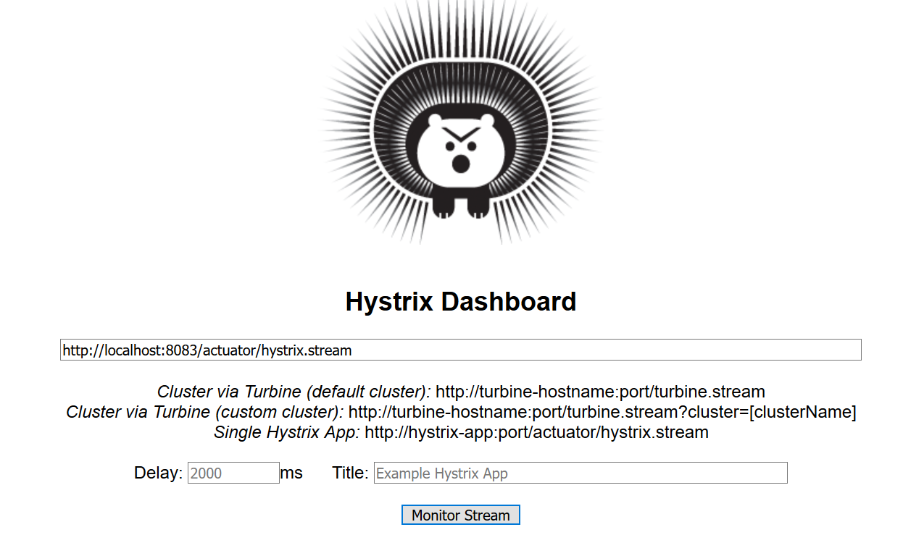
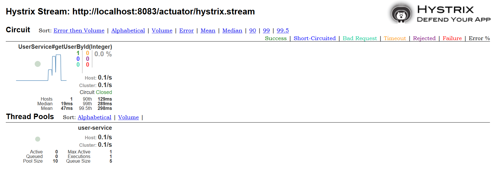

# Hystrix 熔断器

Hystrix是Netflix公司开源的一个项目，提供了熔断器功能，它能够阻止分布式系统中出现联动故障，从而提高了分布式系统总体上的可靠性。

## Hystrix解决的问题

首先我们了解一下Hystrix解决的问题。在一个庞大的微服务系统中，可能某一个微服务出现故障，请求的数据迟迟不能返回，这可能造成其它依赖该功能的微服务出现阻塞，甚至耗尽服务器的线程资源，进而造成更大面积的问题。Hystrix就像保险丝，能够在服务出现问题时及时切断问题根源，直接返回错误信息，而不是让其它服务苦苦等待。

Hystrix的功能：

1. 熔断机制，避免单个微服务故障引起大面积故障
2. 提供回退方案，请求失败时执行
3. 提供Hystrix Dashboard，便于管理

Hystrix的工作机制：

一段时间内，一个微服务请求失败次数在一定阈值内，熔断器关闭；超过一定阈值后，熔断器打开，请求该服务将立即失败；处于打开状态的熔断器一段时间后处于半打开状态，并执行一定量的请求，如果请求成功了，熔断器关闭。

## Hystrix的使用

使用Hystrix，我们需要的依赖：
```xml
<dependency>
  <groupId>org.springframework.cloud</groupId>
  <artifactId>spring-cloud-starter-netflix-hystrix</artifactId>
</dependency>
```

### Ribbon+RestTemplate方式

SpringBoot入口类上，我们需要使用`@EnableHystrix`启用Hystrix功能。

```java
@SpringBootApplication
@EnableEurekaClient
@EnableHystrix
public class CloudUserConsumerApplication
{
	@Bean
	@LoadBalanced
	public RestTemplate restTemplate() {
		return new RestTemplate();
	}

	public static void main(String[] args)
	{
		SpringApplication.run(CloudUserConsumerApplication.class, args);
	}
}
```

控制器方法和错误处理方法：

```java
@HystrixCommand(fallbackMethod = "errorGetUserList")
@RequestMapping(value = "/users", method = RequestMethod.GET)
public User[] getUserList()
{
  return restTemplate.getForObject("http://user-service/users", User[].class);
}

public User[] errorGetUserList()
{
  return new User[0];
}
```

我们的控制其方法需要使用`@HystrixCommand`注解标注，其中`fallbackMethod`参数是请求失败时，用于错误处理的方法名。这里要注意，错误处理方法的返回值需要和原方法相同，否则会报错。

### Feign方式

Feign的起步依赖中已经包含了Hystrix，所以我们不需要再单独引入了，但是我们需要在`application.properties`中对Feign进行配置，启用Hystrix。

application.properties
```
# 启用Hystrix，这里默认为false
feign.hystrix.enabled=true
```

声明远程调用接口时，我们需要在`@FeignClient`中指定`fallback`参数，参数的值是一个Class对象，指定的是该接口对应的错误处理类。

```java
@FeignClient(value = "user-service", fallback = UserServiceFallback.class)
public interface UserService
{
	@RequestMapping(value = "/users/{id}", method = RequestMethod.GET)
	User getUserById(@PathVariable("id") Integer id);
}
```

远程调用接口的错误处理类需要实现调用接口，接口中方法的错误处理方式为对应方法名的方法实现。

```java
@Component
public class UserServiceFallback implements UserService
{
	@Override
	public User getUserById(Integer id)
	{
		return null;
	}
}
```

## Hystrix Dashboard的使用

Hystrix Dashboard是监控Hystrix熔断状态的组件，它提供了一个图形化的界面便于我们使用。使用Hystrix Dashboard，需要引入Hystrix、Hystrix Dashboard、Actuator的起步依赖。

注意，如果使用Feign，也要引入Hystrix的起步依赖，因为Feign依赖的Hystrix不是起步依赖，会少一些东西。

Hystrix Dashboard的依赖：
```xml
<dependency>
  <groupId>org.springframework.cloud</groupId>
  <artifactId>spring-cloud-starter-netflix-hystrix-dashboard</artifactId>
</dependency>
```

其余两个依赖在上文和SpringBoot章节介绍过，这里就省略了。

引入依赖后，需要在SpringBoot入口类上使用注解`@EnableHystrixDashboard`启用该功能。书上介绍的配置就到此为止了，但是我实际使用时，发现还需要额外的配置。这里我使用的SpringBoot版本是2.1.0，SpringCloud版本是Greenwich.M3。

在SpringBoot入口类中，配置`HystrixMetricsStreamServlet`：
```java
@Bean
public ServletRegistrationBean getServlet()
{
  HystrixMetricsStreamServlet streamServlet = new HystrixMetricsStreamServlet();
  ServletRegistrationBean registrationBean = new ServletRegistrationBean(streamServlet);
  registrationBean.setLoadOnStartup(1);
  registrationBean.addUrlMappings("/actuator/hystrix.stream");
  registrationBean.setName("HystrixMetricsStreamServlet");

  return registrationBean;
}
```

在application.properties中需要暴露端点（这里为了方便，我直接把全部端点暴露了）：
```
management.endpoints.web.exposure.include=*
```

这样我们就配置好Hystrix Dashboard了，我们可以用浏览器访问`http://应用路径和端口/hystrix`访问Hystrix Dashboard。



如图，第一个选项我们填入`http://应用路径和端口/actuator/hystrix.stream`，其余两个留作默认即可。



Hystrix的监控界面如图所示，我们可以配合AB工具，观察熔断器的工作机制。
