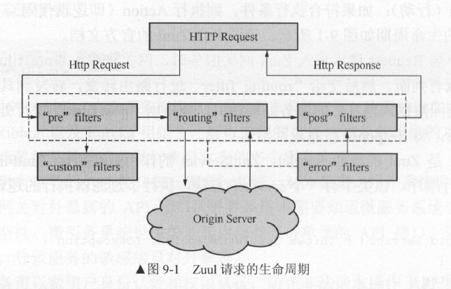

# Zuul 路由网关

Netflix Zuul是微服务系统的网关组件，SpringCloud整合了该组件，主要实现了以下功能：

1. Zuul、Eureka、Ribbon结合，能够实现智能路由（这里指对服务请求路由）和负载均衡
2. 网关能够对服务API统一聚合、统一暴露，外界系统通过网关调用服务，屏蔽了内部的复杂性，同时也便与测试
3. Zuul能够实现身份认证和权限认证
4. 可以实现API调用监控

## Zuul的运行机制

Zuul中包含了一系列过滤器，网关的功能就是通过这些过滤器实现的。

* pre过滤器：服务请求被路由到具体服务之前执行
* routing过滤器：用于将请求路由到具体微服务实例
* post过滤器：请求已被路由到微服务之后执行
* error过滤器：其它过滤器发生错误时执行



## Zuul的使用

我们创建一个SpringBoot项目，需要包含web依赖，Eureka Client依赖，Zuul依赖。

```xml
<dependency>
  <groupId>org.springframework.boot</groupId>
  <artifactId>spring-boot-starter-web</artifactId>
</dependency>
<dependency>
  <groupId>org.springframework.cloud</groupId>
  <artifactId>spring-cloud-starter-netflix-eureka-client</artifactId>
</dependency>
<dependency>
  <groupId>org.springframework.cloud</groupId>
  <artifactId>spring-cloud-starter-netflix-zuul</artifactId>
</dependency>
```

修改SpringBoot入口类，使用`@EnableEurekaClient`开启Eureka的服务发现机制，开启`@EnableZuulProxy`开启Zuul网关功能：
```java
@SpringBootApplication
@EnableEurekaClient
@EnableZuulProxy
public class CloudZuulApplication
{
	public static void main(String[] args)
	{
		SpringApplication.run(CloudZuulApplication.class, args);
	}
}
```

修改application.properties：
```
# 运行端口
server.port=8084
# Eureka地址
eureka.client.serviceUrl.defaultZone=http://localhost:8080/eureka/
# 本微服务的名字
spring.application.name=zuul-service
# user-service微服务网关配置
zuul.routes.userapi.path=/userapi/**
zuul.routes.userapi.service-id=user-service
# consumer-feign-service微服务网关配置
zuul.routes.feignapi.path=/feignapi/**
zuul.routes.feignapi.service-id=consumer-feign-service
```

其中注意微服务网关配置的写法，例如：我们配置的微服务在Eureka中注册的名字是`demo-service`，我们要将例如`/demoapi/users/1`这样的请求映射到该微服务的`/users/1`，那么对应的配置就是：

```
zuul.routes.demoapi.path=/userapi/**
zuul.routes.demoapi.service-id=demo-service
```

打开浏览器，访问网关对应的地址，就可以看到网关配置生效了。

一些其它的配置：

如果我们想给网关API加个版本号，可以这样配置前缀：`zuul.prefix=/v1`。

## Zuul网关的负载均衡

默认情况下，Zuul已经结合Ribbon做了负载均衡，如果网关后面的服务有多个实例，Zuul会用Ribbon的默认策略（轮询）进行负载均衡访问。

## Zuul网关的熔断器

在Zuul中实现熔断器，需要定义一个类，实现`ZuulFallbackProvider`接口：
```java
package com.ciyaz.demo.cloudzuul;

import org.springframework.cloud.netflix.zuul.filters.route.FallbackProvider;
import org.springframework.http.HttpHeaders;
import org.springframework.http.HttpStatus;
import org.springframework.http.MediaType;
import org.springframework.http.client.ClientHttpResponse;
import org.springframework.stereotype.Component;

import java.io.ByteArrayInputStream;
import java.io.IOException;
import java.io.InputStream;

@Component
public class ApiGatewayFallbackProvider implements FallbackProvider
{
	@Override
	public String getRoute()
	{
		return "consumer-feign-service";
	}

	@Override
	public ClientHttpResponse fallbackResponse(String route, Throwable cause)
	{
		return new ClientHttpResponse()
		{
			@Override
			public HttpStatus getStatusCode() throws IOException
			{
				return HttpStatus.OK;
			}

			@Override
			public int getRawStatusCode() throws IOException
			{
				return 200;
			}

			@Override
			public String getStatusText() throws IOException
			{
				return "OK";
			}

			@Override
			public void close()
			{

			}

			@Override
			public InputStream getBody() throws IOException
			{
				return new ByteArrayInputStream("fall back".getBytes());
			}

			@Override
			public HttpHeaders getHeaders()
			{
				HttpHeaders httpHeaders = new HttpHeaders();
				httpHeaders.setContentType(MediaType.TEXT_PLAIN);
				return httpHeaders;
			}
		};
	}
}
```

* `getRoute()`：该配置对哪个服务的调用生效
* `fallbackResponse()`：熔断器打开时的响应，其参数是`ClientHttpResponse`，实际上非常简单，就是定义返回一段HTTP信息
