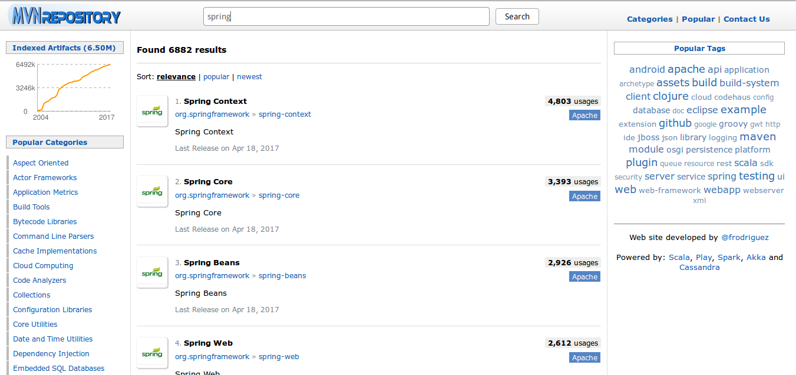

# Spring简介

本系列笔记参考《Spring实战》第四版，和Spring官方文档。

Spring不止是一个框架，而是一个平台。打开Spring官网可以看到一堆project。尽管Java有JavaEE的EJB等规范，但现在显然Spring是Java企业级项目开发的事实标准。Spring大而全，内容极其丰富，不仅有很强的实用价值，还有很好的学习价值。

首先不得不吐槽下，网上有些“大神”，说学习Spring要读懂源码才行，我觉得这种人估计也没看过Spring的代码。所谓学习价值，不是说看它的源码，而是要领会它的哲学。用人家写的框架，为啥就这么方便？我们自己设计一个框架，要有哪些功能？解决了什么问题？提供给用户怎样的接口？框架里面的类为什么这么组织，感觉就这么优雅？我们该在哪里有所创新？至于怎么实现，Java基础打好，完全就够用了。去啃xx框架的源码，完全是本末倒置，浪费时间。有那功夫还不如多思考思考，赶紧动手开始写。

关于Spring我已经看过很多书了，第一次接触Spring已经是很久以前的事情了。如今，Spring最新版本已经到了Spring4.3.8，Spring5.0.0 Snapshot也已经出现了。我使用Spring3编过几个网站程序，Spring也算是比较熟悉了。

由于以前学习Spring没有记笔记，后来也找不到地方翻，着实有些遗憾。再加上有些Spring高级的地方还不是很熟，因此我打算重新复习一下Spring，但是这回使用新书，直接上Spring4。

## Spring解决的问题

总的来说，使用Spring的好处就是简化Java编程，这里特指业务很复杂的程序。比如社交网站，企业管理系统等。

### 非入侵编程模型

很多框架要求我们编写的类继承框架提供的某个类，这可能造成一些问题，比如测试困难等。Spring则遵循非入侵式的编程模型，我们使用的java类仅仅是POJO。Spring通过依赖注入装配这些POJO。

### 依赖注入

依赖注入可以说是Spring最好用的地方之一。虽然它实现起来比较复杂，而且会造成一点点额外的性能开销，但是它极大的提高了我们的工作效率，因此是十分值得使用的。

不使用依赖注入，比如设计成一个类调用另一个类，类实例管理起来就麻烦了。如果软件架构设计的不好，类与类之间耦合很深，调试起来也是比较困难，最重要的问题就是难以扩展。当然，面向对象设计模式不是白学的，我们可以想办法解决这些问题，但是一遍遍遇到重复的问题，一遍遍解决，开发效率不高。Spring不仅通用的解决了这个问题，而且解决方法十分优雅。对象交由Spring管理，我们仅仅是告诉Spring，把对象装配到某个位置就可以了。

### Bean容器

依赖注入中的对象，其实就是Bean容器托管的。容器如何加载对象呢？我们通过配置文件配置一下就好了。Bean容器+依赖注入，显然比我们自己运用复杂的设计模式，管理我们的Bean要高效的多。

### 面向切面编程

比较大的系统都会遇到功能和功能之间耦合的问题。面向切面编程解决的就是把遍布应用各处的功能分离出来，形成可重用组件。这一点在业务复杂的系统中十分明显。

### 代码模板

使用模板简化编程最明显的例子就是JDBC。原始的JDBC就不说了，我们一遍一遍的编写差不多的代码，idea都会给我们的代码画上灰线，告诉我们这样写不好。我们可以自己抽取模板，但显然为了模板通用性，这个过程可能又比较复杂。Spring的JDBC模板替我们解决了这个问题。

## Spring平台

一门编程语言火不火，首先看看它的生态如何。就像英语是世界通用语言一样，Java可以说是程序员通用语言，其生态必然也是最完善的。

开始编程，首先我们要掌握语言本身。其次，我们可以下载一些类库，帮助我们解决不熟悉的领域的问题。还是觉得程序复用性不好，框架就出现了。Spring却不止于此，Spring出了一堆框架，这些框架可以方便的组合在一起，用户可以根据需求选用，Spring创造了一个平台。

### SpringFramework

#### 核心容器

实现Spring的bean管理容器，依赖注入等。基本这个模块是必备的。

#### AOP模块

提供面向切面编程的支持。

#### 数据访问集成

包括Spring的JDBC模板，整合ORM框架（如Hibernate，JPA）等功能。

#### springMVC

表现层框架，实现表现层的MVC，实现整合模板引擎，简化控制器编写等等，这个框架实在太流行了，不多介绍了。

#### 测试模块

Spring为了便于开发者测试代码，为JNDI，Servlet编写单元测试提供了一系列mock实现。测试驱动开发，也是一个很流行的概念。

### Spring Portfolio

#### Spring Web Flow

简化工作流的编写。

#### Spring Web Service

更好的WebService模型。

#### Spring Security

为应用提供声明式安全机制。

#### Spring Integration

提供多种通用应用集成模式的Spring风格实现。

#### Spring Batch

对数据进行大量操作的批处理支持。

#### Spring Data

Spring Data使得应用使用数据库变得容易，包括传统数据库和NoSQL。

#### Spring Social

社交网络扩展模块。

#### Spring Mobile

支持移动Web应用开发。

#### Spring for Android

为开发基于Android的本地应用提供简单的支持。

#### Spring Boot

致力于简化Spring本身。

## 如何在我们的项目中引入Spring

有很多同学弄不懂怎么在项目中配置Spring（这里指Spring框架的最核心功能，类容器和DI等），这是因为没能理解Spring是怎么结合到我们的项目中的。

使用Spring框架，需要启动一个`ApplicationContext`，我们管它叫Spring应用上下文。启动这个模块，它会读取我们的Spring配置文件，在类容器中托管Bean，实现依赖注入等。在普通Java工程中，我们可以使用如下代码，手动启动Spring应用上下文并获取Bean。

例子：
```java
ApplicationContext applicationContext = new ClassPathXmlApplicationContext("applicationContext.xml");
UtilA utilA = (UtilA) applicationContext.getBean("utilA");
```


在Web工程中，我们知道Listener可以监听Web应用的启动，因此Spring提供了一个启动Spring应用上下文的监听器。只需要在`web.xml`中配置一下就行了：

```xml
<listener>
  <listener-class>org.springframework.web.context.ContextLoaderListener</listener-class>
</listener>
```

## 如何在Junit测试环境中得到Spring应用上下文

Junit测试环境中也是可以启动Spring应用上下文的，而且使用起来还十分方便。

```java
@RunWith(SpringJUnit4ClassRunner.class)
@ContextConfiguration(value = "/applicationContext.xml")
public class TestDi
{

	@Autowired
	private UtilA utilA;

	@Test
	public void test()
	{
		utilA.doA();
	}
}
```

我们使用注解`@RunWith`，表示运行这个单元测试的时候，一同启动Spring应用上下文。`@ContextConfiguration`指定了Spring应用上下文的xml配置文件，它的实际路径在`src/main/resources`。

注：我们的测试类在`src/test/java`，`applicationContext.xml`放在`src/main/resources`或`src/test/resources`均可。

## 关于Spring依赖

我们可以在这个网站搜索maven仓库中的各种包：[http://mvnrepository.com/](http://mvnrepository.com/)

搜索Spring的结果如下：



Spring的各个模块，被分散在了多个包中，这样的确实现了灵活的依赖配置，但是着实会让一些同学纠结。实际上还是得凭经验来，例如在Java工程中，搭建一个最基础的Spring环境，我们要求包含Spring的类容器和依赖注入功能，那么我们选用这些包：`Spring Context`，`Spring Core`，`Spring Beans`。一般我们还需要引入单元测试整合的依赖，这时还会用到`Spring TestContext Framework`。

关于包的版本选择，其实很好办，使用Spring3.x，就用3.x里用的人最多的那个，使用4.x，就用4.x里用的人最多的那个。
