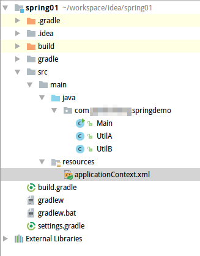

# 装配Bean

Spring的核心功能之一就是依赖注入（DI），所谓的依赖注入，其实就是自动装配Java类。

什么时候使用依赖注入呢？

例如：一个订单管理组件需要一个信用卡认证组件，传统的简单做法是在订单管理类中`new`出信用卡管理类，但是这样做很不好，我们并没有细致的控制信用卡管理类的生命周期，性能上可能有一些问题，此外，对象之间耦合度变高，难以测试和复用。此时，我们就可以使用Spring了。我们只需要在Spring中简单的进行配置，将信用卡管理类交由Spring控制，其余我们要做的，就是在需要依赖注入的地方声明下就可以了。具体做法请往下看。

## 三种声明Spring装配Bean的方法

* 使用Java注解实现自动装配
* XML定义显示装配
* 使用Java代码进行显示装配

通常情况下，我们都是使用第一种方法进行自动装配的，因为这样写起来配置文件少，不容易出错，出错也好改。但是后两种方案也时常会用到，比如维护旧系统，或者调用其他人编写的模块。除此之外，三种方案甚至还可以一起使用。

有关自动装配和显示装配，两者都需要在Java代码或XML中进行一些配置（自动装配需要配置package扫描）。虽然《Spring in Action》中作者极力推荐使用Java代码进行配置，但是我看过的项目都是使用XML配置的，我做的项目也是使用XML配置的，这里本着实用的原则就不介绍后者了。

后期补充：JavaConfig在`Java企业级应用开发/SpringCore/04-使用JavaConfig`中介绍。

## 注解实现自动化装配Bean

自动装配的步骤：

1. 组件扫描：我们需要定义一个或几个包（package），Spring会在这些包下寻找满足条件的类，并托管其生命周期
2. 依赖注入：Spring会自动根据注解配置的注入点，进行依赖注入

我们直接看一个使用自动装配的例子，同时学习一下如何在Java项目中使用Spring框架：

项目目录结构：



首先在项目中加入Spring的依赖：
```java
dependencies {
    testCompile group: 'junit', name: 'junit', version: '4.12'
    // https://mvnrepository.com/artifact/org.springframework/spring-core
    compile group: 'org.springframework', name: 'spring-core', version: '4.3.8.RELEASE'
	// https://mvnrepository.com/artifact/org.springframework/spring-context
	compile group: 'org.springframework', name: 'spring-context', version: '4.3.8.RELEASE'
	// https://mvnrepository.com/artifact/org.springframework/spring-beans
	compile group: 'org.springframework', name: 'spring-beans', version: '4.3.8.RELEASE'

}
```

Main.java
```java
package com.ciyaz.springdemo;

import org.springframework.context.ApplicationContext;
import org.springframework.context.support.ClassPathXmlApplicationContext;

public class Main
{

	private static ApplicationContext applicationContext = new ClassPathXmlApplicationContext("applicationContext.xml");

	public static void main(String[] args)
	{
		UtilA utilA = (UtilA) applicationContext.getBean("utilA");

		utilA.doA();
	}
}
```

UtilA.java
```java
package com.ciyaz.springdemo;

import org.springframework.beans.factory.annotation.Autowired;
import org.springframework.stereotype.Component;

@Component(value = "utilA")
public class UtilA
{
	@Autowired
	private UtilB utilB;

  public UtilA(UtilB utilB)
	{
		this.utilB = utilB;
	}

	public void doA()
	{
		System.out.println("util A");
		utilB.doB();
	}
}
```

UtilB.java
```java
package com.ciyaz.springdemo;

import org.springframework.stereotype.Component;

@Component(value = "utilB")
public class UtilB
{
	public void doB()
	{
		System.out.println("util B");
	}
}
```

applicationContext.xml
```xml
<?xml version="1.0" encoding="UTF-8"?>
<beans xmlns="http://www.springframework.org/schema/beans"
       xmlns:xsi="http://www.w3.org/2001/XMLSchema-instance"
       xmlns:Context="http://www.springframework.org/schema/context"
       xsi:schemaLocation="http://www.springframework.org/schema/beans http://www.springframework.org/schema/beans/spring-beans.xsd
		http://www.springframework.org/schema/context http://www.springframework.org/schema/context/spring-context.xsd">

	<Context:component-scan base-package="com.ciyaz.springdemo"/>

</beans>
```

上述代码还是非常简单的，这个例子并没有什么实际作用，我们只是为了说明Spring自动装配的用法。

UtilA和UtilB类使用`@Component`注解进行标识，表名这两个类是Spring组件，使用该注解意味着这两个类将被Spring应用上下文托管，可以被用来依赖注入。

UtilA依赖于UtilB，所以我们使用`@Autowired`指定了依赖注入点。程序运行时，Spring会自动把UtilB注入UtilA。这里要注意：`@Autowired`可以用在类属性上，也可以用在构造函数上，我们更推荐后者，因为实际上，不写构造器也是可以在属性上注入的，这是通过反射强行做到的，这也稍微违反了面向对象的封装原则，因此有人对此种做法提出了质疑。

在Main.java中，我们需要获取Spring应用上下文，因此调用了`ClassPathXmlApplicationContext`，并加载`applicationContext.xml`配置文件。这里要注意：在Web项目中，这个Spring应用上下文可能不是我们手动创建的，这里仅仅是一个简单的Java工程，因此使用了这种方法进行指定。除此之外，我们还使用了`applicationContext.getBean()`，用来获取一个Spring应用上下文中托管的Bean。获取Bean时，我们使用的字符串是Bean的名字，这个名字在`@Component`注解中指定。如果不指定，默认值是首字母小写的类名。

最后`applicationContext.xml`是Spring应用上下文的配置文件。注意`xsi:schemaLocation`，这个必须配置好`beans`和`context`schema约束文件，否则会报错。之后，我们使用`<Context:component-scan base-package="com.ciyaz.springdemo"/>`，指定了注解扫描的包名，这样我们的`@Component`注解就能起作用了，Spring会自动找到标注了这个注解的类并托管。

运行结果：
```
六月 04, 2017 8:34:05 下午 org.springframework.context.support.ClassPathXmlApplicationContext prepareRefresh
信息: Refreshing org.springframework.context.support.ClassPathXmlApplicationContext@5010be6: startup date [Sun Jun 04 20:34:05 CST 2017]; root of context hierarchy
六月 04, 2017 8:34:05 下午 org.springframework.beans.factory.xml.XmlBeanDefinitionReader loadBeanDefinitions
信息: Loading XML bean definitions from class path resource [applicationContext.xml]
util A
util B

Process finished with exit code 0
```

## 通过XML显示装配Bean

很多旧系统都是大量使用XML进行Spring配置的，这无疑非常之麻烦。但是那时候使用的JDK和Spring版本比较低，也是无奈之举。我们还是有必要了解一下如何使用XML显示的定义和装配Bean。

applicationContext.xml
```xml
<?xml version="1.0" encoding="UTF-8"?>
<beans xmlns="http://www.springframework.org/schema/beans"
       xmlns:xsi="http://www.w3.org/2001/XMLSchema-instance"
       xmlns:Context="http://www.springframework.org/schema/context"
       xsi:schemaLocation="http://www.springframework.org/schema/beans http://www.springframework.org/schema/beans/spring-beans.xsd
		http://www.springframework.org/schema/context http://www.springframework.org/schema/context/spring-context.xsd">

	<bean id="utilA" class="com.ciyaz.springdemo.UtilA">
		<constructor-arg ref="utilB" />
	</bean>

	<bean id="utilB" class="com.ciyaz.springdemo.UtilB" />

</beans>
```

我们使用`<bean>`定义了两个Bean，`id`就是Bean的名字，`class`是类全名，注意`utilA`，我们使用`<constructor-arg>`指定了构造器参数，`ref`指定了`utilB`类的Bean，这实现了依赖注入。

运行结果和上面是相同的。

XML中Spring还定义了一些奇奇怪怪的做法，比如装配字面量，装配集合等，这个根本没什么用处啊，这里我就不写了。

## Bean的作用域

默认情况下，Spring注入的Bean都是单例的，即多次注入的都是同一个实例，但是这通常不符合我们的要求。例如一个多线程模块，单例可能引起线程安全问题。这就需要配置Bean的作用域了。

Spring可配置的作用域：

* Singleton 单例，每次依赖注入使用的都是同一个实例，在应用上下文启动时自动创建，该值默认值
* Prototype 原型，每次依赖注入都会创建新的实例
* Session 会话，Web环境下对应一次http会话
* Request 请求，Web环境下对应一次http请求

我们可以使用`@Scope`注解声明Bean的作用域。

注解声明Bean作用域例子：
```java
@Component
@Scope(ConfigurableBeanFactory.SCOPE_PROTOTYPE)
public class UtilA
{
}
```

当然这个`ConfigurableBeanFactory`名字太长了，有点麻烦，我们也可以直接用字符串指定：`@Scope("prototype")`。

如果用xml进行显示装配，则要加上`scope`属性：
```xml
<bean id="utilA" class="com.ciyaz.springdemo.UtilA" scope="prototype"></bean>
```

注意：在Web环境中，我们使用的Spring应用上下文实际上是WebAppicationContext，这个类是我们在`web.xml`中配置的Listener自动启动的。WebAppicationContext中，才可以使用`Session`作用域和`Request`作用域。

## 装配和代理模式

虽然我们现在已经基本掌握了Spring的装配机制，但是先别高兴的太早，考虑这样一种场景（例子来自书上）：

```java
@Component
@Scope("prototype")
public class ShoppingCart
{}
```

```java
@Component
@Scope("singleton")
public class StoreService
{
	@Autowired
	public StoreService(ShoppingCart shoppingCart)
	{}
}
```

我们的StoreService类是单例的，单例的Bean会在Spring应用上下文启动时自动创建，但是ShoppingCart是多例的，StoreService创建时要求依赖注入，但是此时并没有ShoppingCart的Bean，我们会发现，Session和Request作用域也会发生同样的问题。这该怎么办呢？我们可以使用`@Scope`注解的`ScopedProxyMode`。

```java
@Scope(value = "prototype", proxyMode = ScopedProxyMode.TARGET_CLASS)
```

这实际上是Spring对代理模式的一个应用，我们依赖注入的Bean，实际上是一个代理。代理模式，使用接口很好理解，如果使用类，其实是通过CGLIB强行做到的。

* ScopedProxyMode.INTERFACES 创建该接口的代理，代理类实现该接口
* ScopedProxyMode.TARGET_CLASS 创建该类的代理

使用XML配置装配代理：

生成基于CGLIB的代理：
```xml
<bean id="cart" class="com.myapp.ShoppingCart" scope="prototype">
  <aop:scoped-proxy />
</bean>
```

生成基于接口的代理：
```xml
<bean id="cart" class="com.myapp.ShoppingCart" scope="prototype">
  <aop:scoped-proxy proxy-target-class="false" />
</bean>
```

注意：使用XML配置，需要在XML中声明aop的schema。

其实仔细一想，这个功能似乎不太会用到，对于上面的例子，我们一般不会在Service实例化时直接注入ShoppingCart。而是在其他位置，比如表现层的控制器实例化ShoppingCart，然后传递给Service。
