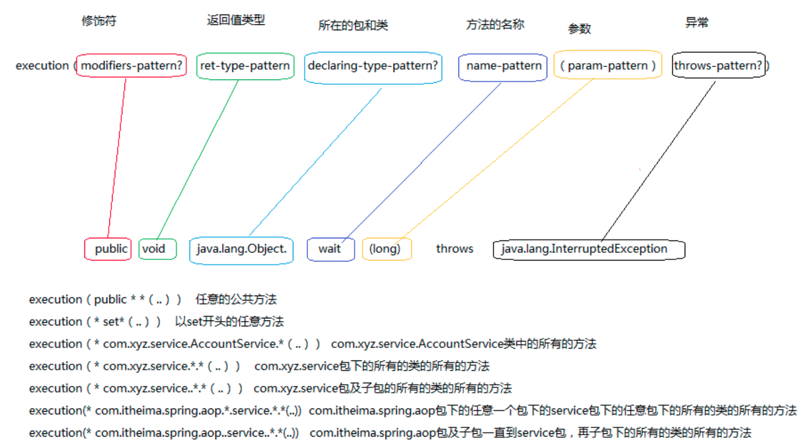

# AOP 面向切面编程

面向切面编程（Aspect Oriented Programming）是一种编程的思维模式，已经在`软件工程/设计模式`章节中有所介绍，关于什么是AOP这里就不多说了。如果没有Spring，我们实现面向切面要掌握复杂的设计模式（动态代理，甚至一些基于字节码的技术等），有了Spring，我们稍加配置就可以方便的使用面向切面了。

本章我们主要介绍如何使用Spring实现AOP。

## AOP的一些术语

### 通知 Advice

切面的工作被称为通知。通俗的说，就是调用目标方法前或后，执行的代码（切面）。

* 前置通知：目标方法调用前调用通知功能
* 后置通知：目标方法调用后调用通知功能
* 返回通知：目标方法成功执行之后调用通知功能
* 异常通知：目标方法抛出异常时通知功能
* 环绕通知：目标方法调用前和调用后执行通知功能

### 连接点 Join Point

应用过程中，能够插入切面的点。

### 切点 Poincut

匹配通知所要织入的一个或多个连接点。

### 切面 Aspect

通知和切点的结合，即：在何时和何处完成其功能。

### 引入 Introduction

引入，允许我们向现有的类添加新方法或属性。

### 织入 Weaving

把切面应用到目标对象并创建新的代理对象的过程。

可以进行织入的阶段：

* 编译期织入：例如AspectJ的织入编译器
* 类加载期织入：需要特殊的类加载器，如AspectJ 5的LTW
* 运行时织入：使用Java语言提供的动态代理实现，SpringAOP就采用这种方式

总的来说，Spring的AOP是基于动态代理实现的，被代理的Bean载入类容器时，代理类就会被创建，同时，基于动态代理也导致了Spring只支持方法级别的连接点（实际上大部分情况已经够用了）。

## 切入点表达式

Spring需要使用AspectJ的切入点表达式来定义切点，实际上由于Spring只支持方法级别的AOP，因此我们使用的只是AspectJ切入点表达式的一个子集。

有关如何编写切入点表达式，就不用文字描述了，我们直接上一张图：



图片来自某培训机构的视频

## 使用注解创建切面

可用的通知类型注解：

* `@After` 目标方法返回或抛出异常调用
* `@AfterRunning` 目标方法返回后调用
* `@AfterThrowing` 目标方法抛出异常后调用
* `@Around` 环绕通知
* `@Before` 目标方法调用之前执行

由于完全使用XML配置切面比较复杂，这里就不介绍了，我们只介绍使用注解创建切面。这里的例子，我们创建了前置通知和后置通知。

在applicationContext.xml中开启AOP功能
```xml
<?xml version="1.0" encoding="UTF-8"?>
<beans xmlns="http://www.springframework.org/schema/beans"
       xmlns:xsi="http://www.w3.org/2001/XMLSchema-instance"
       xmlns:Context="http://www.springframework.org/schema/context"
       xmlns:aop="http://www.springframework.org/schema/aop"
       xsi:schemaLocation="http://www.springframework.org/schema/beans http://www.springframework.org/schema/beans/spring-beans.xsd
		http://www.springframework.org/schema/context http://www.springframework.org/schema/context/spring-context.xsd
		http://www.springframework.org/schema/aop http://www.springframework.org/schema/aop/spring-aop.xsd">

	<Context:component-scan base-package="com.ciyaz.springdemo"/>
	<aop:aspectj-autoproxy />
</beans>
```

切面，MyAspect.java
```java
package com.ciyaz.springdemo;

import org.aspectj.lang.annotation.After;
import org.aspectj.lang.annotation.Aspect;
import org.aspectj.lang.annotation.Before;
import org.springframework.stereotype.Component;

@Aspect
@Component
public class MyAspect
{
	@Before("execution(* com.ciyaz.springdemo.UtilA.doA(..))")
	public void before()
	{
		System.out.println("before");
	}

	@After("execution(* com.ciyaz.springdemo.UtilA.doA(..))")
	public void after()
	{
		System.out.println("after");
	}
}
```

目标，UtilA.java
```java
package com.ciyaz.springdemo;

import org.springframework.stereotype.Component;

@Component
public class UtilA
{
	public void doA()
	{
		System.out.println("utilA");
	}
}
```

Main.java
```java
package com.ciyaz.springdemo;

import org.springframework.context.ApplicationContext;
import org.springframework.context.support.ClassPathXmlApplicationContext;

public class Main
{

	private static ApplicationContext applicationContext = new ClassPathXmlApplicationContext("applicationContext.xml");

	public static void main(String[] args)
	{
		UtilA utilA = (UtilA) applicationContext.getBean("utilA");
		utilA.doA();
	}
}
```

注意，切面类也必须使用`@Component`托管在类容器中，不然切面是不起作用的。

运行结果：
```
before
utilA
after
```

## 改进切面的写法 `@Pointcut`

上面切面中，我们写了两次同样的切入点表达式，这个实际上可以用一个`@Poincut`注解进行简化。

MyAspect.java
```java
@Aspect
@Component
public class MyAspect
{
	@Pointcut("execution(* com.ciyaz.springdemo.UtilA.doA(..))")
	public void doA() {}

	@Before("doA()")
	public void before()
	{
		System.out.println("before");
	}

	@After("doA()")
	public void after()
	{
		System.out.println("after");
	}
}
```

当然，多复制几个切入点表达式没有问题，但确实比较low。

## 环绕通知

环绕通知的定义和前面比起来，比较麻烦。我们看一个环绕通知的例子：

```java
@Aspect
@Component
public class MyAspect
{
	@Pointcut("execution(* com.ciyaz.springdemo.UtilA.doA(..))")
	public void doA() {}

	@Around("doA()")
	public void around(ProceedingJoinPoint proceedingJoinPoint)
	{
		try
		{
			System.out.println("before");
			proceedingJoinPoint.proceed();
			System.out.println("after");
		}
		catch (Throwable throwable)
		{
			throwable.printStackTrace();
			System.out.println("exception");
		}
	}
}
```

环绕通知切面方法，有一个参数`ProceedingJoinPoint`，实际上`proceedingJoinPoint.proceed()`就是目标方法的调用。但是要注意，`proceed()`函数有Object类型返回值，这个返回值实际上就是拦截的目方法的返回值，目标方法如果是`void`，当然没什么问题，但是如果目标方法有返回值，我们在切面中不处理，真正调用目标方法的地方就永远得不到返回值了。此时，我们可以把切面方法返回值改为Object，并在方法体中读取`proceed()`的返回值，返回给调用目标方法的位置。

## 处理目标方法的参数

上面的例子中，我们的目标方法没有参数。如果目标方法有参数怎么办呢？我们直接看一个例子。

UtilA.java
```java
package com.ciyaz.springdemo;

import org.springframework.stereotype.Component;

@Component
public class UtilA
{
	public void doA(int i)
	{
		System.out.println("utilA:" + i);
	}
}
```

MyAspect.java
```java
package com.ciyaz.springdemo;

import org.aspectj.lang.annotation.*;
import org.springframework.stereotype.Component;

@Aspect
@Component
public class MyAspect
{
	@Pointcut("execution(* com.ciyaz.springdemo.UtilA.doA(..))")
	public void doA() {}

	@Before("doA()")
	public void before()
	{
		System.out.println("before");
	}
}
```

Main.java
```java
package com.ciyaz.springdemo;

import org.springframework.context.ApplicationContext;
import org.springframework.context.support.ClassPathXmlApplicationContext;

public class Main
{

	private static ApplicationContext applicationContext = new ClassPathXmlApplicationContext("applicationContext.xml");

	public static void main(String[] args)
	{
		UtilA utilA = (UtilA) applicationContext.getBean("utilA");
		utilA.doA(1);
	}
}
```

上面我们仅仅是给目标方法加了参数，然而我们并没有改变切面。运行一下，发现一切正常：

```
before
utilA:1
```

实际上，我们可以在切面中对参数进行拦截。

MyAspect.java
```java
package com.ciyaz.springdemo;

import org.aspectj.lang.annotation.*;
import org.springframework.stereotype.Component;

@Aspect
@Component
public class MyAspect
{
	@Pointcut("execution(* com.ciyaz.springdemo.UtilA.doA(int)) && args(i)")
	public void doA(int i) {}

	@Before("doA(i)")
	public void before(int i)
	{
		System.out.println("aspect:" + i);
		System.out.println("before");
	}
}
```

注意，切入点表达式中的`args()`是对参数的拦截，这个之前图中没有给出，但是使用起来也是十分简单的，只要给出参数名就可以了。

运行结果：

```
aspect:1
before
utilA:1
```
