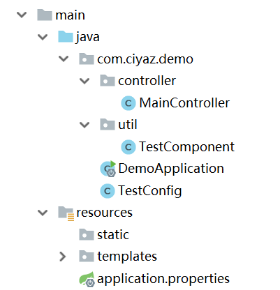

# 使用JavaConfig

随着SpringBoot的流行，使用JavaConfig的方式进行Spring配置变得更加适合，因为SpringBoot自动帮我们把大部分配置配好了，我们再显式写一个XML，显得有些多此一举。这篇笔记基于SpringBoot介绍如何使用JavaConfig，自行搭建的Spring工程还是不建议使用，但用法是相通的。

## 例子SpringBoot工程



## 配置一个Bean

现在假设我们有这样一个Bean需要进行装配（假设它存在于一个不依赖Spring的通用jar包中，不能直接通过`@Component`注解托管到IoC容器），它是一个工具类，我们现在要在Spring容器中固定一些参数并将其实例化，以供Controller等组件中依赖注入。

```java
public class TestComponent
{
	private String host;
	private int port;

	public TestComponent(String host, int port)
	{
		this.host = host;
		this.port = port;
	}

	public String getUrl()
	{
		return "http://" + host + ":" + port;
	}
}
```

我们直接创建一个配置类`TestConfig`。

```java
@Configuration
public class TestConfig
{
	@Bean("testComponent")
	public TestComponent getTestComponent() {
		return new TestComponent("localhost", 8080);
	}
}
```

实际上，现在已经配置完了。SpringBoot能够自动检测到我们用`@Configuration`标注的配置类，其中`@Bean`标注的方法，其实和XML装配Bean的功能是一模一样的，只不过把XML配置换成了Java代码，这确实更加简洁了。

## 配置Scope

配置Bean作用域，和基于类配置Bean是一样的，加上`@Scope`注解就行了。默认Bean是单例的，这里我们配置一个`prototype`模式的Bean。

这里一定要注意下`proxyMode`，我们知道`prototype`表示多例，但是仅仅加上`@Scope("prototype")`却不好使，因为JavaConfig只会在SpringBoot初始化时调用一次，默认`proxyMode`为不使用任何代理，不使用代理当然不能实现非单例的作用域。正确的写法如下：

```java
@Bean("testComponent")
@Scope(value = BeanDefinition.SCOPE_PROTOTYPE, proxyMode = ScopedProxyMode.TARGET_CLASS)
public TestComponent getTestComponent() {
  return new TestComponent("localhost", 8080);
}
```

* `ScopedProxyMode.TARGET_CLASS`：使用基于CGLIB的动态代理

注：这里我被SpringBoot（就简称SB好了）坑了一把，由于实际开发中仅仅是使用，Spring的一些核心原理即使学过也有点忘了。一开始没配置`proxyMode`，结果怎么都弄不成多例注入，各种Google、百度搜到的国内外砖家都没人说得清，最后看了半天Spring文档也没太理解，一下子想起了许多许多年前我好像研究过这个问题，一翻前篇笔记，一下子就想了起来是`proxyMode`这个坑。。。
