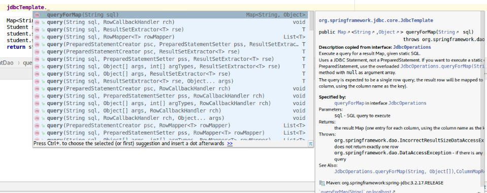
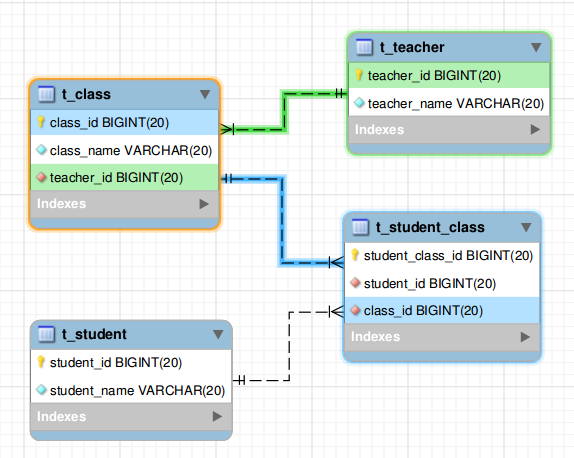

# SpringJDBC

JDK自带的JDBC接口使用起来不是很方便，对于稍大的项目，直接使用JDBC进行数据库操作，冗余代码较多。Spring提供了封装的JDBC模块JdbcTemplate，大大简化了开发人员对数据库操作的代码。

注：尽管SpringJDBC不属于SpringData项目，但毕竟属于数据访问层的内容，还是把这一章节放在这个目录下了。但是要注意，SpringData项目下面还有一个`spring-data-jdbc`，目前正处于RC版本，和这里介绍的不是一个东西，不要弄混了。

## 配置文件

Spring对JDBC封装后提供了`JdbcTemplate`类供我们使用。在`applicationContext.xml`配置文件中，我们要对这个类进行装配配置。除此之外，还要配置数据源。

applicationContext.xml
```xml
<?xml version="1.0" encoding="UTF-8"?>
<beans xmlns="http://www.springframework.org/schema/beans"
       xmlns:xsi="http://www.w3.org/2001/XMLSchema-instance"
       xmlns:context="http://www.springframework.org/schema/context"
       xsi:schemaLocation="http://www.springframework.org/schema/beans
       http://www.springframework.org/schema/beans/spring-beans.xsd
       http://www.springframework.org/schema/context
       http://www.springframework.org/schema/context/spring-context.xsd">

	<context:component-scan base-package="com.ciyaz.dao"/>

	<bean id="dataSource" class="com.mchange.v2.c3p0.ComboPooledDataSource"
	      destroy-method="close">
		<!-- 数据库驱动-->
		<property name="driverClass" value="com.mysql.jdbc.Driver"/>
		<!-- 数据库连接URL-->
		<property name="jdbcUrl" value="jdbc:mysql://localhost:3306/demo01"/>
		<!-- 用户名-->
		<property name="user" value="root"/>
		<!-- 密码-->
		<property name="password" value="root"/>
		<!-- 连接池最小维持连接数-->
		<property name="minPoolSize" value="10"/>
		<!-- 连接池最大维持连接数-->
		<property name="maxPoolSize" value="100"/>
		<!-- 连接池初始连接数-->
		<property name="initialPoolSize" value="10"/>
		<!-- 连接最大空闲时间-->
		<property name="maxIdleTime" value="300"/>
		<!-- 数据源已加载预编译SQL语句最大数量-->
		<property name="maxStatements" value="1000"/>
		<!-- 空闲连接检查时间间隔-->
		<property name="idleConnectionTestPeriod" value="60"/>
		<!--获取新连接失败时的重试次数-->
		<property name="acquireRetryAttempts" value="30"/>
	</bean>

	<bean id="jdbcTemplate" class="org.springframework.jdbc.core.JdbcTemplate">
		<constructor-arg ref="dataSource" />
	</bean>

</beans>
```

## JdbcTemplate

JdbcTemplate类提供了大量的JDBC封装方法供我们使用，根据IDE的代码和文档提示，我们很容易就能找到最适合当前情况的方法。



这里我们用一个例子进行简单的查询演示，例子的EER图如下图所示。



共有学生、课程、教师三个实体类，学生和课程为多对多关系，教师和课程为一对多关系。这里实现如下几个示例功能：

* 按id查询学生
* 查询所有学生
* 查询某个学生选的所有课程
* 查询某个课程的所有学生
* 查询某个学生的所有老师

### 手动映射查询结果集到实体对象

```java
@Component("studentDao")
public class StudentDao
{

	private JdbcTemplate jdbcTemplate;

	/**
	 * 构造函数自动装配JdbcTemplate
	 */
	@Autowired
	public StudentDao(JdbcTemplate jdbcTemplate)
	{
		this.jdbcTemplate = jdbcTemplate;
	}

	/**
	 * 根据学生ID查询学生信息
	 *
	 * @param id 学生ID
	 * @return 学生对象
	 */
	public Student queryStudentById(Long id)
	{
		String sql = "select * from t_student where student_id = ?";

		Map<String, Object> resultMap = jdbcTemplate.queryForMap(sql, id);
		Student student = new Student();
		student.setStudentId((Long) resultMap.get("student_id"));
		student.setStudentName((String) resultMap.get("student_name"));
		return student;
	}

	/**
	 * 查询所有学生
	 *
	 * @return 包含所有学生对象的列表
	 */
	public List<Student> queryAllStudents()
	{
		String sql = "select * from t_student order by student_id asc";
		List<Student> studentList = new ArrayList<>();
		List<Map<String, Object>> mapList;
		mapList = jdbcTemplate.queryForList(sql);
		for (Map<String, Object> m : mapList)
		{
			Student student = new Student();
			student.setStudentId((Long) m.get("student_id"));
			student.setStudentName((String) m.get("student_name"));
			studentList.add(student);
		}
		return studentList;
	}

	/**
	 * 查询某个学生选的所有课
	 *
	 * @param id 学生ID
	 * @return 包含课程对象的列表
	 */
	public List<Class> queryAllClassesByStudentId(Long id)
	{
		String sql = "select distinct t_class.class_id,t_class.class_name,t_class.teacher_id " +
				"from t_class " +
				"inner join t_student_class on t_class.class_id=t_student_class.class_id " +
				"where t_student_class.student_id = ?";
		List<Class> classList = new ArrayList<>();
		List<Map<String, Object>> mapList;
		mapList = jdbcTemplate.queryForList(sql, id);
		for (Map<String, Object> m : mapList)
		{
			Class c = new Class();
			c.setClassId((Long) m.get("class_id"));
			c.setClassName((String) m.get("class_name"));
			classList.add(c);
		}
		return classList;
	}

	/**
	 * 查询某个学生的所有教师
	 *
	 * @param id 学生ID
	 * @return 包含教师对象的列表
	 */
	public List<Teacher> queryTeachersByStudentId(Long id)
	{
		String sql = "select distinct t_teacher.teacher_id,t_teacher.teacher_name from t_teacher " +
				"inner join t_class on t_teacher.teacher_id = t_class.teacher_id " +
				"inner join t_student_class on t_class.class_id = t_student_class.class_id " +
				"where t_student_class.student_id = ?";
		List<Teacher> teacherList = new ArrayList<>();
		List<Map<String, Object>> mapList;
		mapList = jdbcTemplate.queryForList(sql, id);
		for (Map<String, Object> m : mapList)
		{
			Teacher teacher = new Teacher();
			teacher.setTeacherId((Long) m.get("teacher_id"));
			teacher.setTeacherName((String) m.get("teacher_name"));
			teacherList.add(teacher);
		}
		return teacherList;
	}
}
```

```java
@Component("classDao")
public class ClassDao
{
	private JdbcTemplate jdbcTemplate;

	@Autowired
	public ClassDao(JdbcTemplate jdbcTemplate)
	{
		this.jdbcTemplate = jdbcTemplate;
	}

	/**
	 * 查询某门课程的所有学生
	 * @param id 课程ID
	 * @return 包含学生对象的列表
	 */
	public List<Student> queryStudentsByClassId(Long id)
	{
		String sql = "select t_student.student_id,t_student.student_name from t_student " +
				"inner join t_student_class on t_student.student_id = t_student_class.student_id " +
				"where t_student_class.class_id=?";
		List<Student> studentList = new ArrayList<>();
		List<Map<String, Object>> mapList;
		mapList = jdbcTemplate.queryForList(sql, id);
		for (Map<String, Object> m : mapList)
		{
			Student student = new Student();
			student.setStudentId((Long) m.get("student_id"));
			student.setStudentName((String) m.get("student_name"));
			studentList.add(student);
		}
		return studentList;
	}
}
```

注：为了方便演示，代码中，未对具有关联关系的实体进行关联查询赋值，实际情况下应根据具体需求实现。

实际上，JdbcTemplate提供给我们了许多重载方法，可以用几种不同的姿势传递参数和获取结果，以上功能可以用许多不同的写法实现，我们的项目中统一选一种就可以了，不要写的乱七八糟。上面代码中，查询主要用了两种方法`queryForMap`和`queryForList`，分别用于查询单个结果和多个结果列表。

### 自动映射查询结果集到实体对象

上面代码中，我们将结果集映射到实体对象的操作是手动进行的，比较麻烦，SpringJDBC也提供了自动映射的功能。注意，自动映射时，实体类的属性名和数据库中的名字要相同，比如数据库字段`student_id`对应属性名`studentId`。

```java
//自动映射单个结果
student = jdbcTemplate.queryForObject(sql, new Object[]{id}, new BeanPropertyRowMapper<>(Student.class));
//自动映射多个结果
studentList = jdbcTemplate.query(sql, new Object[]{id}, new BeanPropertyRowMapper<>(Student.class));
```

query函数其中的一个参数是`RowMapper<T>`，这个参数就是用来告诉JdbcTemplate将结果集映射到哪个实体类的。

### execute()和update()

除了查询，对于其他的数据库操作：增、删、改，可以使用JdbcTemplate提供的`update()`方法，对于其他的操作，比如要用代码建表，可以使用`execute()`方法。

```java
public int update(String sql,
         Object... args)
           throws org.springframework.dao.DataAccessException
```

参数是SQL语句，和SQL参数，返回值是受影响的列数。

```java
public void execute(String sql)
             throws org.springframework.dao.DataAccessException
```

参数是SQL语句。
