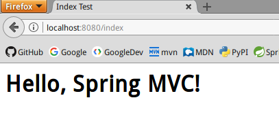

# SpringMVC 简介和环境搭建

SpringMVC是现在JavaWeb应用最广泛的表现层MVC框架。所谓表现层MVC框架，用途就是拦截HTTP请求，调用业务层处理数据，返回视图给用户。SpringMVC和Spring很容易结合在一起，而Spring几乎是JavaWeb应用必用的框架。

本系列笔记参考《Spring in Action》第四版，阅读本系列笔记前需要阅读`Java/Spring`章节。

## SpringMVC环境搭建

虽然JavaWeb应用的工程目录是高度可配置的，但是毕竟每次创建项目都要重新配置一次，比较麻烦。这里我们直接给出Gradle+SpringMVC+Spring4.3+SpringJDBC（数据源使用JNDI配置Tomcat内置连接池）+Tomcat7（Servlet3.0）+JSP（JSTL1.2）的最佳实践（已删除）。请参考SSM项目框架[https://gitee.com/ciyaz/ssm-demo](https://gitee.com/ciyaz/ssm-demo)。以后每次创建项目，直接从这里面的文件复制就行了。

这里，我们只看几个关键的配置。

### web.xml

```xml
<?xml version="1.0" encoding="UTF-8"?>
<web-app xmlns:xsi="http://www.w3.org/2001/XMLSchema-instance"
         xmlns="http://java.sun.com/xml/ns/javaee"
         xsi:schemaLocation="http://java.sun.com/xml/ns/javaee http://java.sun.com/xml/ns/javaee/web-app_3_0.xsd"
         id="WebApp_ID" version="3.0">
	<display-name>SpringMVCDemo</display-name>

	<!-- SpringContext 监听器-->
	<listener>
		<listener-class>org.springframework.web.context.ContextLoaderListener</listener-class>
	</listener>

	<!-- 编码处理过滤器 设定编码统一为UTF-8-->
	<filter>
		<filter-name>CharacterEncodingFilter</filter-name>
		<filter-class>org.springframework.web.filter.CharacterEncodingFilter</filter-class>
		<init-param>
			<param-name>encoding</param-name>
			<param-value>utf-8</param-value>
		</init-param>
	</filter>
	<filter-mapping>
		<filter-name>CharacterEncodingFilter</filter-name>
		<url-pattern>/*</url-pattern>
	</filter-mapping>

	<!--SpringMVC 核心转发处理器-->
	<servlet>
		<servlet-name>spring-mvc-demo</servlet-name>
		<servlet-class>org.springframework.web.servlet.DispatcherServlet</servlet-class>
		<load-on-startup>1</load-on-startup>
	</servlet>
	<servlet-mapping>
		<servlet-name>spring-mvc-demo</servlet-name>
		<url-pattern>/</url-pattern>
	</servlet-mapping>

</web-app>
```

`CharacterEncodingFilter`是Spring提供的编码过滤器，由于我们开发的大多是中文应用，因此最佳实践就是把整个项目从页面，到IDE，再到数据库，全部统一成UTF-8。

`DispatcherServlet`是SpringMVC的核心转发处理器，这很好理解，毕竟SpringMVC是架构在ServletAPI上的，SpringMVC的Controller要拦截请求，那么必须使用Servlet（尽管Struts2使用Filter），我们只管把它配置上就行了，但是要注意`servlet-name`，其值是和`spring-mvc-demo-servlet.xml`相对应的，不要配置错了。

spring-mvc-demo-servlet.xml
```xml
<?xml version="1.0" encoding="UTF-8"?>
<beans xmlns="http://www.springframework.org/schema/beans"
       xmlns:xsi="http://www.w3.org/2001/XMLSchema-instance"
       xmlns:mvc="http://www.springframework.org/schema/mvc"
       xmlns:context="http://www.springframework.org/schema/context"
       xsi:schemaLocation="
            http://www.springframework.org/schema/context
            http://www.springframework.org/schema/context/spring-context.xsd
            http://www.springframework.org/schema/beans
            http://www.springframework.org/schema/beans/spring-beans.xsd
            http://www.springframework.org/schema/mvc
            http://www.springframework.org/schema/mvc/spring-mvc.xsd">
	<!-- 注解驱动-->
	<mvc:annotation-driven/>
	<!-- 静态资源文件夹-->
	<mvc:resources location="/resources/" mapping="/resources/**"/>
	<!-- 控制器所在包-->
	<context:component-scan base-package="com.ciyaz.controller"/>

	<!-- JSP视图处理器配置-->
	<bean class="org.springframework.web.servlet.view.InternalResourceViewResolver">
		<property name="viewClass" value="org.springframework.web.servlet.view.JstlView"/>
		<property name="prefix" value="/WEB-INF/views/"/>
		<property name="suffix" value=".jsp"/>
	</bean>
</beans>
```

这个文件是SpringMVC核心转发Servlet的配置文件，注意`<mvc:resources>`，这个配置是针对静态资源的，比如JS库，CSS库等，`location="/resources/"`对应`webapp/resources`。`mapping="/resources/**"`则表示resources文件夹下的所有文件。如果我们不配置静态资源，那么默认是无法访问到resources目录的。

之后我们配置了一个`<bean>`，这个是JSP模板的处理器配置，我们把所有JSP都放到了`webapp/WEB-INF/views`下。如果是velocity模板，请参考`Java/Velocity模板引擎`相关章节。

## 运行示例工程

运行结果如图所示：


