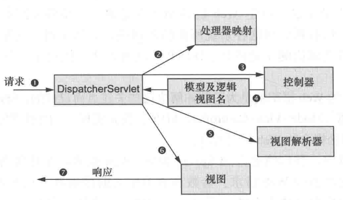

# 处理HTTP请求

上一篇笔记给出了如何搭建SpringMVC环境，从这篇笔记开始正式学习如何使用SpringMVC开发Web应用。阅读本篇笔记需要JavaWeb的知识，很多重复的内容我就不额外说明了。

我们在使用Servlet作为控制器，开发MVC架构的程序时，HTTP请求被我们的Servlet拦截，然后调用业务层对请求进行处理，最后Servlet使用`forward`的方式，调用视图（通常是JSP），并将HTML返回给用户。SpringMVC是对Servlet的封装。我们使用SpringMVC，HTTP请求的处理流程是怎样的呢？下面的图来自《Spring in Action》，这张图说明了一切。

SpringMVC中HTTP请求的处理流程



SpringMVC的`DispatcherServlet`是框架的核心转发Servlet，它会拦截所有请求，并根据配置转发给SpringMVC控制器（Controller），控制器返回视图名字符串，交回核心转发Servlet，并调用视图。我们实际只要编写Controller就行了，我们的控制器不会和视图耦合，编写起来也比Servlet简单得多，这就是使用SpringMVC的好处。

## 编写控制器

下面我们看一个最简单的控制器，处理一个GET请求。这两个文件都在上一篇笔记提供的工程模板中。

IndexController.java
```java
package com.ciyaz.controller;

import org.springframework.stereotype.Controller;
import org.springframework.web.bind.annotation.RequestMapping;
import org.springframework.web.bind.annotation.RequestMethod;

@Controller
public class IndexController
{
	@RequestMapping(value = "/index", method = RequestMethod.GET)
	public String getIndexPage()
	{
		return "index";
	}
}
```

index.jsp
```html
<%@ page contentType="text/html;charset=UTF-8" language="java" %>
<html>
<head>
	<title>Index Test</title>
</head>
<body>
	<h1>Hello, Spring MVC!</h1>
</body>
</html>
```

`index.jsp`没什么好说的，我们主要来看`IndexController.java`。

注意`@Controller`，这个注解声明了这个类是SpringMVC控制器类，这样我们才能使用控制器相关的功能（如配置拦截请求等），并将该类托管到Spring的Bean容器。

注意`@RequestMapping`，这个注解我们使用了`value`和`method`这两个属性，表示拦截的请求和HTTP方法，建议所有控制器的方法都至少显示包含这两个属性，这样比较清晰，防止写完了忘了这个方法是干什么的。

注意返回值`"index"`，这个对应`index.jsp`，也就是说，返回值是视图文件名（不加后缀）的字符串，这里显然我们调用视图使用的是转发（forward）方式。

SpringMVC和Struts2的一点不同，就是SpringMVC的Controller对应一个HTTP接口，是方法级别的。而Struts2的Action是类级别的。在实际开发当中，我更喜欢SpringMVC的处理方式。

## 向视图传递数据

```java
@Controller
public class IndexController
{
	@RequestMapping(value = "/index", method = RequestMethod.GET)
	public String getIndexPage(Model model)
	{
		model.addAttribute("text", "hello, world!");
		return "index";
	}
}
```

```html
<p>${text}</p>
```

这里我们向JSP视图传递数据，实际上非常简单，我们在控制器方法中加上一个参数Model，SpringMVC就会自动把这个参数传递给我们，实际上Model是一个键值对，我们在里面插入数据，使用`addAttribute()`方法就行了，在JSP中，就可以通过EL表达式或者JSTL标签取出数据。传递复合类型，或者List，Map等都是可以的。

## 转发和重定向

上面返回一个视图名字符串，实际上就是转发（forward）的方式，这里我们再介绍重定向的方式（redirect）。

```java
@Controller
public class TestController
{
	@RequestMapping(value = "/", method = RequestMethod.GET)
	public String redirectPage()
	{
		return "redirect:/index";
	}
}
```

我们发现，重定向也非常容易实现，返回的字符串格式就是`redirect:`+重定向的URL名即可。

要注意的是，转发不要忘了填充一些视图需要的数据，而重定向实际上是重定向到某个URL，针对这个URL的请求还是会被某个控制器拦截，并使用转发的方式，返回视图。

当然，这里我们编写的重定向没什么意义，重定向用的最多的两个地方是：

1. 权限控制，权限不足，如未登录时，访问某些接口直接重定向
2. 表单提交，提交完成后重定向，防止重复提交

## 接受请求参数

### 基本类型的参数

例如HTTP请求为`GET localhost:8080/index?id=1`，我们怎么在控制器中取出`id`的值为1呢？

```java
@Controller
public class IndexController
{
	@RequestMapping(value = "/index", method = RequestMethod.GET)
	public String getIndexPage(@RequestParam(value = "id", required = false) Integer id, Model model)
	{
		System.out.println(id);
		model.addAttribute("id", id);
		return "index";
	}
}
```

我们在控制器方法里，又加了一个参数，这个就是对应的HTTP请求参数。这里要注意几点：

1. `@RequestParam`注解，表示这个参数是一个HTTP请求参数，SpringMVC会把响应的值传进来。`value`设置了HTTP请求参数的键，`required=false`表示这不是一个必须参数（这里只是为了演示功能设置这一属性，实际情况下应该根据需求进行设置，`required`默认值为`true`）。实际上，如果请求参数名和方法的形参名相同，这个注解一般是省略的。
2. 注意，为什么我们使用`Integer`而不是`int`呢？因为，这个参数是非必须参数，也就是说HTTP请求可能并没有传入这个参数，那么id就会被置为`null`，如果id被设置为`int`，那么就没法置`null`，服务器就会报500内部错误。
3. 如果`required=true`，但是HTTP请求没有携带id参数，那么服务器就会向用户报400错误。

### 使用POJO作为参数

如果请求参数比较复杂，比如接收一个表单，SpringMVC支持把请求参数封装到一个POJO中。

页面表单
```html
<form action="${pageContext.request.contextPath}/index" method="post">
	<table>
		<tr>
			<td>用户名</td>
			<td><input type="text" name="username"/></td>
		</tr>
		<tr>
			<td>密码</td>
			<td><input type="password" name="password"/></td>
		</tr>
		<tr>
			<td rowspan="2"><input type="submit" value="提交"/></td>
		</tr>
	</table>
</form>
```

用户POJO
```java
public class User
{
	private String username;
	private String password;

	public String getUsername()
	{
		return username;
	}

	public void setUsername(String username)
	{
		this.username = username;
	}

	public String getPassword()
	{
		return password;
	}

	public void setPassword(String password)
	{
		this.password = password;
	}

	@Override
	public String toString()
	{
		return "User{" +
				"username='" + username + '\'' +
				", password='" + password + '\'' +
				'}';
	}
}
```

控制器方法
```java
@RequestMapping(value = "/index", method = RequestMethod.POST)
public void doPost(User user)
{
	System.out.println(user);
}
```

要注意的是，POJO的属性名必须和页面中，表单里的`name`属性名一致，这样SpringMVC才能帮我们正确的进行数据类型绑定。除此之外，一个POJO里嵌套另一个POJO，也是支持的，这里就不再写一个例子了。
