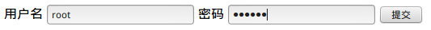
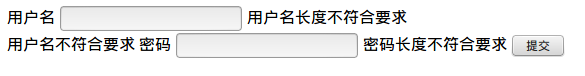

# SpringMVC 处理表单

处理表单和展示数据，是Web应用最基本的两个需求。展示数据由模板引擎负责（JSP，Velocity等），我们有专门的章节进行讲解，这篇笔记我们看看SpringMVC对表单处理做了哪些简化。

上一篇笔记中，我们介绍了一种最基本的处理表单的方法，就是从HTTP请求参数中，读取表单的各个字段，但这和直接使用Servlet没什么区别，比较麻烦，即使把字段封装到POJO中，也有字段验证等一系列问题没有解决。

SpringMVC提供了表单相关的JSP标签，能够直接将表单数据封装进我们定义好的实体类中，同时我们可以使用`Java Validate API`简化表单校验的操作，并使用SpringMVC提供的`BindingResult`简化错误处理。下面我们将一一介绍这些功能。

## 使用表单标签封装数据

我们继续在第一篇笔记给出的模板工程上，添加文件。

TestFormBean.java
```java
package com.ciyaz.beans;

public class TestFormBean
{
	private String username;
	private String password;

	public String getUsername()
	{
		return username;
	}

	public void setUsername(String username)
	{
		this.username = username;
	}

	public String getPassword()
	{
		return password;
	}

	public void setPassword(String password)
	{
		this.password = password;
	}
}
```

我们首先定义一个实体类，我们这个实体类对应于一个表单，因此我们经常习惯性的将其命名为XXFormBean，我们定义了两个字段，用户名和密码，并编写了其set和get方法。

form.jsp
```html
<%@ page contentType="text/html;charset=UTF-8" language="java" %>
<%@ taglib prefix="form" uri="http://www.springframework.org/tags/form" %>
<html>
<head>
	<title>Title</title>
</head>
<body>
<form:form method="post" action="${pageContext.request.contextPath}/form" modelAttribute="testFormBean">
	<label for="username">用户名</label>
	<form:input id="username" path="username"/>
	<label for="password">密码</label>
	<form:password id="password" path="password" />
	<input type="submit" value="提交">
</form:form>
</body>
</html>
```

这里我们就用到了SpringMVC提供的表单标签，注意：表单标签的`modelAttribute`和`path`属性是必须的，他们分别定义了表单的实体类和对应的属性字段。

FormController.java
```java
package com.ciyaz.controller;


import com.ciyaz.beans.TestFormBean;
import org.springframework.stereotype.Controller;
import org.springframework.ui.Model;
import org.springframework.web.bind.annotation.RequestMapping;
import org.springframework.web.bind.annotation.RequestMethod;

@Controller
public class FormController
{
	@RequestMapping(value = "/form", method = RequestMethod.GET)
	public String getFormPage(Model model)
	{
		model.addAttribute("testFormBean", new TestFormBean());
		return "form";
	}

	@RequestMapping(value = "/form", method = RequestMethod.POST)
	public String processForm(TestFormBean testFormBean)
	{
		System.out.println(testFormBean.getUsername());
		System.out.println(testFormBean.getPassword());

		return "redirect:/index";
	}
}
```

控制器中，我们定义了获取表单页面的方法和处理表单的方法。获取表单页面时，我们传入了一个新的`TestFormBean`实例，不传入的话，表单标签会报错。处理表单的方法中，`TestFormBean`作为参数传入方法中，这里我们仅仅是打印出表单字段的值。

运行结果（页面）：



控制台输出：

```
root
123456
```

## 表单校验

我们知道，表单的前台校验是可选的，前台校验能够提升用户体验，但是不能解决安全问题。后台校验才是服务器安全的关键。SpringMVC中，我们可以直接对实体类使用`Java Validate API`验证注解进行校验。表单校验通常比较繁琐，也比较无聊，使用验证注解，我们只需要在实体类上标注几个注解即可完成校验。

依赖库：
```java
compile group: 'javax.validation', name: 'validation-api', version: '1.1.0.Final'
compile group: 'org.hibernate', name: 'hibernate-validator', version: '5.4.1.Final'
```

TestFormBean.java
```java
package com.ciyaz.beans;

import javax.validation.constraints.NotNull;
import javax.validation.constraints.Pattern;
import javax.validation.constraints.Size;

public class TestFormBean
{
	@NotNull(message = "用户名不能为空")
	@Size(min = 3, max = 6, message = "用户名长度不符合要求")
	@Pattern(regexp = "[a-zA-Z0-9]+", message = "用户名不符合要求")
	private String username;

	@NotNull(message = "密码不能为空")
	@Size(min = 6, message = "密码长度不符合要求")
	private String password;

	public String getUsername()
	{
		return username;
	}

	public void setUsername(String username)
	{
		this.username = username;
	}

	public String getPassword()
	{
		return password;
	}

	public void setPassword(String password)
	{
		this.password = password;
	}
}
```

我们在字段上加了一些注解，这些注解都很好理解，就不多做解释了。实际上，表单校验上面三个注解`@NotNull @Size @Pattern`可以解决几乎所有的表单校验操作。当然，还有一些特殊的情况，比如注册时判断用户名是否已被注册，此时就不能通过这种方式了，我们可以在控制器中进行判断。

FormController.java
```java
package com.ciyaz.controller;


import com.ciyaz.beans.TestFormBean;
import org.springframework.stereotype.Controller;
import org.springframework.ui.Model;
import org.springframework.validation.BindingResult;
import org.springframework.web.bind.annotation.RequestMapping;
import org.springframework.web.bind.annotation.RequestMethod;

import javax.validation.Valid;

@Controller
public class FormController
{
	@RequestMapping(value = "/form", method = RequestMethod.GET)
	public String getFormPage(Model model)
	{
		model.addAttribute("testFormBean", new TestFormBean());
		return "form";
	}

	@RequestMapping(value = "/form", method = RequestMethod.POST)
	public String processForm(@Valid TestFormBean testFormBean, BindingResult bindingResult)
	{
		System.out.println(testFormBean.getUsername());
		System.out.println(testFormBean.getPassword());

		if(bindingResult.hasErrors())
		{
			return "form";
		}
		else
		{
			return "redirect:/index";
		}
	}
}
```

我们修改了一下`processForm`的参数，注意`@Valid`，这个注解是必须的，否则验证机制不会工作。注意`BindingResult`参数，我们必须获取这个参数，才能判断表单校验的结果，如果表单验证通过，`bindingResult.hasErrors()`返回false。

```html
<form:form method="post" action="${pageContext.request.contextPath}/form" modelAttribute="testFormBean">
	<label for="username">用户名</label>
	<form:input id="username" path="username"/>
	<form:errors path="username" />
	<label for="password">密码</label>
	<form:password id="password" path="password" />
	<form:errors path="password" />
	<input type="submit" value="提交">
</form:form>
```

JSP视图中，我们使用`<form:errors>`标签，注意其`path`属性，也是对字段进行绑定，这个标签会输出对应字段表单校验的错误信息。

运行结果：



这个界面可能不是十分友好，我们可以通过SpringMVC标签的`cssClass`属性，修改标签元素的CSS属性。这里就不多做介绍了。除此之外，SpringMVC还提供了其他的表单元素对应的JSP标签，其使用方法都差不多，可以参考官方文档。

如果想要使用其他模板引擎，比如Velocity，怎么办呢？SpringMVC都有对应的解决方案，请参考官方文档。在`Java/Velocity模板引擎`章节，也有相关介绍。
