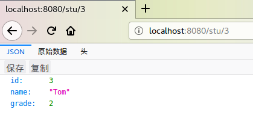

# SpringMVC的REST支持

在SpringMVC中，编写RESTful风格的网络接口非常简单。这里给出一个简单的查询接口返回JSON数据的例子。

引入jackson依赖，这样SpringMVC能够自动为我们映射Java实体类和JSON字符串。

```java
compile group: 'com.fasterxml.jackson.core', name: 'jackson-core', version: '2.8.8'
compile group: 'com.fasterxml.jackson.core', name: 'jackson-databind', version: '2.8.8'
```

StudentController.java

```java
@Controller
public class StudentController
{
	@ResponseBody
	@RequestMapping(value = "/stu/{id}", method = RequestMethod.GET)
	public Student stuAPI(@PathVariable("id") Long id)
	{
		Student student = ...（查询数据库操作）
		return student;
	}
}
```

运行结果



# 使用@RestController注解

上面例子中，我们使用了`@Controller`注解标注控制器类，SpringMVC还专门提供了一个`@RestController`，这个注解相当于结合`@Controller`和`@ResponseBody`两个注解的功能，它标注的控制器类只能直接返回数据，而不能返回视图名称。
