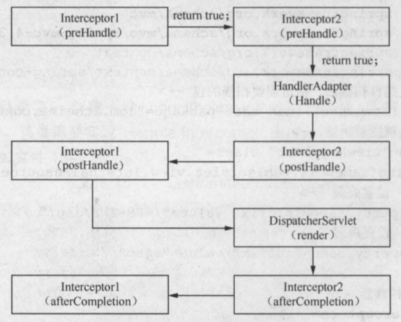

# 拦截器

SpringMVC中，和Struts2一样有拦截器的概念，我们可以用拦截器实现登录验证、日志记录等功能。使用拦截器使得功能代码解耦的更加清晰，实现了AOP的编程思想，在功能较复杂的项目中，也能保持代码结构清晰，利于维护。

## 使用SpringMVC拦截器

下面给出一个拦截器实现session登录验证的例子。

拦截器类 LoginInterceptor.java
```java
public class LoginInterceptor implements HandlerInterceptor
{
	@Override
	public boolean preHandle(HttpServletRequest request, HttpServletResponse response, Object handler) throws Exception
	{
		HttpSession session = request.getSession();
		User user = (User) session.getAttribute("user");
		if(user == null)
		{
			response.sendRedirect("/index");
			System.out.println("未登录");
			return false;
		}
		else
		{
			System.out.println("已登录");
			return true;
		}
	}

	@Override
	public void postHandle(HttpServletRequest request, HttpServletResponse response, Object handler, ModelAndView modelAndView) throws Exception{}

	@Override
	public void afterCompletion(HttpServletRequest request, HttpServletResponse response, Object handler, Exception ex) throws Exception{}
}
```

对拦截器进行配置
```xml
<mvc:interceptors>
  <mvc:interceptor>
    <mvc:mapping path="/success"/>
    <bean class="com.ciyaz.controller.LoginInterceptor" />
  </mvc:interceptor>
</mvc:interceptors>
```

编写拦截器，首先实现`HandlerInterceptor`接口，然后在XML配置文件中进行拦截器类的声明。

* preHandle()：在控制器方法执行前执行，返回值为`true`表示继续处理链，返回`false`表示终止处理链
* postHandle()：在控制器方法执行后执行
* afterCompletion()：在所有拦截器的postHandle()执行完成后执行

## 多个拦截器的执行流程

这里直接给出书中的图。


