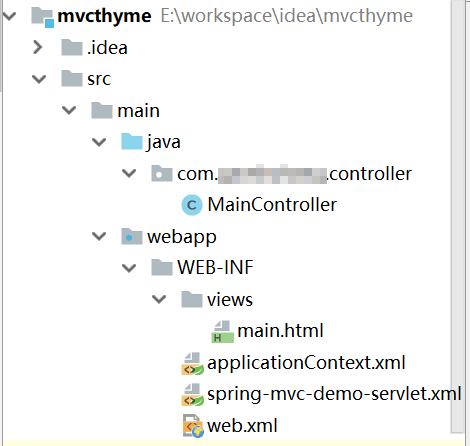

# 使用Thymeleaf模板引擎

在Thymeleaf出现之前，我们通常是用JSP或是Velocity这种模板引擎编写SpringMVC中的V（View），这引起的严重问题就是我们编写的`.jsp`或是`.vm`文件和真正的HTML文件格式严重不符，我们想要预览已经编写好的模板，就必须启动后端服务器，填充真实或是模拟出来的数据，比较麻烦。

Thymeleaf的语法比较像现在很流行的前端框架（比如Angular），它通过在HTML中定义一个`th`命名空间，引入`th:`系列的XML标签属性，模板的显示逻辑如`th:if`，`th:each`都是放在真正的HTML标签中的属性，这样做的好处就是能够正确的让浏览器直接解析预览我们的模板，利于程序员和设计人员合作。

当然，Thymeleaf其实语法十分不灵活，实际开发任务中经常碰到过于绕弯、难以实现的问题，因此不适合太复杂的页面。

## 项目结构如下



注意：其中Thymeleaf模板文件就放在`/WEB-INF/views`下，模板文件以`.html`为后缀名。

## 引入Maven依赖

SpringMVC中使用Thymeleaf需要如下几个依赖包：

```xml
<dependency>
  <groupId>org.thymeleaf</groupId>
  <artifactId>thymeleaf</artifactId>
  <version>3.0.9.RELEASE</version>
</dependency>
<dependency>
  <groupId>org.thymeleaf</groupId>
  <artifactId>thymeleaf-spring5</artifactId>
  <version>3.0.9.RELEASE</version>
</dependency>
```

注意：`thymeleaf-spring5`这个包是因为这里测试时使用的是SpringMVC5版本，如果使用的是4版本，对应的包是`thymeleaf-spring4`。

## 在Spring配置文件中配置Thymeleaf的模板处理器

demo-servlet.xml
```xml
<!--thymeleaf模板配置-->
<bean id="viewResolver" class="org.thymeleaf.spring5.view.ThymeleafViewResolver">
  <property name="templateEngine" ref="templateEngine"/>
  <property name="characterEncoding" value="UTF-8"/>
</bean>
<bean id="templateEngine" class="org.thymeleaf.spring5.SpringTemplateEngine">
  <property name="templateResolver" ref="templateResolver"/>
</bean>
<bean id="templateResolver" class="org.thymeleaf.spring5.templateresolver.SpringResourceTemplateResolver">
  <property name="prefix" value="/WEB-INF/views/"/>
  <property name="suffix" value=".html"/>
  <property name="templateMode" value="HTML5" />
  <!--<property name="cacheable" value="false" />-->
  <property name="characterEncoding" value="UTF-8"/>
</bean>
```

配置项都比较简单，这里就不多做解释了。

## 控制器和模板代码的编写

下面写一个最简单的例子，从控制器中传一个字符串到Thymeleaf模板。

MainController.java
```java
package com.ciyaz.controller;

import org.springframework.stereotype.Controller;
import org.springframework.ui.Model;
import org.springframework.web.bind.annotation.RequestMapping;
import org.springframework.web.bind.annotation.RequestMethod;

@Controller
public class MainController
{
	@RequestMapping(value = "/", method = RequestMethod.GET)
	public String getMainPage(Model model)
	{
		model.addAttribute("msg", "hello, world!!");
		return "main";
	}
}
```

main.html
```html
<!DOCTYPE html>
<html lang="zh" xmlns:th="http://www.thymeleaf.org">
<head>
	<meta charset="UTF-8">
	<title>测试</title>
</head>
<body>
<h1 th:text="${msg}"></h1>
</body>
</html>
```

## Thymeleaf使用简介

Thymeleaf是一个为web设计的现代模板引擎，使用起来比较简便，但是实际上Thymeleaf设计的还是蛮复杂的，这里就不介绍太多鸡肋的内容了，下面介绍一些Thymeleaf作为WebMVC程序中模板的简单使用方法。

### 引入XML命名空间

```html
<html lang="zh" xmlns:th="http://www.thymeleaf.org">
```

### 显示控制器传来的字符串

```html
<!--显示字符串-->
<div th:text="${msg}">defaultMsg</div>
```

### 显示JavaBean的属性

```html
<!--显示Java Bean-->
<table>
	<tr>
		<th>用户名</th>
		<th>密码</th>
		<th>出生日期</th>
	</tr>
	<tr>
		<td th:text="${user.username}">defaultUsername</td>
		<td th:text="${user.password}">defaultPassword</td>
		<td th:text="${user.birthday}">defaultBirthday</td>
	</tr>
</table>
```

### 迭代显示List<String>

```html
<!--迭代显示List-->
<ul>
	<li th:each="s : ${strings}" th:text="${s}">defaultItem</li>
</ul>
```

### 迭代显示复杂对象的列表

```html
<!--迭代显示Java Bean的List-->
<table>
	<tr>
		<th>用户名</th>
		<th>密码</th>
		<th>出生日期</th>
	</tr>
	<tr th:each="u : ${userList}">
		<td th:text="${u.username}"></td>
		<td th:text="${u.password}"></td>
		<td th:text="${u.birthday}"></td>
	</tr>
</table>
```

### 判断

```html
<!--判断-->
<span th:if="${var} == 1">aa</span>
<span th:if="${var} == 2">bb</span>
```

### 通过session进行登录判断

```html
<!--登录判断-->
<span th:if="!${session.user}">请登录</span>
<span th:if="${session.user}">已登录</span>
</body>
</html>
```

## 格式化输出日期

```html
<td th:text="${#dates.format(u.birthday, 'yyyy-MM-dd')}"></td>
```

## 使用URL

```html
<!--URL-->
<a th:href="@{/test2}">URL</a>
```

注：最开始的`/`代表项目的Context Path。

## 绑定表单字段并使用javax.validation进行后端验证

下面例子中写了一个简单的登录表单的例子，例子中使用`javax.validation`注解API进行的后端的表单字段验证，并演示了如何将FormBean绑定到HTML的form控件上，以及如何将注解式验证的错误信息输出到Thymeleaf模板上。

LoginFormBean.java
```java
package com.ciyaz.thyme.domain;

import javax.validation.constraints.NotNull;
import javax.validation.constraints.Pattern;
import javax.validation.constraints.Size;

public class LoginFormBean
{
	@NotNull(message = "用户名能为空")
	@Size(min = 1, max = 255, message = "用户名必须在1-255个字符之间")
	@Pattern(regexp = "[a-zA-Z0-9]+", message = "用户名必须是字母和数字")
	private String username;
	@NotNull(message = "密码不能为空")
	@Size(min = 1, max = 20, message = "密码必须在1-20个字符之间")
	private String password;

	public String getUsername()
	{
		return username;
	}

	public void setUsername(String username)
	{
		this.username = username;
	}

	public String getPassword()
	{
		return password;
	}

	public void setPassword(String password)
	{
		this.password = password;
	}

	@Override
	public String toString()
	{
		return "LoginFormBean{" +
				"username='" + username + '\'' +
				", password='" + password + '\'' +
				'}';
	}
}
```

Test2Controller.java
```java
package com.ciyaz.thyme.controller;

import com.ciyaz.thyme.domain.LoginFormBean;
import org.springframework.stereotype.Controller;
import org.springframework.ui.Model;
import org.springframework.validation.BindingResult;
import org.springframework.web.bind.annotation.RequestMapping;
import org.springframework.web.bind.annotation.RequestMethod;

import javax.validation.Valid;

@Controller
public class Test2Controller
{
	@RequestMapping(value = "/test2", method = RequestMethod.GET)
	public String getTest2Page(Model model)
	{
		model.addAttribute("loginFormBean", new LoginFormBean());
		return "test2";
	}

	@RequestMapping(value = "/test2", method = RequestMethod.POST)
	public String doPost(@Valid  LoginFormBean loginFormBean, BindingResult bindingResult, Model model)
	{
		if(!bindingResult.hasErrors())
		{
			System.out.println(loginFormBean);
			if ("root".equals(loginFormBean.getUsername()) && "123".equals(loginFormBean.getPassword()))
			{
				return "redirect:/";
			}
			else
			{
				model.addAttribute("err_msg", "用户名或密码错误");
				return "test2";
			}
		}
		else
		{
			return "test2";
		}
	}
}
```

test2.html
```html
<!DOCTYPE html>
<html lang="zh" xmlns:th="http://www.thymeleaf.org">
<head>
	<meta charset="UTF-8">
	<title>Title</title>
</head>
<body>
<form th:action="@{/test2}" method="post" th:object="${loginFormBean}">
	<input type="text" name="username" th:value="${loginFormBean.username}">
	<input type="password" name="password" th:value="${loginFormBean.password}">
	<input type="submit" value="提交">
	<span th:if="${err_msg != null}" th:text="${err_msg}"></span>
	<span th:errors="${loginFormBean.username}"></span>
	<span th:errors="${loginFormBean.password}"></span>
</form>
</body>
</html>
```

表单验证的原理前面已经介绍过了，这里我们主要关注模板的编写：

* `th:action`：值是一个URL语法，用于指定表单的提交地址，使用`@{}`而不是相对路径的好处是可以自动处理Context Path。
* `th:object`：用于将FormBean绑定到HTML的form标签，FormBean需要我们首先实例化并通过控制器传入模板中。
* `th:errors`：用户回显错误信息。
* `th:value`：用于填充表单字段值。在上面例子中，这个标签用于在提交失败时回显上次的表单的数据，以免用户全部重填。
