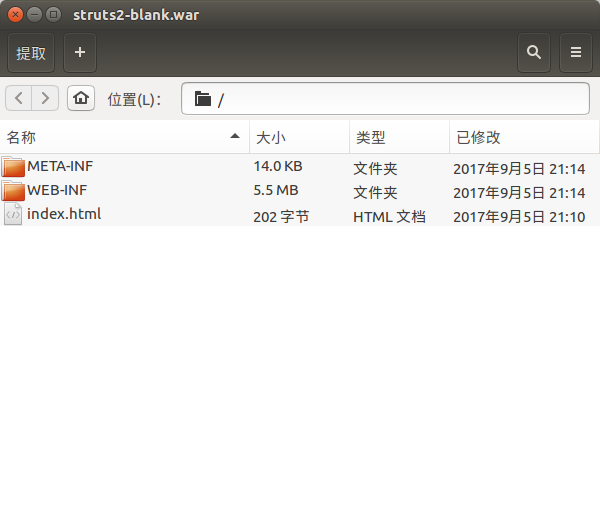
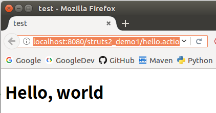

# struts2 简介

struts2是一个优秀的JavaWeb表现层MVC框架，由apache基于struts1和webwork框架开发。struts2使用POJO作为控制器Action，不与Servlet的API耦合，支持更多视图技术（JSP，Velocity，FreeMarker等）。基于SpringAOP思想的拦截器机制，更易扩展。除此之外，struts2还简化了极其常用的后台输入校验功能，简化了表现层的编程。

## struts2环境搭建

struts2发行包下载地址：[http://struts.apache.org/download.cgi](http://struts.apache.org/download.cgi)

将发行包解压后，在`apps`目录下，有一个`struts2-blank.war`，这是一个空的struts2工程，我们可以直接解压这个war包，在其基础上进行开发。如果使用Maven等包管理工具，也建议下载下来对应版本的发行包，这样可以方便的直接把配置文件`struts.xml`拷贝过来，在其上进行修改即可。



在工程中引入struts2十分简单，首先从空工程中拷贝需要的jar包，或者通过maven等工具引入依赖库。然后写好`struts.xml`，最后在`web.xml`中配置stuts2的核心过滤器即可。

struts.xml（我这里使用的是struts2.3版本）
```xml
<?xml version="1.0" encoding="UTF-8" ?>
<!DOCTYPE struts PUBLIC
	"-//Apache Software Foundation//DTD Struts Configuration 2.3//EN"
	"http://struts.apache.org/dtds/struts-2.3.dtd">

<struts>
</struts>
```

`struts.xml`应该放在`src`目录下（maven结构对应`src/main/resources`目录下）。

web.xml
```xml
<?xml version="1.0" encoding="UTF-8"?>
<web-app xmlns:xsi="http://www.w3.org/2001/XMLSchema-instance" xmlns="http://java.sun.com/xml/ns/javaee" xsi:schemaLocation="http://java.sun.com/xml/ns/javaee http://java.sun.com/xml/ns/javaee/web-app_3_0.xsd" id="WebApp_ID" version="3.0">
  <display-name>struts2_demo1</display-name>
<filter>
	<filter-name>struts2</filter-name>
	<filter-class>org.apache.struts2.dispatcher.ng.filter.StrutsPrepareAndExecuteFilter</filter-class>
</filter>
<filter-mapping>
	<filter-name>struts2</filter-name>
	<url-pattern>/*</url-pattern>
</filter-mapping>
</web-app>
```

## struts2工程例子

下面编写一个struts2的hello world工程，简单了解一下使用struts2框架时的编码流程。

HelloAction.java
```java
package com.ciyaz.action;

public class HelloAction
{
	public String hello()
	{
		return "success";
	}
}
```

struts.xml
```xml
<?xml version="1.0" encoding="UTF-8" ?>
<!DOCTYPE struts PUBLIC
	"-//Apache Software Foundation//DTD Struts Configuration 2.3//EN"
	"http://struts.apache.org/dtds/struts-2.3.dtd">

<struts>
	<package name="p1" extends="struts-default">
		<action name="hello" class="com.ciyaz.action.HelloAction" method="hello">
			<result name="success">/success.jsp</result>
		</action>
	</package>
</struts>
```

success.jsp
```html
<%@ page language="java" contentType="text/html; charset=UTF-8" pageEncoding="UTF-8"%>
<!DOCTYPE html PUBLIC "-//W3C//DTD HTML 4.01 Transitional//EN" "http://www.w3.org/TR/html4/loose.dtd">
<html>
<head>
<meta http-equiv="Content-Type" content="text/html; charset=UTF-8">
<title>test</title>
</head>
<body>
	<h1>Hello, world</h1>
</body>
</html>
```

我们注意到，配置文件中，新配置了一个Action，Action就是struts2的控制器，我们在`<action>`节点里配置了类全名，以及一个方法名。实际上，一个HTTP请求，就对应配置文件里的一个`<action>`，也就是对应Action类里的一个方法。

`<result>`里配置了jsp，作为MVC的视图。注意，result的name属性对应`hello()`的返回值字符串，也就是说，在这里就实现了根据http请求结果的不同，返回不同的字符串，对应不同的视图模板的目的。

我们用浏览器访问`http://localhost:8080/struts2_demo1/hello.action`，视图的内容正常输出：



## struts2执行流程


如图所示，简单地说，struts2的工作流程就是所有用户请求由`StrutsPrepareAndExecuteFilter`拦截，之后通过各种拦截器Interceptor的处理，交给控制器Action，之后转发给JSP或其他视图，再经过一系列拦截器后，最终的HTML返回给用户。

在`struts2-core.jar`下，我们可以看到一个`struts-default.xml`，上面代码中，我们编写的`struts.xml`中，也提到了这个文件，我们的`package`节点继承了`struts-default.xml`。这个文件里可以看到如下代码：

```xml
<interceptor-stack name="defaultStack">
	...
```

struts2默认有一个拦截器栈，上面例子中，虽然我们尚未编写任何拦截器，但实际上一些struts2自带的拦截器已经工作了。

## struts2基本的编程思路

struts2和springMVC虽然是同类产品，但是编程思路很不一样，struts2相对比较复杂。

struts2中，Action和数据是绑定的，加入现在需求是简单的增删改查，数据实体类是User（用户），那么Action就和这个User绑定，Action中的代码可能就有四个方法，分别调用Service层的方法，执行真正的增删改查操作。再来一个其他的实体类，也会有对应的Action进行绑定，数据作为Action的类属性，页面显示的数据都是通过值栈从Action取出的，也正因为如此，Action是多例的，否则会发生线程安全问题。而SpringMVC的Controller不和数据绑定，Controller的一个方法就对应一个HTTP请求，所有的HTTP请求均由Controller进行转发，Controller是单例的，属性只有依赖注入的Service对象。
