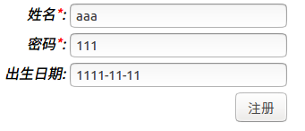
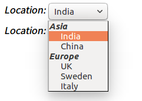
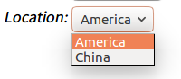

# 表单处理和类型转换

web应用的核心功能之一就是提交表单。struts2对表单数据封装，以及表单输入类型转换都有很好的支持。

在`04-处理HTTP请求`章节中，已经使用了表单作为例子，说明了struts2如何将HTTP请求参数封装进Model。这篇笔记，更进一步的记录如何使用struts2的表单标签，还有类型转换器的相关知识。

## 使用struts2表单标签

下面看一个struts2表单标签的简单例子。

register.jsp
```html
<%@ page language="java" contentType="text/html; charset=UTF-8"
	pageEncoding="UTF-8"%>
<%@taglib prefix="s" uri="/struts-tags"%>
<!DOCTYPE html PUBLIC "-//W3C//DTD HTML 4.01 Transitional//EN" "http://www.w3.org/TR/html4/loose.dtd">
<html>
<head>
<meta http-equiv="Content-Type" content="text/html; charset=UTF-8">
<title>学生注册</title>
</head>
<body>
	<s:head/>
	<s:form action="register.action">
		<s:textfield name="student.name" label="姓名" requiredLabel="true"></s:textfield>
		<s:textfield name="student.password" label="密码" requiredLabel="true"></s:textfield>
		<s:textfield name="student.birthday" label="出生日期"></s:textfield>
		<s:submit value="注册"></s:submit>
	</s:form>
</body>
</html>
```



注意JSP中，我们引入了struts2标签库，使用了`<s:form>`等标签。下面是用户的网页中，输出的HTML的表单结构。

```html
<link rel="stylesheet" href="/struts2_demo1/struts/xhtml/styles.css" type="text/css"/>
<script src="/struts2_demo1/struts/utils.js" type="text/javascript"></script>
<form id="register" name="register" action="register.action"
  method="post">
  <table class="wwFormTable">
    <tr>
      <td class="tdLabel"><label for="register_student_name"
        class="label">姓名:</label></td>
      <td><input type="text" name="student.name" value=""
        id="register_student_name" /></td>
    </tr>
    <tr>
      <td class="tdLabel"><label for="register_student_password"
        class="label">密码:</label></td>
      <td><input type="text" name="student.password" value=""
        id="register_student_password" /></td>
    </tr>
    <tr>
      <td class="tdLabel"><label for="register_student_birthday"
        class="label">出生日期:</label></td>
      <td><input type="text" name="student.birthday" value=""
        id="register_student_birthday" /></td>
    </tr>
    <tr>
      <td colspan="2"><div align="right">
          <input type="submit" value="注册" id="register_0" />
        </div></td>
    </tr>
  </table>
</form>
```

我们发现，实际上struts2表单标签自动生成了一个表格，我们的表单嵌入了表格中。除此之外，`<s:head>`标签还引入了一些CSS和JS，给表单添加了样式，这些都是struts2内置的功能。

struts2还有一些其他的表单控件标签封装，下面介绍一些常用的控件标签。

```html
<s:hidden name="" value=""/>
```

隐藏表单参数。

```html
<s:textfield name="" />
```

单行文本输入框。

```html
<s:password name="" />
```

密码框。

```html
<s:textarea name="" />
```

文本域。

```html
<s:label for="" value=""/>
```

对应HTML的label标签，用于表单控件的文字说明。

```html
<s:file name="" accept="" />
```

文件上传控件，accept取值是MIME类型，多个可用逗号分隔，如`accept="text/html,text/plain"`。

```html
<s:submit value="" />
```

提交表单按钮。

```html
<s:radio label="" name="" list="" />
```

单选按钮组，label是按钮组的标签名，list是OGNL表达式的列表，如`list={'male','female'}`。

```html
<s:checkboxlist label="" name="" list="" />
```

多选按钮组，属性参数和`<s:radio>`相同。

```html
<s:select name="" label="" list="">
  <s:optgroup label="" list="" />
</s:select>

<!--例子：-->
<s:select label="Location" name="location" list="%{{}}">
  <s:optgroup label="Asia" list="%{#{'India':'India','China':'China'}}" />
  <s:optgroup label="Europe" list="%{#{'UK':'UK','Sweden':'Sweden','Italy':'Italy'}}" />
</s:select>

<s:select label="Location" name="location" value="%{'America'}" list="%{#{'America':'America','China':'China'}}" />
```

效果：





如图所示，下拉选择框控件，select是下卡列表控件，list是下拉框的选项。optgroup是选项的分组。

## 取消struts2表单标签的默认样式

上面代码中，我们发现struts2为表单生成了表格，还有一套CSS和JS可用，但大多数时候我们不需要这些多余的东西，可能我们需要套用Bootstrap之类的样式库，这和struts2默认的样式会产生冲突。

为一个表单设置simple主题，取消一个表单的样式
```html
<s:form action="" theme="simple"></s:form>
```

全局配置simple主题：struts.properties
```
struts.ui.theme=simple
```

注：全局配置simple主题后，使用`<s:head />`会报错。

如上配置后，这些控件标签就不会自作主张的添加各种样式了。

## 自动数据类型装换

网页表单提交的字符串，但是后台实体类对应的可能是整型，浮点数，或是日期（Date）等，struts2提供了自动类型转换功能，封装了常见的类型转换器供我们使用。下面是一个输入日期的例子。

TestAction.java
```java
package com.ciyaz.action;

import java.util.Date;

public class TestAction
{
	private Date date;

	public Date getDate()
	{
		return date;
	}

	public void setDate(Date date)
	{
		this.date = date;
	}

	public String test()
	{
		System.out.println(date.toString());
		return null;
	}
}
```

index.jsp
```html
<s:form action="test.action">
  <s:textfield name="date"></s:textfield>
  <s:submit value="提交"></s:submit>
</s:form>
```

输入`2014-9-1`，后台可以得到Date对象的实例。

struts2提供的自动类型转换包括所有的基本类型，以及`yyyy-MM-dd`形式字符串到日期类型的转换。

## 自定义类型转换器

有时默认的类型转换器不符合我们的需求，例如非要用户输入`yyyy/MM/dd`形式的日期，默认的日期类型转换器就做不到了。此时，需要我们自定义类型转换器。

```
待更新：这里出了点问题，自定义类型转换器以前从没用过，这次试验，我的类型转换器正确执行并返回，但是实体类里对应属性一直是null，其他属性正确赋值，目前原因不明
```
