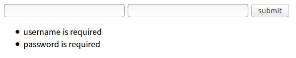
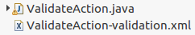

# 表单验证

表单验证在开发中工作量是很大的，编码也很无趣。web开发中，表单验证分为客户端验证和服务端验证，struts2是服务端表现层的MVC框架，可以简化服务端的验证编码。struts2的表单验证分为编程式验证和声明式验证，下面一一进行介绍。

## 编程式验证

所谓“编程式验证”就是自己编写一段代码，判断用户的输入是否符合要求。

下面是编程式验证的例子。

ValidateAction.java
```java
public class ValidateAction extends ActionSupport
{
	private User user;

	public User getUser()
	{
		return user;
	}

	public void setUser(User user)
	{
		this.user = user;
	}

	public String login()
	{
		System.out.println(user);
		return null;
	}
	@Override
	public void validate()
	{
		if(user.getUsername() == null || user.getUsername().equals(""))
		{
			addFieldError("user.username", "username is required");
		}
		if(user.getPassword() == null || user.getPassword().equals(""))
		{
			addFieldError("user.username", "password is required");
		}
	}
}
```

struts.xml
```xml
<package name="p1" extends="struts-default">
  <action name="login" class="com.ciyaz.action.ValidateAction" method="login">
    <result name="input">/login.jsp</result>
  </action>
</package>
```

login.jsp
```html
<s:form action="login.action">
  <s:textfield name="user.username" label="username"></s:textfield>
  <s:textfield name="user.password" label="password"></s:textfield>
  <s:submit value="submit"></s:submit>
  <s:fielderror fieldName="user.username"></s:fielderror>
  <s:fielderror fieldName="user.password"></s:fielderror>
</s:form>
```

表单全为空，提交后显示效果如图（主题为simple）



首先在Action中覆盖`validate()`方法，在方法体内编写验证的代码，验证失败会自动转向`input`视图，login.jsp中，使用`<s:fielderror>`进行错误输出。一个比较坑的问题是这个错误输出标签最终的输出效果是这样的：

```html
<ul class="errorMessage">
  <li><span>username is required</span></li>
  <li><span>password is required</span></li>
</ul>
```

struts2把错误信息包含在了`<ul>`中，这可能和我们的样式库不太兼容。想要改变这个，可能要修改`fielderror.ftl`，这里就不测试了。

注：实际上判断表单是否为空在JSP的`<s:textfield>`标签中加上`requiredLabel="true"`比较简单，这里只是作为例子。

### 针对指定动作方法进行验证

使用`validate()`会验证Action中的所有动作方法，可能一个Action里有某个动作方法我们不想验证函数执行，可以在动作方法上使用`@SkipValidation`标签。如果想为某个特定的动作方法制定验证函数，比如`public String login(){...}`，此时可以编写函数`public void validateLogin(){...}`取代`validate()`。

## 声明式验证

“声明式验证”指在XML配置文件中，配置struts2内置的验证器，或是配置自己编写的验证器。

下面看一个声明式验证的例子。



ValidateAction.java
```java
public class ValidateAction extends ActionSupport
{
	private User user;

	public User getUser()
	{
		return user;
	}

	public void setUser(User user)
	{
		this.user = user;
	}

	public String login()
	{
		System.out.println(user);
		return null;
	}
}
```

ValidateAction-validation.xml
```xml
<?xml version="1.0" encoding="UTF-8"?>
  <!DOCTYPE validators PUBLIC
  		"-//Apache Struts//XWork Validator 1.0.3//EN"
  		"http://struts.apache.org/dtds/xwork-validator-1.0.3.dtd">
<validators>
	<field name="user.username">
		<field-validator type="requiredstring">
			<message>username is required</message>
		</field-validator>
	</field>
	<field name="user.password">
		<field-validator type="requiredstring">
			<message>password is required</message>
		</field-validator>
	</field>
</validators>
```

动作类里没有什么特别的代码，而在动作类同包下，放有一个`[动作类名]-validation.xml`，里面使用struts2的内置验证器进行了字段的验证。注意`<field>`的name属性要和表单的name属性一致。`requiredstring`验证器的作用是保证输入的字段不为空。

如果需要针对制定的动作方法进行验证，可以将验证器声明配置文件名改为`[动作类名]-[动作名]-validation.xml`，注意这里说的动作名不是动作方法名，而是struts.xml中`<action>`的`name`属性。

验证功能是由validation拦截器来负责处理的。回显错误信息是由workflow拦截器来负责处理的。

### 常用的struts2内置验证器

除了上面使用的`requiredstring`验证器，struts2还内置了许多其他的验证器，基本能够满足大部分开发需求。有些验证器需要传入参数，可以使用`<param name="参数名">参数值</param>`标签。

内置验证器（/com/opensymphony/xwork2/validator/validators/default.xml）
```xml
<validators>
    <validator name="required" class="com.opensymphony.xwork2.validator.validators.RequiredFieldValidator"/>
    <validator name="requiredstring" class="com.opensymphony.xwork2.validator.validators.RequiredStringValidator"/>
    <validator name="int" class="com.opensymphony.xwork2.validator.validators.IntRangeFieldValidator"/>
    <validator name="long" class="com.opensymphony.xwork2.validator.validators.LongRangeFieldValidator"/>
    <validator name="short" class="com.opensymphony.xwork2.validator.validators.ShortRangeFieldValidator"/>
    <validator name="double" class="com.opensymphony.xwork2.validator.validators.DoubleRangeFieldValidator"/>
    <validator name="date" class="com.opensymphony.xwork2.validator.validators.DateRangeFieldValidator"/>
    <validator name="expression" class="com.opensymphony.xwork2.validator.validators.ExpressionValidator"/>
    <validator name="fieldexpression" class="com.opensymphony.xwork2.validator.validators.FieldExpressionValidator"/>
    <validator name="email" class="com.opensymphony.xwork2.validator.validators.EmailValidator"/>
    <validator name="url" class="com.opensymphony.xwork2.validator.validators.URLValidator"/>
    <validator name="visitor" class="com.opensymphony.xwork2.validator.validators.VisitorFieldValidator"/>
    <validator name="conversion" class="com.opensymphony.xwork2.validator.validators.ConversionErrorFieldValidator"/>
    <validator name="stringlength" class="com.opensymphony.xwork2.validator.validators.StringLengthFieldValidator"/>
    <validator name="regex" class="com.opensymphony.xwork2.validator.validators.RegexFieldValidator"/>
    <validator name="conditionalvisitor" class="com.opensymphony.xwork2.validator.validators.ConditionalVisitorFieldValidator"/>
</validators>
```

我们可以看到很多熟悉的验证需求，字符串长度，email，正则表达式等等，具体现查现用即可。正则表达式由于可能用到特殊符号，如`&`，会和XML冲突，建议包裹在CDATA中。

这里有一个要注意区别：required判断字段是否为null，requiredstring判断字段是否为空或null，不要误用。

## 自定义验证器

有时struts2内置的验证器不能满足我们的需求，处于代码复用等目的我们又非要使用声明式验证，这种情况下就需要自定义验证器了。自定义声明式验证器，首先需要定义一个验证器类，继承`FieldValidatorSupport`，然后在`src`下编写`validators.xml`文件注册自定义的声明式验证器。之后，在`[动作类名]-validation.xml`直接引用即可。

下面是自定义声明式验证器的例子，验证密码必须包含大小写字母和数字（代码参考网上的视频）。


```java
package com.ciyaz.validators;

import com.opensymphony.xwork2.validator.ValidationException;
import com.opensymphony.xwork2.validator.validators.FieldValidatorSupport;

public class StrongPasswordValidator extends FieldValidatorSupport
{
	private boolean trim = true;

	public boolean isTrim()
	{
		return trim;
	}

	public void setTrim(boolean trim)
	{
		this.trim = trim;
	}

	// Object object:当前执行的动作类
	public void validate(Object object) throws ValidationException
	{
		String fieldName = getFieldName();// 当前要验证的字段名
		Object value = this.getFieldValue(fieldName, object);// 获取用户输入的值
		if (!(value instanceof String))
		{
			addFieldError(fieldName, object);
		}
		else
		{
			String s = (String) value;

			if (trim)
			{
				s = s.trim();
			}

			if (!isPasswordStrong(s))
			{
				addFieldError(fieldName, object);
			}
		}
	}
	private static final String GROUP1 = "abcdefghijklmnopqrstuvwxyz";
	private static final String GROUP2 = "ABCDEFGHIJKLMNOPQRSTUVWXYZ";
	private static final String GROUP3 = "0123456789";

	protected boolean isPasswordStrong(String password)
	{
		boolean ok1 = false;
		boolean ok2 = false;
		boolean ok3 = false;
		int length = password.length();
		for (int i = 0; i < length; i++)
		{
			if (ok1 && ok2 && ok3)
				break;
			String character = password.substring(i, i + 1);
			if (GROUP1.contains(character))
			{
				ok1 = true;
				continue;
			}
			if (GROUP2.contains(character))
			{
				ok2 = true;
				continue;
			}
			if (GROUP3.contains(character))
			{
				ok3 = true;
				continue;
			}
		}
		return ok1 && ok2 && ok3;
	}
}
```

validators.xml
```xml
<?xml version="1.0" encoding="UTF-8"?>
<!DOCTYPE validators PUBLIC
        "-//Apache Struts//XWork Validator Definition 1.0//EN"
        "http://struts.apache.org/dtds/xwork-validator-definition-1.0.dtd">
<validators>
    <validator name="strongpassword" class="com.ciyaz.validators.StrongPasswordValidator"/>
</validators>
```
