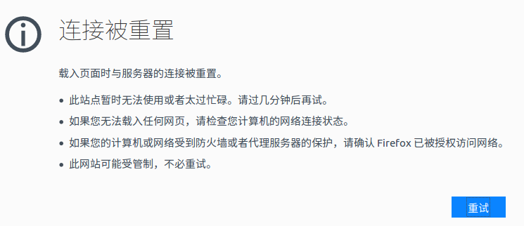

# 文件上传和下载

struts2集成了apache的commons-fileupload组件，文件上传的代码编写非常简单。除此之外，还提供了`stream`结果视图，简化了文件下载代码的编写。

## 文件上传

我们直接看一个文件上传的例子。

UploadAction.java
```java
package com.ciyaz.action;

import java.io.File;
import java.io.IOException;

import org.apache.commons.io.FileUtils;

import com.opensymphony.xwork2.ActionSupport;

public class UploadAction extends ActionSupport
{
	private File photo;
	private String photoFileName;//命名约定为xxxFileName
	private String photoContentType;//命名约定为xxxContentType

	public String upload()
	{
		String basePath = "/home/ciyaz/";
		File file = new File(basePath + photoFileName);
		try
		{
			FileUtils.copyFile(photo, file);
		}
		catch (IOException e)
		{
			e.printStackTrace();
		}
		return NONE;
	}

  ... set和get方法略
}
```

upload.jsp
```html
<s:form action="upload.action" enctype="multipart/form-data">
  <s:file name="photo" accept="image/png"></s:file>
  <s:submit value="submit"></s:submit>
</s:form>
```

struts2中，文件上传的代码编写就是这么简单，框架已经把很多工作都为我们处理好了，我们需要的只是在Action类中按照约定，定义好几个类属性，框架会在Action实例化后自动注入值。

## 处理文件上传失败

如果上传了一个超过默认限制大小的文件，这里会出现一点小问题，浏览器看到的现象是连接被重置（Tomcat版本>7有此现象），而不是输出错误信息。



我使用的struts2.3和Tomcat7，网上给出的解释是Tomcat和struts2框架的兼容性问题，解决方法暂时不明。

对上传文件进行校验可以使用编程式验证，向JSP页面输出错误信息，这种方式比较简单。还可以通过调整struts2文件上传大小限制的常量，以及文件上传处理的拦截器参数，对上传文件进行声明式的验证，但是我觉得比较麻烦，输出的错误信息也不好控制。

* struts.multipart.maxSize struts2框架允许的最大文件上传大小

## 多文件上传

一个表单如果包含多个文件上传标签，同时上传多个文件，此时把Action中的几个属性全改成数组就行了。struts2会自动初始化数组，填入合适的数据，这里就不多演示了。

## 文件下载

下面是文件下载的例子。

DownloadAction.java
```java
package com.ciyaz.action;

import java.io.File;
import java.io.FileInputStream;
import java.io.FileNotFoundException;
import java.io.InputStream;

import com.opensymphony.xwork2.ActionSupport;

public class DownloadAction extends ActionSupport
{
	private InputStream inputStream;
	private String fileName = "icon.png";

	public String download() throws FileNotFoundException
	{
		inputStream = new FileInputStream(new File("/home/ciyaz/icon.png"));
		return SUCCESS;
	}

  ... set和get方法略
}
```

struts.xml
```xml
<action name="download" class="com.ciyaz.action.DownloadAction" method="download">
  <result type="stream">
    <param name="inputName">inputStream</param>
    <param name="contentDisposition">attachment;filename=${fileName}</param>
    <param name="contentType">image/png</param>
  </result>
</action>
```

文件下载的编写也非常简单，框架都为我们处理好了，我们只需要实例化输入流对象交给框架即可，struts.xml中，需要配置结果视图的类型type为`stream`，同时需要传入几个参数，非别是流对象的属性名（在这里就是DownloadAction的inputStream），还有两个HTTP响应头，表示以下载方式获取，MIME类型为png图片。
