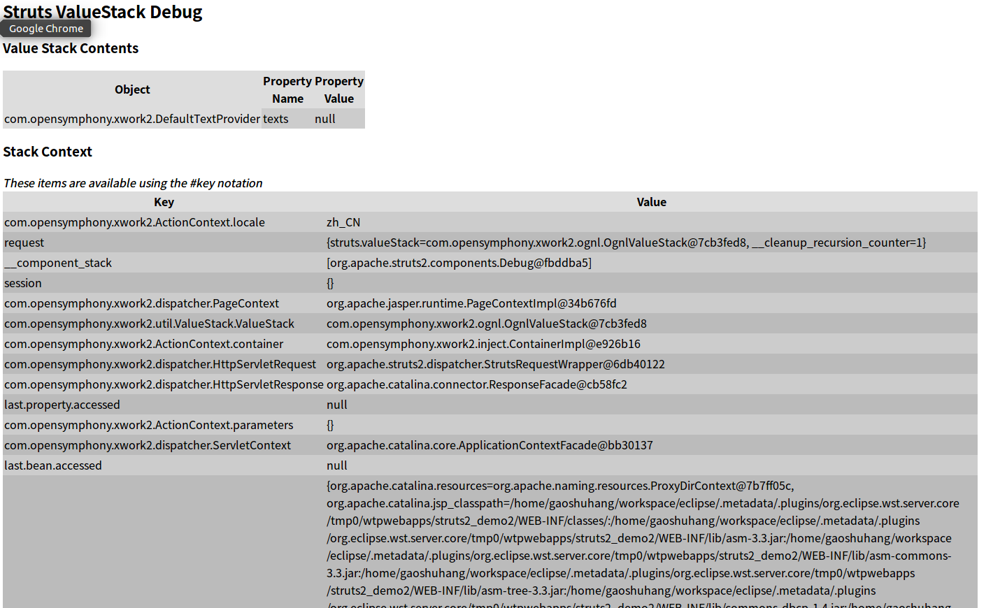
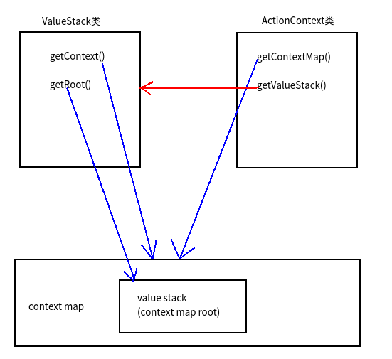

# 值栈和OGNL表达式

## Action类和数据

我们前面讲解过，为什么Action类是多实例的。Action处理请求，它产生的数据需要显示在页面上。这些相关的数据会放在context map和value stack上。值栈分为两部分，分别是context map和value stack，每次Action实例化，这两个对象也会一起产生新的实例，放在线程局部变量上。在JSP中，我们可以使用`debug`标签输出这些数据，进行观察。

```html
<s:debug></s:debug>
```



图中，上方的是value stack，下面的是context map，value stack实际上是context map的一部分，只不过它比较重要，因此单独拿了出来。如果请求是由Action转发的，value stack的栈顶就是Action，Action中的属性（有公开get方法）会显示在栈顶对象的属性中。

struts中，有一个ActionContext对象，通过它的API可以操作context map，还有一个ValueStack对象，用于操作value stack。

## context map

context map实际上是包含很多数据的Map，我们可以用OGNL表达式，访问context map里的数据。Context map共有application，session，value stack，action，request，parameters，attr共7项。

* application 值是ServletContext中的所有键值对，相当于EL的内置对象applicationScope。

* session HttpSession中的所有键值对，相当于EL的内置对象sessionScope

* value stack（root） 是一个List

* action 动作类

* request ServletRequest中的所有键值对，相当于EL的内置对象requestScope

* parameters 值是request.getParameters()，相当于EL的内置对象paramValues

* attr 从四大域对象范围中搜索

### ActionContext API

```java
//获得当前线程的ActionContext实例
ActionContext ac = ActionContext.getContext();
//获取ValueStack
ValueStack vs = ac.getValueStack();
//获取context map
Map<String, Object> contextMap = ac.getContextMap();
//获取请求参数
Map<String, Object> requestMap = ac.getParameters();
//获取session map
Map<String, Object> session = ac.getSession();
```

还有一些其他的方法，直接在eclipse中看源码了解即可。

### ValueStack API

```java
//获取ValueStack的实例
ValueStack vs = ac.getValueStack();
//获取context map数据结构
Map<String, Object> contextMap = vs.getContext();
//栈操作
vs.push(o);
vs.pop();
vs.peek();
```

还有一些其他的方法，直接在eclipse中看源码了解即可。

### 理解context map和value stack

struts2这里设计的看上去相当混乱，从类的关系，到函数名，再到数据结构，乍一看很是让人费解，这是历史原因造成的。下图红线返回值是struts2框架提供的Java对象，蓝线返回值是数据结构（Map等对象）。



表现层框架的核心功能之一就是解析请求参数，交给业务层处理，然后返回数据到页面，实际上这一过程非常简单清晰。struts2设计的这种结构，本是为了让程序员用着更加方便，思路更加清晰，实际上这个混乱的设计恰好是个反面教材，不仅性能低下，还很难理解。

## OGNL表达式

OGNL（Object Graphic Navigation Language 对象导航图语言），是另一个开源项目，webwork使用它作为表达式语言，struts2基于webwork也使用该表达式语言。要使用OGNL表达式，在视图模板里，表达式必须放在struts2标签中。

OGNL支持EL表达式的语法和运算符等，除此之外，下面介绍一些EL表达是没有的用法。

对象的方法调用
```html
<s:property value="'abcde'.length()"/>
```

类的静态变量访问
```html
<s:property value="@java.lang.Integer@MAX_VALUE"/>
```

struts2还支持类的静态方法调用，但默认不允许，需要设置全局配置
```
struts.ognl.allowStaticMethodAccess=true
```

```html
<s:property value="@java.lang.Math@abs(-100)"/>
```

## 用OGNL从context map中取数据

从context map中取数据，需要加`#`。

```html
//假设Action在context map中put()了一个键值对
<s:property value="#p1"/>
//假设Action在request对象中放了一个键值对（request也在context里）
<s:property value="#request.p1"/>
<s:property value="#request['p1']"/>
```

从value stack（context map root）中取数据，直接写上属性名就行了。

```html
//假设Action压栈一个Date对象，这里要取出date.month
<s:property value="month"/>
```

从value stack取数据时，框架会自动从栈顶向下查找，知道遇到第一个有某个属性名符合的对象，输出属性的值。如果希望忽略第一个找到的属性，OGNL表达式可以这样写`[1].month`。这个是比较方便的，前面说了Action对象会出现在栈顶，Action类转发到JSP，携带的数据保存在Action的属性里，OGNL很容易就能取到了。

## 构建List和Map

```html
//构造List（默认为ArrayList）
<s:property value="{'a','b','v'}"/>
//构造Map（默认为LinkedHashMap）
<s:property value="#{'1':'a','2':'b','c':'v'}"/>
```

单选框复选框组等struts2标签可能会用到构造List或Map的情况。

## 把普通字符串当成OGNL表达式

struts2标签里，有的属性默认是OGNL表达式，有的默认是普通字符串。想要普通字符串作为OGNL表达式解析，使用百分号引起来即可。

```html
<s:textfield name="" label="%{user.name}"></s:textfield?
```

相反的，让默认OGNL表达式的位置只是输出字符串，使用单引号`''`引起来即可（实际上就是定义一个OGNL的字符串字面值）。

## 在配置文件中使用OGNL表达式

配置文件中使用OGNL表达式，可以使用`$`引起来。

```xml
<param name="contentDisposition">attachment;filename=${fileName}</param>
```
