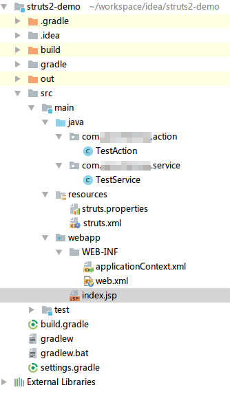

# 整合Spring和Struts2

这篇笔记记录如何整合struts2框架和spring框架。这里使用的是Intellij IDEA，构建工具使用gradle，struts2和Spring大部分使用注解配置，少量使用XML配置。

## 引入gradle依赖

```java
dependencies {
    //测试框架
    testCompile group: 'junit', name: 'junit', version: '4.12'
    //struts2核心
    compile group: 'org.apache.struts', name: 'struts2-core', version: '2.3.34'
    //struts2的spring整合插件
    compile group: 'org.apache.struts', name: 'struts2-spring-plugin', version: '2.3.34'
    //struts2的注解配置插件
    compile group: 'org.apache.struts', name: 'struts2-convention-plugin', version: '2.3.34'

    //spring核心,上下文,装配功能
    compile group: 'org.springframework', name: 'spring-core', version: '3.2.18.RELEASE'
    compile group: 'org.springframework', name: 'spring-context', version: '3.2.18.RELEASE'
    compile group: 'org.springframework', name: 'spring-beans', version: '3.2.18.RELEASE'
}
```

## 编写Spring配置文件

在`WEB-INF`下，创建applicationContext.xml文件，并设置注解扫描。

```xml
<?xml version="1.0" encoding="UTF-8"?>
<beans xmlns="http://www.springframework.org/schema/beans"
       xmlns:xsi="http://www.w3.org/2001/XMLSchema-instance"
       xmlns:context="http://www.springframework.org/schema/context"
       xmlns:jee="http://www.springframework.org/schema/jee"
       xsi:schemaLocation="http://www.springframework.org/schema/beans
       http://www.springframework.org/schema/beans/spring-beans.xsd
       http://www.springframework.org/schema/context
       http://www.springframework.org/schema/context/spring-context.xsd
       http://www.springframework.org/schema/jee
       http://www.springframework.org/schema/jee/spring-jee.xsd">
	<context:component-scan base-package="com.ciyaz.service,com.ciyaz.action"/>
</beans>
```

注：注解扫描包需要包含action所在的包，否则没法依赖注入。Action类也需要使用`@Component`标注。

## 编写struts2配置文件

```xml
<?xml version="1.0" encoding="UTF-8" ?>
<!DOCTYPE struts PUBLIC
		"-//Apache Software Foundation//DTD Struts Configuration 2.3//EN"
		"http://struts.apache.org/dtds/struts-2.3.dtd">
<struts>
	<package name="p1" extends="struts-default"/>
</struts>
```

注：为了测试，struts2配置文件里我新建了一个package。

## 编写web.xml

```xml
<?xml version="1.0" encoding="UTF-8"?>
<web-app xmlns:xsi="http://www.w3.org/2001/XMLSchema-instance"
         xmlns="http://java.sun.com/xml/ns/javaee"
         xsi:schemaLocation="http://java.sun.com/xml/ns/javaee http://java.sun.com/xml/ns/javaee/web-app_3_0.xsd"
         id="WebApp_ID" version="3.0">
	<display-name>Struts2 Demo</display-name>

	<!-- SpringContext 监听器-->
	<listener>
		<listener-class>org.springframework.web.context.ContextLoaderListener</listener-class>
	</listener>

	<!--struts2 核心过滤器-->
	<filter>
		<filter-name>struts2</filter-name>
		<filter-class>org.apache.struts2.dispatcher.ng.filter.StrutsPrepareAndExecuteFilter</filter-class>
	</filter>
	<filter-mapping>
		<filter-name>struts2</filter-name>
		<url-pattern>/*</url-pattern>
	</filter-mapping>

</web-app>
```

## 测试

为了说明如何标注注解，下面简单写了一个例子，请求Action，调用Service，什么都不做直接返回一个JSP。

项目结构



TestAction.java
```java
package com.ciyaz.action;

import com.ciyaz.service.TestService;
import com.opensymphony.xwork2.ActionSupport;
import org.apache.struts2.convention.annotation.Action;
import org.apache.struts2.convention.annotation.ParentPackage;
import org.apache.struts2.convention.annotation.Result;
import org.springframework.beans.factory.annotation.Autowired;
import org.springframework.stereotype.Component;

@ParentPackage("p1")
@Component
public class TestAction extends ActionSupport
{
	private TestService testService;

	@Autowired
	public TestAction(TestService testService)
	{
		this.testService = testService;
	}

	@Action(value = "test", results = {@Result(name = "success", location = "/index.jsp")})
	public String test()
	{
		testService.test();
		System.out.println("action");
		return SUCCESS;
	}
}
```

TestService.java
```java
package com.ciyaz.service;

import org.springframework.stereotype.Service;

@Service
public class TestService
{
	public void test()
	{
		System.out.println("service");
	}
}
```
