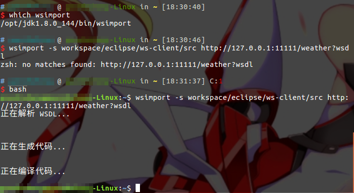
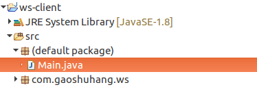

# JDK内置的JWS实现

我们可以自己实现JAX-WS，手写一个“基于SOAP协议的Web Service服务器”，但显然这个工作比较复杂，于是出现了各种框架。JDK6发布时，自带了一个JAX-WS和SOAP1.1的实现模块，我们使用`javax.jws`下的类时，只需要加几个注解，用几行代码调用一下即可。

## JWS例子

下面例子代码中，简单的提供一个实体类Weather，供远程调用。

Weather.java
```java
package com.ciyaz.ws.domain;

import java.util.Date;

public class Weather
{
	private String city;
	private String weather;
	private int temperature;
	private Date date;

	//省略get/set方法
}
```

Weather类是一个标准的POJO。

WeatherInterface.java
```java
package com.ciyaz.ws;

import com.ciyaz.ws.domain.Weather;

public interface WeatherInterface
{
	public Weather queryWeather(String city);
}
```

WeatherInterface接口定义了Web Service要提供的服务的接口方法。

WeatherInterfaceImpl.java
```java
package com.ciyaz.ws;

import com.ciyaz.ws.domain.Weather;

import javax.jws.WebMethod;
import javax.jws.WebParam;
import javax.jws.WebResult;
import javax.jws.WebService;
import java.util.Date;

@WebService(serviceName = "WeatherService")
public class WeatherInterfaceImpl implements WeatherInterface
{
	@WebMethod(operationName = "queryWeather")
	@Override
	public @WebResult(name = "weather") Weather queryWeather(@WebParam(name = "city") String city)
	{
		Weather weather = new Weather();

		weather.setCity(city);
		weather.setDate(new Date());
		weather.setTemperature(17);
		weather.setWeather("晴");

		return weather;
	}
}
```

WeatherInterfaceImpl实现了具体的Web Service业务，注意我们使用了注解`@WebService`，标注这个注解后，JWS模块就会调用这个类的服务方法，读取其返回值发给客户端。其余注解都是覆盖一些默认的描述信息，都是非必须的，但是最好标注上，具体内容请参考WSDL文档。

Main.java
```java
import com.ciyaz.ws.WeatherInterfaceImpl;

import javax.xml.ws.Endpoint;

public class Main
{

	public static void main(String[] args)
	{
		Endpoint.publish("http://127.0.0.1:11111/weather", new WeatherInterfaceImpl());
	}
}
```

主方法里只有一行代码，`Endpoint.publish()`发布我们编写好的Web Service接口。此时，JWS会启动一个内置服务器，提供Web Service。

## 使用浏览器访问WSDL文档

浏览器访问的地址：
```
http://127.0.0.1:11111/weather?wsdl
```

返回的WSDL文档
```xml
<?xml version="1.0" encoding="UTF-8"?><!-- Published by JAX-WS RI (http://jax-ws.java.net). RI's version is JAX-WS RI 2.2.9-b130926.1035 svn-revision#5f6196f2b90e9460065a4c2f4e30e065b245e51e. --><!-- Generated by JAX-WS RI (http://jax-ws.java.net). RI's version is JAX-WS RI 2.2.9-b130926.1035 svn-revision#5f6196f2b90e9460065a4c2f4e30e065b245e51e. -->
<definitions xmlns:wsu="http://docs.oasis-open.org/wss/2004/01/oasis-200401-wss-wssecurity-utility-1.0.xsd"
             xmlns:wsp="http://www.w3.org/ns/ws-policy" xmlns:wsp1_2="http://schemas.xmlsoap.org/ws/2004/09/policy"
             xmlns:wsam="http://www.w3.org/2007/05/addressing/metadata"
             xmlns:soap="http://schemas.xmlsoap.org/wsdl/soap/" xmlns:tns="http://ws.ciyaz.com/"
             xmlns:xsd="http://www.w3.org/2001/XMLSchema" xmlns="http://schemas.xmlsoap.org/wsdl/"
             targetNamespace="http://ws.ciyaz.com/" name="WeatherService">
	<types>
		<xsd:schema>
			<xsd:import namespace="http://ws.ciyaz.com/"
			            schemaLocation="http://127.0.0.1:11111/weather?xsd=1"></xsd:import>
		</xsd:schema>
	</types>
	<message name="queryWeather">
		<part name="parameters" element="tns:queryWeather"></part>
	</message>
	<message name="queryWeatherResponse">
		<part name="parameters" element="tns:queryWeatherResponse"></part>
	</message>
	<portType name="WeatherInterfaceImpl">
		<operation name="queryWeather">
			<input wsam:Action="http://ws.ciyaz.com/WeatherInterfaceImpl/queryWeatherRequest"
			       message="tns:queryWeather"></input>
			<output wsam:Action="http://ws.ciyaz.com/WeatherInterfaceImpl/queryWeatherResponse"
			        message="tns:queryWeatherResponse"></output>
		</operation>
	</portType>
	<binding name="WeatherInterfaceImplPortBinding" type="tns:WeatherInterfaceImpl">
		<soap:binding transport="http://schemas.xmlsoap.org/soap/http" style="document"></soap:binding>
		<operation name="queryWeather">
			<soap:operation soapAction=""></soap:operation>
			<input>
				<soap:body use="literal"></soap:body>
			</input>
			<output>
				<soap:body use="literal"></soap:body>
			</output>
		</operation>
	</binding>
	<service name="WeatherService">
		<port name="WeatherInterfaceImplPort" binding="tns:WeatherInterfaceImplPortBinding">
			<soap:address location="http://127.0.0.1:11111/weather"></soap:address>
		</port>
	</service>
</definitions>
```

我们观察文档，可以看到`<service>`就代表我们发布的服务，name属性就是我们通过注解定义的服务名，`<portType>`和`<operation>`分别是服务的实现类名和服务方法名。

## 客户端调用Web Service

JDK自带了wsimport工具，可以根据WSDL文档的描述（实际上还有几个xsd）自动生成客户端的远程调用代码，下面演示如何使用wsimport工具。

首先使用wsimport工具生成代码
```
wsimport -s workspace/eclipse/ws-client/src http://127.0.0.1:11111/weather?wsdl
```

注：wsimport在JDK的bin下，需要正确配置环境变量才能使用，除此之外，我在使用时发现zsh和这个工具有冲突，必须用bash才行。windows下应该是没有任何问题的。



自动生成的包中，包含了我们需要调用的类。其中代码很少，我们可以简单看下。



调用自动生成的代码非常简单：

Main.java
```java
import java.text.SimpleDateFormat;
import java.util.Date;

import com.ciyaz.ws.Weather;
import com.ciyaz.ws.WeatherInterfaceImpl;
import com.ciyaz.ws.WeatherService;

public class Main
{
	public static void main(String[] args)
	{
		//获取Service
		WeatherService weatherService = new WeatherService();
		//获取PortType
		WeatherInterfaceImpl weatherInterfaceImpl = weatherService.getWeatherInterfaceImplPort();
		//发起远程调用
		Weather weather = weatherInterfaceImpl.queryWeather("Tokyo");

		System.out.println(weather.getCity());
		System.out.println(weather.getTemperature());
		System.out.println(weather.getWeather());
		Date date = weather.getDate().toGregorianCalendar().getTime();
		SimpleDateFormat simpleDateFormat = new SimpleDateFormat("yyyy-MM-dd");
		System.out.println(simpleDateFormat.format(date));
	}
}
```

除了上面的写法直接把Service和PortType实例化，还可以指定WSDL文档的URL，让程序自己去查Service和PortType是哪个类，这种写法更加规范，在一个服务器有很多不同服务时，这种写法结构更加清晰，代码如下：

Main.java
```java
import java.net.MalformedURLException;
import java.net.URL;
import java.text.SimpleDateFormat;
import java.util.Date;

import javax.xml.namespace.QName;
import javax.xml.ws.Service;

import com.ciyaz.ws.Weather;
import com.ciyaz.ws.WeatherInterfaceImpl;

public class Main
{
	public static void main(String[] args) throws MalformedURLException
	{
		//WSDL文档的URL
		URL wsdlDocUrl = new URL("http://127.0.0.1:11111/weather?wsdl");
		//从WSDL找到服务视图 第一个参数是命名空间 namespace 第二个参数是服务视图名 name
		QName serviceName = new QName("http://ws.ciyaz.com/", "WeatherService");
		//创建服务视图
		Service service = Service.create(wsdlDocUrl, serviceName);
		//获取PortType
		WeatherInterfaceImpl weatherInterfaceImpl = service.getPort(WeatherInterfaceImpl.class);
		//获取远程调用对象
		Weather weather = weatherInterfaceImpl.queryWeather("Tokyo");

		System.out.println(weather.getCity());
		System.out.println(weather.getTemperature());
		System.out.println(weather.getWeather());
		Date date = weather.getDate().toGregorianCalendar().getTime();
		SimpleDateFormat simpleDateFormat = new SimpleDateFormat("yyyy-MM-dd");
		System.out.println(simpleDateFormat.format(date));
	}
}
```

输出结果：
```
Tokyo
17
晴
2017-11-10
```
