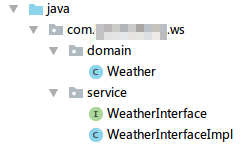
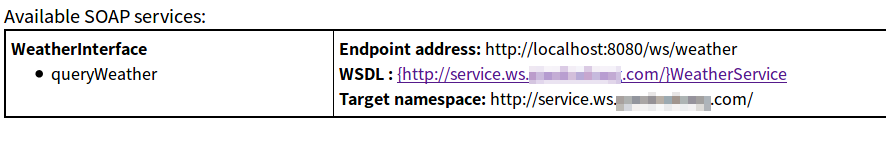

# CXF框架简介

CXF是Apache开发的SOA（面向服务）框架，CXF结合了Celtix和Xfire，开始叫Apache CeltiXfire，后来改名CXF。这个框架比起JDK自带的JWS强大得多，JWS只支持SOAP1.1，CXF支持SOAP1.1，SOAP1.2，XML/HTTP，Restful HTTP甚至CORBA这种古董（当然现在也很少用了）。CXF部署很灵活，能够运行于Tomcat，Jetty等容器下，同时很容易和Spring集成。

[CXF下载地址](http://cxf.apache.org/download.html)

## CXF整合Spring实现Web Service服务器

下面例子中，我们使用CXF+Spring，使用Tomcat作为容器，开发一个简单的WebService。

引入CXF和Spring框架的gradle依赖
```java
compile group: 'org.springframework', name: 'spring-core', version: '3.2.18.RELEASE'
compile group: 'org.springframework', name: 'spring-context', version: '3.2.18.RELEASE'
compile group: 'org.springframework', name: 'spring-context-support', version: '3.2.18.RELEASE'
compile group: 'org.springframework', name: 'spring-beans', version: '3.2.18.RELEASE'
compile group: 'org.springframework', name: 'spring-web', version: '3.2.18.RELEASE'

compile group: 'org.apache.cxf', name: 'cxf-core', version: '3.2.1'
compile group: 'org.apache.cxf', name: 'cxf-rt-frontend-jaxrs', version: '3.2.1'
compile group: 'org.apache.cxf', name: 'cxf-rt-frontend-jaxws', version: '3.2.1'
```

编写Web Service代码



Weather.java
```java
package com.ciyaz.ws.domain;

import java.util.Date;

public class Weather
{
	private String city;
	private String weather;
	private int temperature;
	private Date date;

  //省略get/set方法
}
```

WeatherInterface.java
```java
package com.ciyaz.ws.service;

import com.ciyaz.ws.domain.Weather;

import javax.jws.WebMethod;
import javax.jws.WebParam;
import javax.jws.WebResult;
import javax.jws.WebService;

@WebService(serviceName = "WeatherService")
public interface WeatherInterface
{
	@WebMethod(operationName = "queryWeather")
	public @WebResult(name = "weather") Weather queryWeather(@WebParam(name = "city") String city);
}
```

WeatherInterfaceImpl.java
```java
package com.ciyaz.ws.service;

import com.ciyaz.ws.domain.Weather;
import org.springframework.stereotype.Component;

import java.util.Date;

@Component(value = "weatherInterface")
public class WeatherInterfaceImpl implements WeatherInterface
{

	@Override
	public Weather queryWeather(String city)
	{
		Weather weather = new Weather();

		weather.setCity(city);
		weather.setDate(new Date());
		weather.setTemperature(17);
		weather.setWeather("晴");

		return weather;
	}
}
```

注意，这里和上一节的代码区别就是把`@WebService`等注解标注在了接口上，而不是实现类上，使用JDK默认实现时，注解标注在接口上是不好使的，但是使用CXF可以这样做。实现类上使用了Spring的`@Component`注解用于依赖注入。

编写配置文件

WEB-INF/applicationContext.xml
```xml
<?xml version="1.0" encoding="UTF-8"?>
<beans xmlns="http://www.springframework.org/schema/beans"
       xmlns:xsi="http://www.w3.org/2001/XMLSchema-instance"
       xmlns:jaxws="http://cxf.apache.org/jaxws"
       xmlns:jaxrs="http://cxf.apache.org/jaxrs"
       xmlns:cxf="http://cxf.apache.org/core"
       xmlns:context="http://www.springframework.org/schema/context"
       xsi:schemaLocation="http://www.springframework.org/schema/beans
				            http://www.springframework.org/schema/beans/spring-beans.xsd
				            http://www.springframework.org/schema/context
				            http://www.springframework.org/schema/context/spring-context.xsd
				            http://cxf.apache.org/jaxrs http://cxf.apache.org/schemas/jaxrs.xsd
				            http://cxf.apache.org/jaxws http://cxf.apache.org/schemas/jaxws.xsd
				            http://cxf.apache.org/core http://cxf.apache.org/schemas/core.xsd">


	<context:component-scan base-package="com.ciyaz.ws.service"/>

	<jaxws:server address="/weather" serviceClass="com.ciyaz.ws.service.WeatherInterface">
		<jaxws:serviceBean>
			<ref bean="weatherInterface"/>
		</jaxws:serviceBean>
	</jaxws:server>

</beans>
```

Spring配置文件里，使用了`<jaxws:server>`和`<jaxws:serviceBean>`这两个标签配置了我们编写的Web Service类。

* address 该Web Service的所在的地址，实际URL是例如`http://localhost:8080/myapp/ws/address`这种形式，`/myapp`是contextPath，`/ws`是web.xml里配置的CXF使用的Servlet的请求地址。
* serviceClass 服务类（这里是接口），即标注了`@WebService`注解的类
* `<ref bean="weatherInterface"/>` 这里配置的就是服务接口的实现类

WEB-INF/web.xml
```xml
<?xml version="1.0" encoding="UTF-8"?>
<web-app xmlns:xsi="http://www.w3.org/2001/XMLSchema-instance"
         xmlns="http://java.sun.com/xml/ns/javaee"
         xsi:schemaLocation="http://java.sun.com/xml/ns/javaee http://java.sun.com/xml/ns/javaee/web-app_3_0.xsd"
         id="WebApp_ID" version="3.0">
	<display-name>CXF WS Demo</display-name>

	<listener>
		<listener-class>org.springframework.web.context.ContextLoaderListener</listener-class>
	</listener>

	<!-- 配置cxf的servlet -->
	<servlet>
		<servlet-name>cxf</servlet-name>
		<servlet-class>org.apache.cxf.transport.servlet.CXFServlet</servlet-class>
		<load-on-startup>1</load-on-startup>
	</servlet>
	<!-- webservice的路径以/ws开头 -->
	<servlet-mapping>
		<servlet-name>cxf</servlet-name>
		<url-pattern>/ws/*</url-pattern>
	</servlet-mapping>

	<welcome-file-list>
		<welcome-file>index.html</welcome-file>
		<welcome-file>index.htm</welcome-file>
		<welcome-file>index.jsp</welcome-file>
		<welcome-file>default.html</welcome-file>
		<welcome-file>default.htm</welcome-file>
		<welcome-file>default.jsp</welcome-file>
	</welcome-file-list>
</web-app>
```

web.xml中，配置Spring上下文就不多说了，下面配置了CXF的Servlet，这个是非常重要的，就像使用SpringMVC要配置核心转发Servlet，使用Struts2要配置核心过滤器一样，CXF如果想在我们自己的web容器中运行，就要求配置一个`CXFServlet`拦截对所有Web Service的请求。

## 用浏览器访问Web Service服务

请求URL为（这里我为了方便把contextPath设成了`/`，正常项目中肯定是类似`/myapp`的形式）
```
http://localhost:8080/ws
```



点击上面的链接，WSDL文档也能正确显示。

## 使用CXF+Spring实现Web Service客户端

使用CXF的Web Service通常都是用于分布式的系统间协作，因此Web Service的客户端很有可能是另一个系统的服务器。CXF不仅能用于开发Web Service服务器，还能用于客户端。`CXF3.2.1/apache-cxf-3.2.1/bin`下有一些可执行文件，其中`wsdl2java`和`wsimport`功能差不多，但是如果使用CXF实现ws客户端，就需要使用CXF提供的工具生成客户端代码。

```
wsdl2java -d workspace/eclipse/ws-client/src http://localhost:8080/ws?wsdl
```

在applicationContext中配置客户端bean
```xml
<jaxws:client id="weatherClient"
  address="http://localhost:8080/ws_1231_cxf_spring_server/ws/weather?wsdl"
  serviceClass="com.ciyaz.ws.service.WeatherInterface">
</jaxws:client>
```

* address：WSDL文档的URL
* serviceClass：生成的代码的PortType类全名

这样我们就能够使用依赖注入，以id为`weatherClient`，得到`WeatherInterface`类进行远程调用了。
