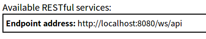
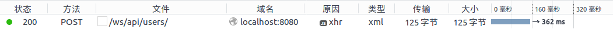

# CXF框架实现JAX-RS

这里我们还是使用CXF框架+Spring的形式，以Tomcat作为容器，实现JAX-RS，提供RESTful的web接口服务。

## CXF实现REST服务例子

依赖库
```java
compile group: 'org.apache.cxf', name: 'cxf-core', version: '3.2.1'
compile group: 'org.apache.cxf', name: 'cxf-rt-frontend-jaxrs', version: '3.2.1'
```

User.java
```java
package com.ciyaz.ws.domain;

import javax.xml.bind.annotation.XmlRootElement;
import java.util.Date;

@XmlRootElement(name = "user")
public class User
{
	private long id;
	private String name;
	private Date birthday;

  //省略get/set方法
}

```

这里使用JAXB指定User类能够序列化为XML。

UserService.java
```java
package com.ciyaz.ws.service;

import com.ciyaz.ws.domain.User;

import javax.jws.WebService;
import javax.ws.rs.GET;
import javax.ws.rs.Path;
import javax.ws.rs.PathParam;
import javax.ws.rs.Produces;
import javax.ws.rs.core.MediaType;
import java.util.List;

@WebService
@Path("/users")
public interface UserService
{
	@GET
	@Path("/{id}")
	@Produces(MediaType.APPLICATION_XML)
	public User queryUser(@PathParam("id") long id);

	@GET
	@Path("/")
	@Produces(MediaType.APPLICATION_XML)
	public List<User> queryUserList();
}
```

注意这里使用的注解，除了`@WebService`，其余都是`javax.ws.rs`里的JAX-RS规范。

* `@Path` 接口上标注的是这个service bean的服务路径，方法上标注的是某个接口的具体路径
* `@GET` 这个注解标注了HTTP请求的动作
* `@Produces` 这个注解表示如何处理实体类，这里指定以XML形式返回

UserServiceImpl.java
```java
package com.ciyaz.ws.service;

import com.ciyaz.ws.domain.User;
import org.springframework.stereotype.Component;

import java.util.ArrayList;
import java.util.Date;
import java.util.List;

@Component(value = "userService")
public class UserServiceImpl implements UserService
{
	@Override
	public User queryUser(long id)
	{
		User user = new User();
		user.setId(id);
		user.setName("tom");
		user.setBirthday(new Date());

		return user;
	}

	@Override
	public List<User> queryUserList()
	{
		List<User> users = new ArrayList<>();

		for(int i = 0; i < 3; i++)
		{
			User user = new User();
			user.setId(i);
			user.setName(String.valueOf(i));
			user.setBirthday(new Date());

			users.add(user);
		}

		return users;
	}
}
```

使用浏览器访问
```
http://localhost:8080/ws
```



访问REST接口
```
http://localhost:8080/ws/api/users/2
```

返回结果（默认是无格式的）
```xml
<?xml version="1.0" encoding="UTF-8" standalone="yes"?>
<user>
	<birthday>2017-11-11T12:20:09.812+08:00</birthday>
	<id>2</id>
	<name>tom</name>
</user>
```

访问另一个REST接口
```
http://localhost:8080/ws/api/users
```

返回结果
```xml
<?xml version="1.0" encoding="UTF-8"?>
<users>
	<user>
		<birthday>2017-11-11T12:27:21.304+08:00</birthday>
		<id>0</id>
		<name>0</name>
	</user>
	<user>
		<birthday>2017-11-11T12:27:21.304+08:00</birthday>
		<id>1</id>
		<name>1</name>
	</user>
	<user>
		<birthday>2017-11-11T12:27:21.304+08:00</birthday>
		<id>2</id>
		<name>2</name>
	</user>
</users>
```

## 使用POST请求

GET和DELETE不需要请求体，这里就不多介绍了，POST和PUT是需要请求体来映射到Java实体类的，这里演示下POST。

UserService.java
```java
@POST
@Path("/")
@Produces(MediaType.APPLICATION_XML)
public Result createUser(@RequestParam("user") User user);
```

实现类就是打印一下user参数，这里就不贴代码了。

index.jsp
```javascript
function ajax() {
  var xhr = new XMLHttpRequest();
  xhr.open("POST", "ws/api/users/", true);
  xhr.setRequestHeader("Content-Type", "application/xml");
  xhr.send("<?xml version=\"1.0\" encoding=\"UTF-8\" standalone=\"yes\"?><user><birthday>2017-11-11T12:20:09.812+08:00</birthday><id>10</id><name>bob</name></user>");
}
```

页面通过ajax发送一个XML信息，注意必须添加请求头，告诉服务器包含的数据类型是XML，否则请求是不会成功的。



## 使用JSON

如果是前台页面调用服务器的REST接口，使用JSON传输数据十分方便，因为JavaScript对象和JSON对象之间是很容易转换的。下面将一个服务接口改为使用json传输数据。

让CXF支持json，需要再额外引入两个依赖

```java
compile group: 'org.apache.cxf', name: 'cxf-rt-rs-extension-providers', version: '3.2.1'
compile group: 'org.codehaus.jettison', name: 'jettison', version: '1.3.8'
```

* cxf-rt-rs-extension-providers：提供了序列化为JSON的转换接口
* jettison：StAX形式读写JSON的库，CXF需要用到

applicationContext.xml
```xml
<jaxrs:server address="/api">
  <jaxrs:serviceBeans>
    <ref bean="userService"/>
  </jaxrs:serviceBeans>

  <jaxrs:providers>
    <bean class="org.apache.cxf.jaxrs.provider.json.JSONProvider">
      <property name="dropRootElement" value="true"/>
      <property name="supportUnwrapped" value="true"/>
    </bean>
  </jaxrs:providers>
</jaxrs:server>
```

配置文件中加入了json的相关配置：

* `JSONProvider`：对应`cxf-rt-rs-extension-providers`，提供了JSON的转换接口
* `dropRootElement`：是否不把根节点写入JSON（为了解析方便可以设为true，其实无所谓）

userService.java
```java
@GET
@Path("/{id}")
@Produces(MediaType.APPLICATION_JSON)
public User queryUser(@PathParam("id") long id);
```

实际上接口里我们更改下MediaType就行了。注意：即使使用json，实体类里JAXB的注解也是不能去掉的。

浏览器访问
```
http://localhost:8080/ws/api/users/1
```

返回json字符串
```json
{"birthday":"2017-11-11T13:11:38.712+08:00","id":1,"name":"tom"}
```
