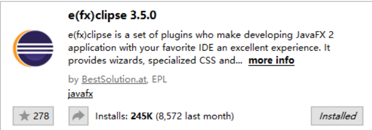
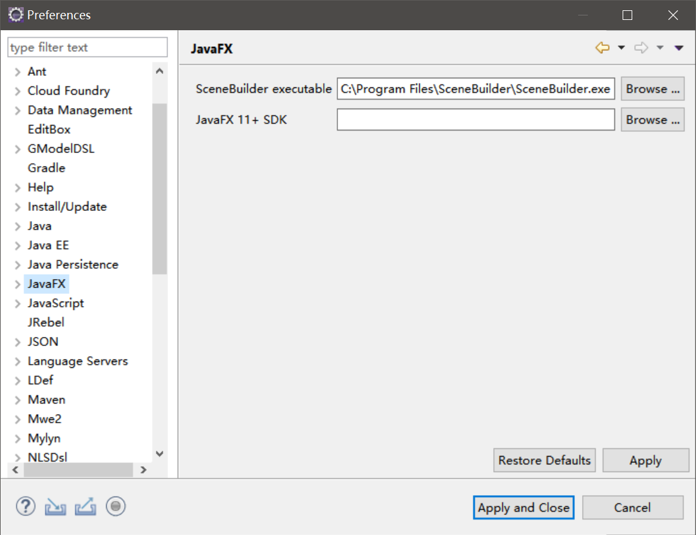

# JavaFX简介和环境搭建

JavaFX是一个跨平台的现代化GUI框架，2008年Sun公司推出JavaFX时就旨在取代老旧的Swing，而且将JavaFX内置在JDK中。如今JDK11已经发布，JavaFX从JDK中被拆分了出来，它并没有取代Swing，而是成为Java开发桌面客户端的另一种选择。

这里我们基于JDK11和Maven介绍JavaFX框架，注意JDK11和老版本（指JDK8及以下）有较大的区别，JDK8中包含了JavaFX而JDK11没有。

补充：JDK11移除了JavaFX，这其实有点问题，因为面向普遍安装了JDK的用户开发软件时，要额外带着JavaFX的运行时，这造成了打包体积更大的问题。

## JavaFX优缺点和适用场景

JavaFX优点非常明显，它完全是一个现代化设计的桌面GUI框架（相对Swing/SWT来说），而且是跨平台的。使用FXML、CSS进行视图布局以及规范的MVC开发模式，它和QML、WPF可以算是同类技术。

缺点就比较多了，最主要就是内存占用太高（和Electron比倒是好多了），在Windows操作系统上的体验是远远不及C#等系列技术的。而且组件生态也不成熟，许多年前我最开始用JavaFX就是想做个编辑器，结果`TextArea`组件不支持语法高亮，也没有靠谱的解决方案（嵌入个浏览器内核的不算，资源占用太高），只好改用Swing。

## 文档

JavaFX由于几乎没什么公司用，而且大部分人都是面向RMB编程，导致这个框架没什么好的中文资料，但其实文档已经非常详尽了，有足够Java基础就可以照着文档直接开写了。

[JavaFX11文档](https://openjfx.io/javadoc/11/)

[JavaFX11 CSS文档](https://openjfx.io/javadoc/11/javafx.graphics/javafx/scene/doc-files/cssref.html)

## 安装Eclipse插件

开发JavaFX程序我们首先要安装一个Eclipse插件，在`Marketplace`中搜索并安装`e(fx)clipse`。该插件提供了`SceneBuilder`设计器的集成，以及`FXML`布局文件支持等。



用`e(fx)clipse`可以直接创建基于Eclipse的JavaFX项目，但我们一般使用Maven或Gradle进行依赖管理和项目构建。

## 安装SceneBuilder

SceneBuilder是JavaFX中，布局文件FXML的设计器，FXML类似HTML，对应控件的API有很多属性可配置，我们没必要把这些属性都记住，需要时在SceneBuilder中拖拽设置就行了。

[https://gluonhq.com/products/scene-builder/](https://gluonhq.com/products/scene-builder/)

安装好SceneBuilder后，在Eclipse中配置一下SceneBuilder的安装路径，我们就可以在Eclipse中直接右键用设计器打开FXML了。



注意：下载的SceneBuilder版本要和我们开发的JavaFX版本对应。

## 创建基于Maven的项目

我们这里直接用`maven-archetype-quickstart`创建一个Maven项目。要注意的是，Maven对于JDK11模块化系统各种插件支持还不是太成熟，随着时间的推移，下面的构建配置可能不再是最佳的办法。

由于我们使用JDK11，因此需要在`pom.xml`中进行相关配置，我们需要用到最新的`maven-compiler-plugin`。

```xml
<properties>
  <project.build.sourceEncoding>UTF-8</project.build.sourceEncoding>
  <maven.compiler.source>11</maven.compiler.source>
  <maven.compiler.target>11</maven.compiler.target>
</properties>
```

```xml
<plugin>
  <groupId>org.apache.maven.plugins</groupId>
  <artifactId>maven-compiler-plugin</artifactId>
  <version>3.8.0</version>
  <configuration>
    <release>11</release>
  </configuration>
</plugin>
```

为了将JavaFX程序打包为可执行Jar，我们还需要`maven-assembly-plugin`。

```xml
<plugin>
  <groupId>org.apache.maven.plugins</groupId>
  <artifactId>maven-assembly-plugin</artifactId>
  <version>3.1.1</version>
  <configuration>
    <archive>
      <manifest>
        <mainClass>com.ciyaz.demo.jfxdemo01.Main</mainClass>
      </manifest>
    </archive>
    <descriptorRefs>
      <descriptorRef>jar-with-dependencies</descriptorRef>
    </descriptorRefs>
  </configuration>
  <executions>
    <execution>
      <id>make-assembly</id>
      <phase>package</phase>
      <goals>
        <goal>single</goal>
      </goals>
    </execution>
  </executions>
</plugin>
```

最后引入JavaFX的Maven依赖：

```xml
<dependency>
  <groupId>org.openjfx</groupId>
  <artifactId>javafx-controls</artifactId>
  <version>12.0.1</version>
</dependency>
```

JavaFX分模块打包为了对应的Maven依赖，`javafx-controls`是必须的，其余依赖我们引入需要的即可。

## 编写代码

App.java
```java
package com.ciyaz.demo.jfxdemo01;


import javafx.application.Application;
import javafx.scene.Scene;
import javafx.scene.control.Label;
import javafx.scene.layout.FlowPane;
import javafx.stage.Stage;

public class App extends Application {

	@Override
	public void start(Stage stage) {
		Label label = new Label("This is a hello world jfx11 application.");
		FlowPane pane = new FlowPane();
		pane.getChildren().add(label);
		stage.setTitle("jfx11 demo");
		Scene scene = new Scene(pane);
		stage.setScene(scene);
		stage.show();
	}

	public static void appMain(String[] args) {
		launch();
	}
}
```

上面代码只是一个例子，界面上会显示一个包含一段文字的`Label`。

JDK11之前，假设我们将上面代码中`appMain`方法改为`main`方法，直接运行上面代码的`main`函数就可以了，但是JDK11由于模块化和JavaFXSDK被拆分了的原因造成了一些bug，我们需要额外写一个`Main`调用`App`的入口函数。

Main.java
```java
package com.ciyaz.demo.jfxdemo01;

public class Main {
	public static void main(String[] args) {
		App.appMain(args);
	}
}
```

## 打包

```
mvn clean package
```

基于`maven-assembly-plugin`的配置，我们会得到一个`xxx-jar-with-dependencies.jar`在，直接运行即可。
