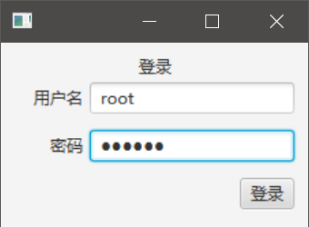
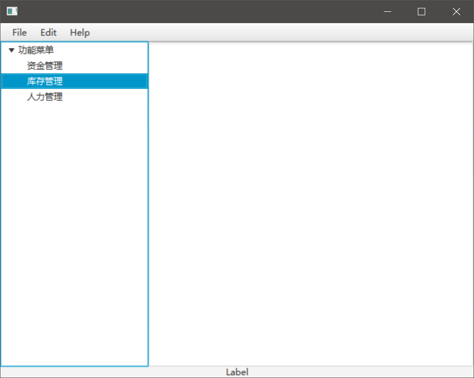
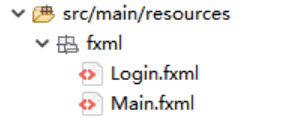
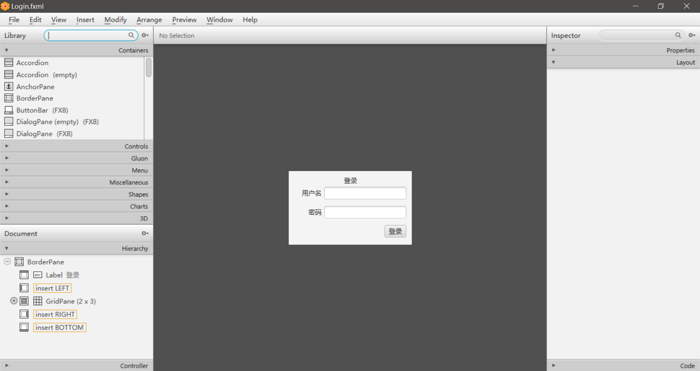
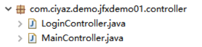

# 开发流程和HelloWorld

这里我们简单编写一个HelloWorld，实现一个登录功能，并演示JavaFX的开发流程。

## 例子工程

我们这里有一个登陆窗口，启动之后要求用户输入用户名和密码才能继续操作。如果用户输入了正确的用户名和密码，就会跳转到主页，如果输入错误，就会弹出警告框提示用户。这里我们只是简单的将用户名和密码硬编码到Java代码中作为校验的条件。



主页没什么实际的功能，左侧的树形菜单会在窗口初始化时载入数据，演示`initialize()`方法的使用。



## 创建工程

这部分就不介绍了，在第一节`JavaFX简介和环境搭建`中已经介绍过了，我们这里按照之前额的叙述，创建一个Maven工程即可。

## 「画」界面

使用JavaFX相比Swing最大的好处就是可以使用SceneBuilder和FXML布局，MVC层次更加清晰。我们这里再`src/main/resources`下创建两个FXML文件作为「登录页面」和「主页」的布局文件。



至于SceneBuilder如何使用，这个就真的没什么好说的了，用过Swing、Qt、GTK、WinForm等任何一款图形界面框架都有这种GUI设计器，拖拖拽拽设置点属性就可以。如果不知道某个控件属性是什么意思，我们可以参考该控件的JavaDoc，FXML中的属性和控件的API基本是对应的。



## 初始化和窗口控制

我们这里由于有两个窗口，在JavaFX中窗口对应的概念叫做`Stage`，Stage中加载Scene（场景），Scene包含一个可修改的组件树。

所以这里我们需要准备两个Stage，并为其分别加载FXML布局。Stage本身就是单例的，这里我们将两个Stage对象设置为了`App`的静态成员，便于外部访问。

App.java
```java
package com.ciyaz.demo.jfxdemo01;

import java.io.IOException;

import javafx.application.Application;
import javafx.fxml.FXMLLoader;
import javafx.scene.Parent;
import javafx.scene.Scene;
import javafx.stage.Stage;

public class App extends Application {

	// 该应用的所有窗口
	public static Stage loginWindow = null;
	public static Stage mainWindow = null;

	@Override
	public void start(Stage stage) throws IOException {

		// 初始化Scene并加载FXML
		Parent loginRoot = FXMLLoader.load(getClass().getResource("/fxml/Login.fxml"));
		Scene loginScene = new Scene(loginRoot);
		Parent mainRoot = FXMLLoader.load(getClass().getResource("/fxml/Main.fxml"));
		Scene mainScene = new Scene(mainRoot);

		// 初始化窗口
		App.loginWindow = stage;
		App.loginWindow.setScene(loginScene);
		App.mainWindow = new Stage();
		App.mainWindow.setScene(mainScene);
		App.mainWindow.initOwner(loginWindow);

		// 显示登录窗口
		App.loginWindow.show();
	}

	public static void appMain(String[] args) {
		launch();
	}
}
```

注意：`start()`方法会给出一个应用默认的Stage，我们新实例化的Stage要用`initOwner()`设置默认窗口的父窗口。

## 控制器和FXML

我们的界面除了FXML布局，还要有业务逻辑，这些代码写在`Controller`类中。



在FXML中，通过在根元素上使用`fx:controller`指定控制器类。

login.fxml
```xml
<BorderPane fx:id="bpLoginPane" xmlns="http://javafx.com/javafx/11.0.1" xmlns:fx="http://javafx.com/fxml/1" fx:controller="com.ciyaz.demo.jfxdemo01.controller.LoginController">
...
</BorderPane>
```

控件如果需要在控制器中访问，需要设置`fx:id`属性：
login.fxml
```xml
<TextField fx:id="tfUserName" GridPane.columnIndex="1" />
```

然后在控制器中，使用`@FXML`标注，控件的Java实例就会自动注入了。
```java
@FXML
private TextField tfUserName;
```

要注意的是，`fx:id`值必须和对象的字段名对应。

一些交互组件可以用`onAction`指定绑定的控制器方法，比如按钮可以直接绑定默认点击事件。

```xml
<Button fx:id="btnLogin" mnemonicParsing="false" onAction="#login" text="登录" GridPane.columnIndex="1" GridPane.rowIndex="2" />
```

当然，更通用的方法是在初始化时，通过代码绑定事件。

### LoginController

下面代码是登录窗口的逻辑。

LoginController.java
```java
package com.ciyaz.demo.jfxdemo01.controller;

import com.ciyaz.demo.jfxdemo01.App;

import javafx.fxml.FXML;
import javafx.scene.control.Alert;
import javafx.scene.control.Alert.AlertType;
import javafx.scene.layout.BorderPane;
import javafx.scene.control.Button;
import javafx.scene.control.PasswordField;
import javafx.scene.control.TextField;

public class LoginController {
	@FXML
	private BorderPane bpLoginPane;
	@FXML
	private TextField tfUserName;
	@FXML
	private PasswordField tfPassword;
	@FXML
	private Button btnLogin;

	public void login() {
		String username = tfUserName.getText();
		String password = tfPassword.getText();
		if ("root".equals(username) && "123456".equals(password)) {
			// 登陆成功
			App.loginWindow.hide();
			App.mainWindow.show();
		} else {
			// 登录失败
			Alert alert = new Alert(AlertType.WARNING);
			alert.setTitle("警告");
			alert.setHeaderText("用户名或密码错误");
			alert.setContentText("该行为会被报告给管理员！");
			alert.initOwner(this.bpLoginPane.getScene().getWindow());
			alert.show();
		}
	}
}
```

上面代码非常简单，用户名和密码校验通过，就进行窗口切换。如果校验不通过，就使用`Alert`弹出一个警告窗口。

### MainController

MainController.java
```java
package com.ciyaz.demo.jfxdemo01.controller;

import javafx.fxml.FXML;
import javafx.scene.control.TreeItem;
import javafx.scene.control.TreeView;

public class MainController {

	@FXML
	private TreeView<String> tvBssMenu;

	@FXML
	public void initialize() {
		// 模拟一些TreeView的数据并加载
		TreeItem<String> root = new TreeItem<>("功能菜单");
		root.setExpanded(true);

		TreeItem<String> ti1 = new TreeItem<>("资金管理");
		TreeItem<String> ti2 = new TreeItem<>("库存管理");
		TreeItem<String> ti3 = new TreeItem<>("人力管理");

		root.getChildren().add(ti1);
		root.getChildren().add(ti2);
		root.getChildren().add(ti3);

		tvBssMenu.setRoot(root);
	}
}
```

上面代码主要演示`initialize()`的使用，该方法是是一个Scene的生命周期方法，使用`@FXML`标注，会在该Scene初始化时回调，我们在初始化时为`TreeView`加载了一些数据。
