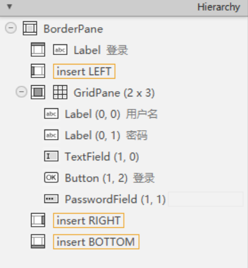
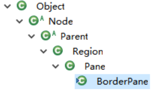
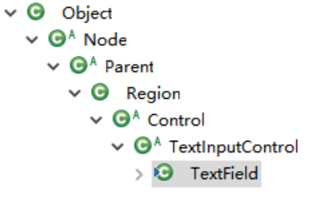

# 布局容器和组件

和其它GUI框架一样，JavaFX中组件分为布局容器（Pane）和普通交互控件，JavaFX中一个界面就是一个树形结构，根组件必然是一个Pane，然后由Pane和交互控件层层嵌套形成了组件树。

我们在SceneBuilder的Hierarchy视图中可以看到这种树形关系。



## 布局容器

我们这里以`BorderPane`为例，在Eclipse中查看一下这个类的继承层次。



其中，`Node`是JavaFX中所有控件的根组件，`Parent`是所有可带子组件的组件父类，`Pane`是所有布局容器组件的父类。

## 交互控件

我们这里看一下`TextField`的继承层次。



`Control`是所有交互控件的父类。

## 组件树的增删改查

组件树其实就是一个可以准确对应XML（在这里是FXML）的树形结构，我们可以通过操作组件树来动态的改变UI。我们布局是通过FXML实现的，如果需要动态修改，那就只能通过Java代码实现了。

添加和获取子组件（假设`fpRootPane`是根组件）：
```java
Button button1 = new Button("btn1");
Button button2 = new Button("btn2");
Button button3 = new Button("btn3");

fpRootPane.getChildren().add(button1);
fpRootPane.getChildren().add(button2);
fpRootPane.getChildren().add(button3);
```

其中，`getChildren()`返回的是一个`ObservableList`对象，它类似`ArrayList`，自然也就能够实现增删改查了。只不过它还支持通过观察者模式监听所容纳元素的改变，我们可以直接在其上进行添加和删除，不需要手动重绘，修改会立即反应到界面上。

## 实现布局嵌套和修改

我们界面就是组件树，修改组件树就能动态更改组件的显示，而组件树又对应一个FXML布局文件，我们当然可以把一个FXML布局作为一个子节点，动态添加到另一个布局中。

```java
try {
  Parent loginRoot = FXMLLoader.load(getClass().getResource("/fxml/Login.fxml"));
  fpRootPane.getChildren().add(loginRoot);
} catch (IOException e) {
  e.printStackTrace();
  throw new RuntimeException("加载布局FXML失败");
}
```

这样就能很容易的实现通过点击菜单，切换旁边的界面布局了。网上随处可见的各种后台管理系统其实都是这样的布局。


