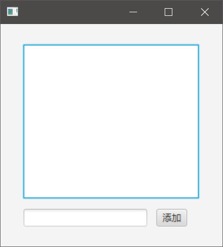

# 数据绑定

JavaFX中数据绑定更神似React/Vue这类框架，而不是Swing、Android这种传统的GUI框架。也就是说，JavaFX更推荐的开发方式是基于数据驱动的设计。如果开发者使用过React/Vue，上手JavaFX就非常快，如果一直使用`Qt Widgets`等传统框架，可能老式思维没法一下子转变过来。

这里我们可以用JQuery和Vue类比，JQuery代表传统的开发方式，表单提交时，回调提交按钮绑定的监听函数，读取表单各个字段值，进行表单验证，并发送Ajax请求。而Vue中，我们的表单字段直接绑定到了表单组件的`data`属性上，表单字段的修改也会触发`data`的修改，其它绑定了`data`的UI控件，比如一些和字段验证相关的组件，也会随着`data`的修改而起效，这样以数据为中心构建组件，由数据驱动页面UI，不仅用户体验更好，而且编程思路更清晰，能避免很多bug。

## 实现数据绑定例子

这里我们再次实现前一节中，修改TextField中内容触发Label同步修改的效果，只不过我们不用数据修改监听，而是改用数据绑定实现。

```java
label.textProperty().bind(textfield.textProperty());
```

可以看到，数据绑定非常简洁，`textProperty()`方法会返回一个`StringProperty`对象，它包含该组件容纳的数据，但并不仅仅如此，它还针对数据实现了观察者模式。将两个组件的`StringProperty`通过`bind()`函数连关联一起，就实现了数据绑定。

## ObservableValue

实际上，上面我们用到的`StringProperty`实现了`ObservableValue`这个接口，许多其它的数据类型对应的`Property`对象也都实现了该接口，我们可以简单看一下。

```java
public interface ObservableValue<T> extends Observable {
    void addListener(ChangeListener<? super T> listener);
    void removeListener(ChangeListener<? super T> listener);
    T getValue();
}
```

实际上这个接口基本就描述了各种`Property`对象的工作原理，`Property`对象在内部封装了数据监听器，当数据改变时，监听器中的方法就会被回调。`bind()`函数只不过把设置移除监听器这些和业务不太相关的代码帮我们封装好了，我们直接使用就可以了。

## ObservableList

前面我们用到了`ObservableValue`，既然一个数据值可以实现数据绑定，一组数据也是可以实现的，JavaFX中很多控件在设置数据时依赖的都是`ObservableList`，而不是简单的`ArrayList`，就是为了实现数据绑定。



我们这里实现一个非常简单的`todolist`，点击`添加`按钮，向`ListView`中添加值，和传统的绑定各种监听器不同，我们这里通过`Observable`和`ObservableList`数据绑定实现。

```java
package com.ciyaz.demo.jfxdemo01.controller;

import javafx.beans.property.StringProperty;
import javafx.collections.ObservableList;
import javafx.fxml.FXML;
import javafx.scene.control.ListView;
import javafx.scene.control.TextField;
import javafx.scene.layout.AnchorPane;

public class TestController {
	@FXML
	private AnchorPane anchorPane;
	@FXML
	private ListView<String> listView;
	@FXML
	private TextField textField;

	private StringProperty inputStr;
	private ObservableList<String> todoList;

	public void add() {
		todoList.add(inputStr.get());
	}

	@FXML
	public void initialize() {
		inputStr = textField.textProperty();
		todoList = listView.getItems();
	}
}
```

我们可以发现，其实实现这个功能的核心代码总共就3行，就是在设置数据绑定。初始化时，我们取出`ListView`和`TextField`的绑定数据对象将其引用放在控制器类的成员变量中，`add()`方法无非就是向`ObservableList`添加一个成员。

注：`add()`绑定到了按钮的点击事件上。

## 总结

如果上述功能使用老式的Swing实现，那可就麻烦了，再加上没有FXML布局文件就更难了，这里就可以发现JavaFX确实在整体设计上比Swing先进的多。
