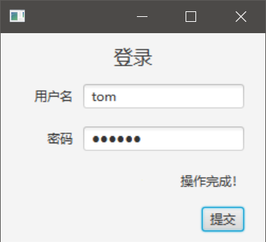
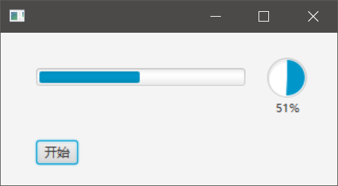

# 多线程和后台服务

我们的应用程序不可能只有界面，还要有相应的业务逻辑，而且这些业务逻辑一般都会涉及到网络请求和文件读写等操作，在GUI程序中这一般通过多线程来实现。本篇笔记主要介绍JavaFX中如何编写带有复杂后台操作的GUI程序。

## UI线程和耗时操作

如果有一定的GUI程序开发经验，我们就知道在非UI线程中不能修改UI组件状态，而在UI线程不能进行阻塞型的耗时操作（文件读写、网络请求等）。前者是出于线程安全考虑，后者UI线程被阻塞，GUI界面的消息循环无法响应用户交互输入，会导致在图形界面操作系统下的应用程序「失去响应」。

JavaFX主要提供了两种解决方案：

1. 在非UI线程中使用`Platform.runLater()`将对UI的更新放入队列
2. 使用Service和Task封装复杂的后台操作（和Android很像）并在UI线程中编写数据绑定

## Platform.runLater()

下面例子我们编写了一个登陆界面，用`Thread.sleep()`模拟一个耗时的同步网络操作，即表单提交。表单提交过程中和提交结束后，显示状态信息的`Label`会展示不同的文字。



```java
package com.ciyaz.demo.jfxdemo01.controller;

import javafx.application.Platform;
import javafx.beans.property.StringProperty;
import javafx.fxml.FXML;
import javafx.scene.control.Label;
import javafx.scene.control.PasswordField;
import javafx.scene.control.TextField;

public class FormController {
	@FXML
	private TextField tfUsername;
	@FXML
	private PasswordField pfPassword;
	@FXML
	private Label lbStatus;

	private StringProperty username;
	private StringProperty password;

	public void handleSubmitForm() {

		Thread networkThread = new Thread(new Runnable() {
			@Override
			public void run() {
				// 更新lbStatus状态为「提交中」
				Platform.runLater(new Runnable() {
					@Override
					public void run() {
						lbStatus.setText("提交中...");
					}
				});
				// 耗时操作
				try {
					Thread.sleep(3000);
					System.out.println("用户名 " + username.get() + " 密码 " + password.get());
				} catch (InterruptedException e) {
					e.printStackTrace();
				}
				// 更新lbStatus状态为「操作完成」
				Platform.runLater(new Runnable() {
					@Override
					public void run() {
						lbStatus.setText("操作完成！");
					}
				});
			}
		});
		networkThread.start();
	}

	@FXML
	private void initialize() {
		this.username = tfUsername.textProperty();
		this.password = pfPassword.textProperty();
	}
}
```

代码中`handleSubmitForm()`是「登录」按钮绑定的回调函数，上面代码虽然很长，但实际上就表达了一个意思：在非UI线程中，我们可以通过`Platform.runLater()`更新UI线程中的控件状态。

其实我们完全没必要像上面写的这么麻烦，老版本的Java是一个特别啰嗦的语言，现代非Java系程序员几乎很难看懂上面写的一大堆东西，JDK8引入了Lambda函数，我们实际开发中最好使用Lambda函数简化基于这些基于接口的复杂写法，以增强代码可读性：

```java
public void handleSubmitForm() {

  Thread networkThread = new Thread(() -> {
    // 更新lbStatus状态为「提交中」
    Platform.runLater(() -> lbStatus.setText("提交中..."));
    // 耗时操作
    try {
      Thread.sleep(3000);
      System.out.println("用户名 " + username.get() + " 密码 " + password.get());
    } catch (InterruptedException e) {
      e.printStackTrace();
    }
    // 更新lbStatus状态为「操作完成」
    Platform.runLater(() -> lbStatus.setText("操作完成！"));
  });
  networkThread.start();
}
```

布局代码这里就忽略了。

## 使用Service和Task

如果后台操作比较复杂，例如要一边下载文件一边显示进度条，或是一个计算密集型任务要显示当前运算进度，单纯使用`Platform.runLater()`是很困难的，我们最好将后台操作封装为一个Service。

下面例子用`Thread.sleep()`模拟了一个后台操作，并随着操作进度，实时更新进度条。



JavaFX中用Service表示一个后台操作，我们定义的Service组件需要继承`javafx.concurrent.Service`。它的好处是可以通过`updateProgress()`实时更新当前状态，并且Service内部维护了一组状态变量，用于标识当前Service是就绪，执行中，或是已完成。

下面代码我们封装了一个Service，其中操作比较简单，就是从0数到100，我们调用了`updateProgress()`更改当前进度，这个进度值可以被外部调用（一般都是通过数据绑定）。

MyService.java
```java
package com.ciyaz.demo.jfxdemo01.service;

import javafx.concurrent.Service;
import javafx.concurrent.Task;

public class MyService extends Service<Integer> {

	@Override
	protected Task<Integer> createTask() {
		return new Task<Integer>() {
			@Override
			protected Integer call() throws Exception {
				int i = 0;
				int max = 100;
				for(i = 0; i <= max; i++) {
					Thread.sleep(100);
					updateProgress(i, max);
					updateValue(i);
				}
				return i;
			}
		};
	}
}
```

控制器类中，我们主要就是在初始化时，将Service的进度绑定到了两个Progress组件上（它们功能一模一样，只不过是形状不同）。其中`startProgress()`是「开始」按钮绑定的回调函数，用来启动Service。

ProgressController.java
```java
package com.ciyaz.demo.jfxdemo01.controller;

import com.ciyaz.demo.jfxdemo01.service.MyService;

import javafx.concurrent.Worker.State;
import javafx.fxml.FXML;
import javafx.scene.control.ProgressBar;
import javafx.scene.control.ProgressIndicator;

public class ProgressController {
	@FXML
	private ProgressBar pb;
	@FXML
	private ProgressIndicator pi;

	private MyService service = new MyService();

	public void startProgress() {
		if(service.getState() == State.SUCCEEDED) {
			// 已经执行过
			service.restart();
		} else {
			// 第一次执行
			service.start();
		}
	}

	@FXML
	public void initialize() {
		pb.progressProperty().bind(service.progressProperty());
		pi.progressProperty().bind(service.progressProperty());
	}
}
```

注意：`ProgressBar`组件接收的进度值是`0`到`1`的`double`类型，而Service中设置进度是`long`类型，并需要指定进度的当前值和最大值，但是Service组件内部进行了一些处理，实际上`service.progressProperty()`就是符合`ProgressBar`组件需求的值，这个地方设计上不太一致。
