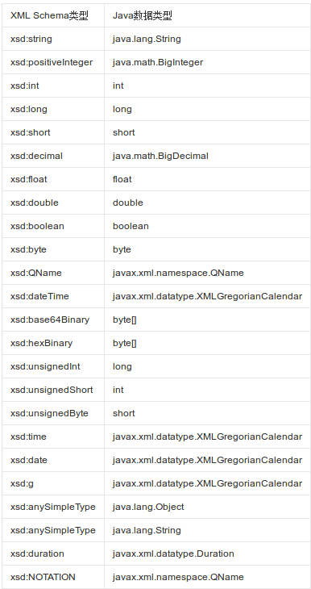

# Java中的XML映射

JAXB（Java Architecture for XML Binding），是通过注解实现Java实体类和XML映射的标准API。通过JAXB，能够很容易的实现Java实体类对象序列化为XML，以及XML反序列化为Java实体类对象。

后期补充：由于JAXB属于JavaEE体系，在JDK11中已经移除了JAXB，但你仍可以通过Maven引入该依赖。

## XML类型和Java类型的映射关系



## 使用JAXB的简单例子

通常我们并不会用到太复杂的Java-XML映射，用到时再查阅文档即可，这里参考网上举一个简单的例子。

User.java
```java
import javax.xml.bind.annotation.*;
import java.util.Date;

@XmlAccessorType(XmlAccessType.FIELD)
@XmlRootElement(name = "user")
@XmlType(name = "user", propOrder = {"name", "age", "birthday"})
public class User
{
	@XmlAttribute
	private long id;
	@XmlElement
	private String name;
	@XmlElement
	private int age;
	@XmlElement
	private Date birthday;

	//省略get/set方法，以及toString()
}

```

* `@XmlAccessType`：class级别注解，`XmlAccessType.FIELD`表示映射所有非静态属性
* `@XmlRootElement`：class级别注解，用于指定XML根节点的名字
* `@XmlType`：class级别注解，name是这个约束的名字，没什么实际意义，propOrder是XML中，所有子节点的顺序
* `@XmlAttribute`：属性级别注解，用于指定该属性为根节点的XML属性
* `@XmlElement`：属性级别注解，用于指定该属性为XML节点

如何给子节点添加属性？这涉及到复杂类型的映射问题（上面除了能直接映射的Date都是基本类型），给子节点加属性就需要把子节点单独定义成一个新类。`@XmlElement`只能给当前类的根节点加上属性。注意，一个值应该作为文本节点还是作为一个节点的属性，这需要一定的设计经验。可以参考XML相关章节。

Main.java
```java
import javax.xml.bind.JAXBContext;
import javax.xml.bind.Marshaller;
import javax.xml.bind.Unmarshaller;
import java.io.File;
import java.util.Date;

public class Main
{
	public static void main(String[] args) throws Exception
	{
		createXML();
		readXML();
	}

	public static void createXML() throws Exception
	{
		//实例化User对象
		User user = new User();
		user.setId(1);
		user.setName("tom");
		user.setAge(10);
		user.setBirthday(new Date());

		File file = new File("test.xml");
		//获取JAXB上下文，获取序列化器
		JAXBContext context = JAXBContext.newInstance(User.class);
		Marshaller marshaller = context.createMarshaller();
		//设置格式化输出
		marshaller.setProperty(Marshaller.JAXB_FORMATTED_OUTPUT, true);
		marshaller.marshal(user, file);
	}

	public static void readXML() throws Exception
	{
		File file = new File("test.xml");
		JAXBContext context = JAXBContext.newInstance(User.class);
		Unmarshaller unmarshaller = context.createUnmarshaller();
		User user = (User) unmarshaller.unmarshal(file);
		System.out.println(user);
	}
}
```

序列化和反序列化的代码比较容易理解，这里就不多解释了。

输出的XML
```xml
<?xml version="1.0" encoding="UTF-8" standalone="yes"?>
<user id="1">
    <name>tom</name>
    <age>10</age>
    <birthday>2017-11-10T22:54:16.785+08:00</birthday>
</user>
```
